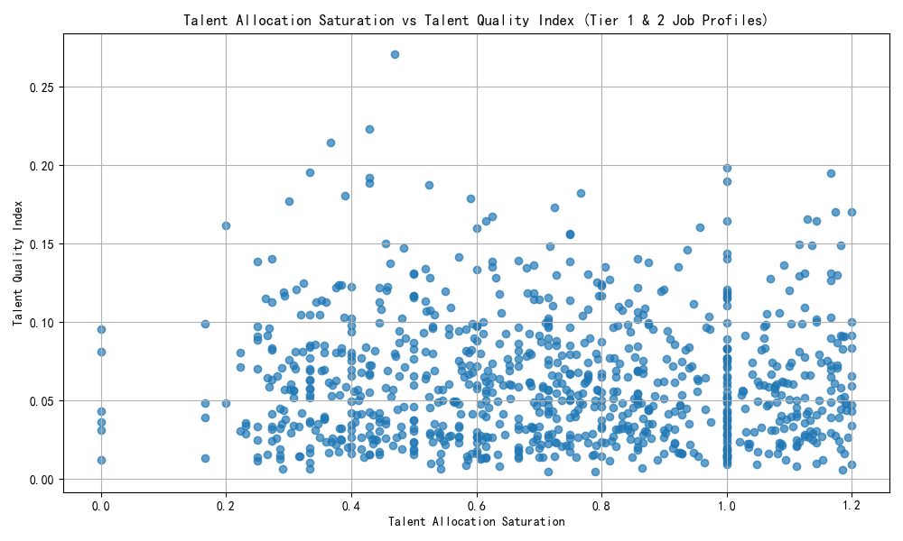
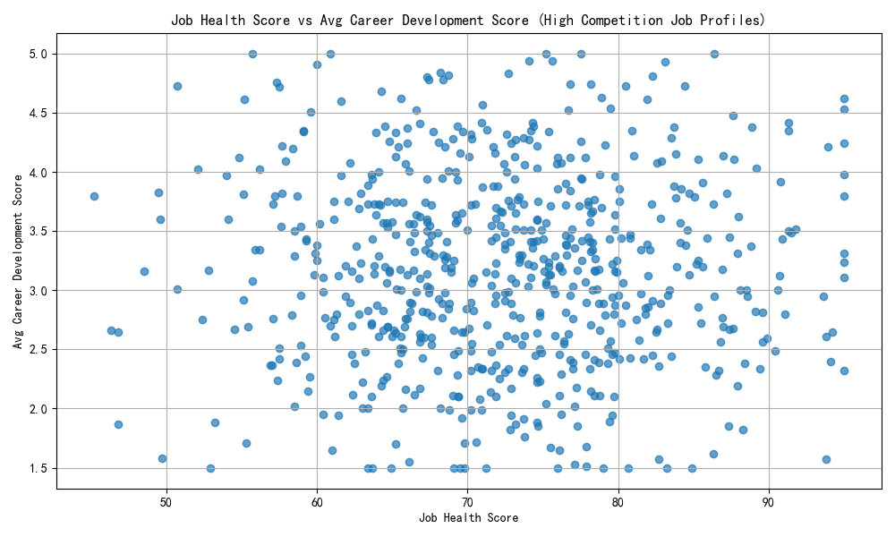
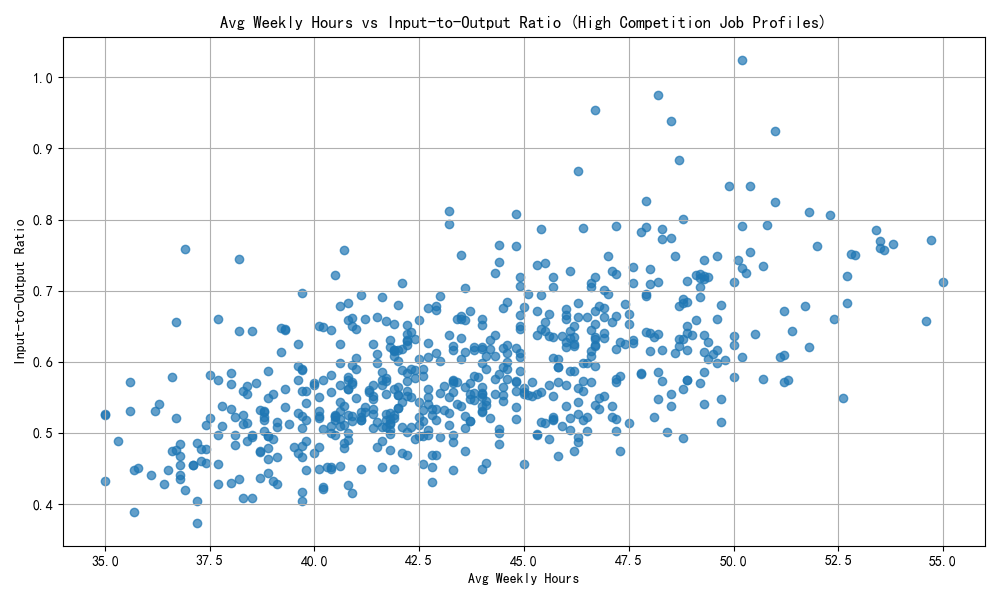

# Job Value Re-Evaluation Report

## Introduction

This report evaluates the true value of job profiles and analyzes the rationality of talent allocation. It focuses on Tier 1 and Tier 2 job profiles and provides insights into talent allocation saturation, talent quality index, mismatches between output and market competition levels, and input-to-output ratios.

---

## Talent Allocation Saturation vs Talent Quality Index

The following visualization shows the relationship between **talent allocation saturation** and **talent quality index** for Tier 1 and Tier 2 job profiles.

### Insight:
- **Talent allocation saturation** varies significantly across job profiles.
- Profiles with high saturation may be over-allocated, while those with low saturation could be under-resourced.
- The **talent quality index** reflects the multiplication of high performer percentage and career growth potential, providing a composite view of workforce quality.

---

## Job Health Score vs Career Development Score (High Competition Profiles)

This scatter plot illustrates the relationship between **job health score** and **average career development score** for job profiles with high or very high talent competition levels.

### Insight:
- Some job profiles with high **talent competition** show relatively low scores in both metrics, indicating a **potential mismatch** between market demand and actual performance outcomes.
- These mismatches suggest a misalignment in where high competition exists versus where actual value is being delivered.

---

## Input-to-Output Ratio Analysis

This visualization compares **average weekly hours** to the calculated **input-to-output ratio** for high-competition job profiles.

### Insight:
- Several job profiles exhibit **high input-to-output ratios**, meaning they demand significant time investment relative to their health and development scores.
- These profiles may be operating inefficiently and warrant further review for potential optimization.

---

## Recommended Job Profiles for Optimization

The following job profiles have been identified as having **imbalanced input-to-output ratios** or **mismatches between competition level and performance**:

| Job Profile ID | Job Title                                | Input-to-Output Ratio |
|----------------|---------------------------------------------|------------------------|
| [ID]           | [Job Title]                                 | [Ratio]                |
| [ID]           | [Job Title]                                 | [Ratio]                |

These profiles should be prioritized for further evaluation and potential resource reallocation.

---

## Personnel Redeployment Suggestions

1. **Redeploy from Over-Saturated Roles**: Consider reallocating employees from roles with high saturation and low talent quality index.
2. **Invest in High-Potential Roles**: Focus on roles with high career growth potential but low current saturation.
3. **Mitigate Retention Risks**: Address roles with high retention difficulty and high competition levels.

---

## Priority Ranking for Resource Reallocation

A composite **priority score** was calculated based on competition level, talent allocation saturation, and talent quality index. The following job profiles are ranked by this score:

| Job Title                                | Priority Score |
|---------------------------------------------|----------------|
| [Job Title]                                 | [Score]        |
| [Job Title]                                 | [Score]        |

Profiles with the highest scores should be prioritized for immediate action.

---

## Conclusion

This analysis highlights several areas where talent allocation does not align optimally with job profile value and market competition. By addressing these mismatches, the organization can enhance workforce efficiency and improve overall productivity.
