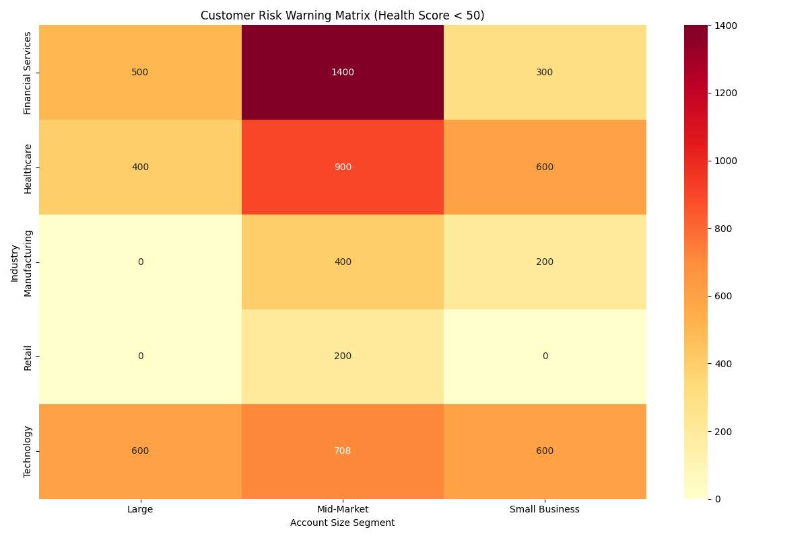
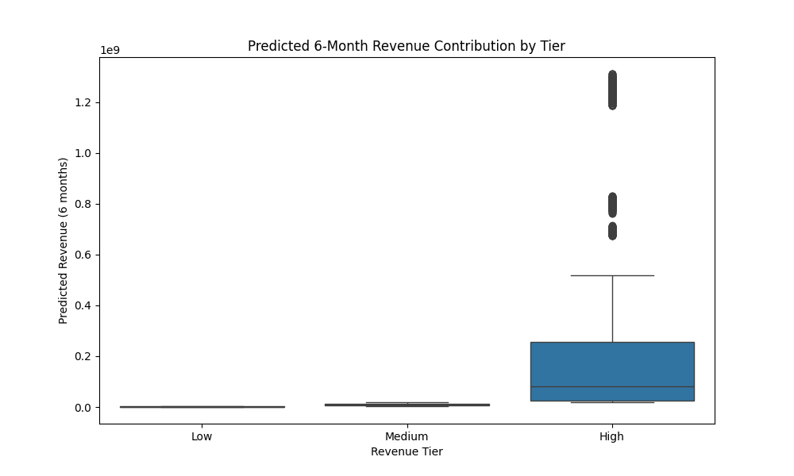

# Customer Health Score and Strategic Analysis Report

This report presents a comprehensive analysis of customer health, identifies at-risk segments, predicts future revenue contributions, and proposes actionable customer success strategies.

## 1. Customer Health Score Calculation

A customer health score, ranging from 0 to 100, was developed to quantify the well-being of each account. The score is a weighted average of four key dimensions:

*   **Activity (40%):** Based on `days_since_last_activity` and `total_activities_30d`.
*   **Contact Quality (30%):** Based on the ratio of contacts with email to total contacts.
*   **Business Value (20%):** Based on `annual_revenue` and `total_won_amount`.
*   **Account Scale (10%):** Based on `account_size_segment` and `number_of_employees`.

## 2. Customer Risk Warning Matrix

To identify high-risk customer segments, we analyzed customers with a health score below 50. The following risk matrix cross-analyzes these customers by industry and account size.

**Key Insights from the Risk Matrix:**

*   **High-Risk Segments:** The most significant number of at-risk customers are found in the **Financial Services** and **Technology** industries, particularly within the **Mid-Market** and **Small Business** segments.
*   **Common Characteristics:** High-risk customers (health score < 50) on average exhibit the following characteristics:
    *   **Low Engagement:** A higher number of days since the last activity (`~22 days`) and fewer activities in the last 30 days (`~5 activities`).
    *   **Contact information:** Although the contact quality is not extremely low in this high-risk segment, it is still a significant factor in the overall health score.
    *   **Lower Business Value:** These customers have lower average annual revenue and total won amounts compared to the overall customer base.

## 3. Revenue Contribution Prediction

A predictive model was built to forecast the potential revenue contribution of each customer over the next 6 months. The model is based on health score, historical won amount, and current pipeline value. Customers were then tiered into 'High', 'Medium', and 'Low' contribution categories.

**Key Insights from Revenue Prediction:**

*   **Health Score Impact:** The health score is a significant factor in predicting future revenue. Healthier customers are more likely to generate higher revenue.
*   **Tiered Customer Base:** The customer base is relatively evenly distributed across the three revenue tiers, indicating a balanced portfolio of high, medium, and low-potential customers.

## 4. Differentiated Customer Success Strategies

Based on the health score and company size, the following differentiated strategies are proposed:

### High-Health Customers (Score 80+)

*   **Objective:** Retention and Expansion.
*   **Strategy:**
    *   **Large/Enterprise:** Proactive engagement with key stakeholders, regular business reviews, and identification of upsell/cross-sell opportunities.
    *   **Medium/Small:** Automated check-ins, targeted feature announcements, and invitations to webinars to showcase new value.

### Medium-Health Customers (Score 50-79)

*   **Objective:** Nurture and Prevent Churn.
*   **Strategy:**
    *   **Large/Enterprise:** In-depth account review to understand any declining trends. Personalized outreach from customer success managers to address potential issues.
    *   **Medium/Small:** Targeted email campaigns with educational content. Proactive support outreach to address common pain points.

### Low-Health Customers (Score < 50)

*   **Objective:** Recovery and Churn Mitigation.
*   **Strategy:**
    *   **Large/Enterprise:** Immediate, high-touch intervention from senior customer success managers or account executives. Develop a formal recovery plan with the customer.
    *   **Medium/Small:** Enroll in an automated "win-back" campaign. Offer special incentives or a consultation to re-engage them.

## Recommendations

1.  **Prioritize At-Risk Segments:** Focus immediate attention on the high-risk segments identified in the risk matrix, particularly Mid-Market and Small Business customers in Financial Services and Technology.
2.  **Implement Tiered Strategies:** Roll out the proposed differentiated customer success strategies to optimize resource allocation and effectively manage customers at different health levels.
3.  **Monitor Health Scores:** Continuously monitor customer health scores to proactively identify changes and trigger appropriate interventions.
4.  **Refine the Health Score Model:** Periodically review and refine the health score model to ensure its accuracy and relevance as the business evolves.
