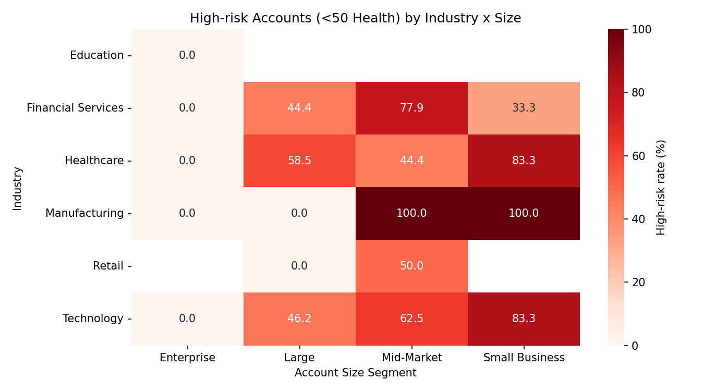

# Customer Health Score, Risk Warning Matrix, and 6-Month Revenue Contribution Plan

Summary
- Health score constructed from activity (40%), contact quality (30%), business value (20%), and account scale (10%). Range: 0–100.
- Total accounts: 10,000. High-risk (<50 health): 5,142 (51.4%).
- A revenue contribution prediction model (heuristic, rule-based) estimates 6-month contribution using health × pipeline and a health-scaled upsell component of historical wins.
- Customers are tiered by predicted contribution (quantile-based): Tier A (Top 25%), Tier B (Mid 50%), Tier C (Bottom 25%).
- Deliverables: account_health_and_prediction.csv (account-level scores, tiers), risk_heatmap.png (industry × size matrix), plus segment and characteristics summaries.

How the Health Score Was Calculated (0–100)
- Activity (40%):
  - days_since_last_activity (lower is better): min-max normalized, inverted.
  - total_activities_30d (higher is better): min-max normalized.
  - Activity sub-score = 100 × (0.5 × act_30_norm + 0.5 × last_act_norm).
- Contact Quality (30%):
  - contacts_with_email / total_contacts, clipped to [0,1].
  - Contact sub-score = 100 × contact_ratio.
- Business Value (20%):
  - annual_revenue and total_won_amount: min-max normalized and averaged.
  - Business sub-score = 100 × (0.5 × rev_norm + 0.5 × won_norm).
- Account Scale (10%):
  - account_size_segment mapped to {Enterprise: 1.0, Large: 0.75, Mid-Market: 0.5, Small Business: 0.25}.
  - number_of_employees: min-max normalized.
  - Scale sub-score = 100 × (0.6 × segment + 0.4 × employees).
- Overall health = 0.4 × Activity + 0.3 × Contact + 0.2 × Business + 0.1 × Scale, clipped to [0,100].

(1) Customer Risk Warning Matrix (Industry × Size)
- High-risk defined as health < 50.
- Heatmap shows the percentage of high-risk accounts by industry and size segment:

Key Observations (Top high-risk segments by rate; from high_risk_segment_rates.csv)
- Manufacturing — Small Business: 100%
- Manufacturing — Mid-Market: 100%
- Healthcare — Small Business: 83.3%
- Technology — Small Business: 83.3%
- Financial Services — Mid-Market: 77.9%
- Education — Enterprise: 0% high-risk (in this dataset, Education appears only as Enterprise accounts).
- Retail — Mid-Market: 50%; Retail — Large: 0%.

Common Characteristics of High-Risk Accounts (median comparison vs all; from high_risk_characteristics_vs_all.csv)
- Dormancy: days_since_last_activity +90% (20 vs 10.5 days).
- Reduced engagement: total_activities_30d −50% (3 vs 6).
- Weaker contact coverage: total_contacts −32%; contacts_with_email −37%.
- Lower economic value: annual_revenue −41%; total_won_amount −55%; current_pipeline_amount −44%.
- Smaller scale: number_of_employees −39%.
- Contact ratio (emails/contacts) is similar (−1.6%), suggesting quantity of contacts matters more than the ratio in differentiating high-risk here.

Implications
- The most at-risk segments are Small Business and Mid-Market in Manufacturing, Healthcare, Technology, and Financial Services.
- Risk is primarily driven by recency/frequency of engagement and smaller economic/organizational scale.

(2) 6-Month Revenue Contribution Prediction and Tiering
Heuristic model (no ML training):
- Probability of close for current pipeline: p_win = health / 100.
- Pipeline component: expected close within 6 months = current_pipeline_amount × p_win.
- Upsell/expansion component: 0.5 × total_won_amount × (0.05 + 0.25 × p_win).
- Predicted 6-month revenue contribution = pipeline component + upsell component.
- Contribution tiers (quantiles):
  - Q25: 2,570,566
  - Q75: 27,865,456
  - Tier C: < Q25; Tier B: Q25–Q75; Tier A: > Q75.

Tier Summary (from tier_summary.csv)
- Tier A (Top 25%): 2,500 accounts; total predicted 6m revenue ≈ 813.13B; average health ≈ 61.1.
- Tier B (Mid 50%): 5,000 accounts; total predicted 6m revenue ≈ 53.56B; average health ≈ 49.1.
- Tier C (Bottom 25%): 2,500 accounts; total predicted 6m revenue ≈ 2.54B; average health ≈ 46.1.

Operational Strategy: Differentiated Customer Success Plans
Health bands:
- High Health (80+): retain and expand
- Medium Health (50–79): stabilize and grow
- Low Health (<50): recover and prevent churn

By Health Band and Company Size

1) High Health (80+)
- Small Business:
  - Actions: Automated nurture and loyalty offers; encourage annual prepay; referral incentives; in-product tips for premium features.
  - Cadence: Quarterly check-ins; scaled webinars.
  - Owners: Growth CSM pod; Lifecycle marketing.
- Mid-Market:
  - Actions: QBRs focused on measurable ROI; bundle upsell (adjacent modules); multi-thread contacts in key functions.
  - Cadence: Quarterly EBRs; exec sponsor twice yearly.
  - Owners: Named CSM; Solutions consultant.
- Large/Enterprise:
  - Actions: Executive alignment; multi-year renewals; co-innovation roadmap; reference and co-marketing programs.
  - Cadence: Bi-monthly steering committee; quarterly EBR.
  - Owners: Strategic CSM; Account Director; Product liaison.

2) Medium Health (50–79)
- Small Business:
  - Actions: Proactive engagement boosts (training, office hours); pipeline acceleration incentives; contact enrichment (find more users/admins).
  - Cadence: Monthly touches; in-app journeys tied to feature adoption.
  - Owners: Scaled CSM; Customer Marketing.
- Mid-Market:
  - Actions: Playbooks to increase activity (usage goals); introduce ROI dashboards; targeted upsell aligned to realized value; expand to new departments.
  - Cadence: Monthly CSM meetings; adoption KPIs tracked openly.
  - Owners: Named CSM; Sales overlay.
- Large/Enterprise:
  - Actions: Executive business case refresh; adoption recovery sprints; value realization workshops; optional professional services to accelerate outcomes.
  - Cadence: Bi-weekly working sessions during recovery; quarterly exec EBR.
  - Owners: Strategic CSM; PS team; Executive sponsor.

3) Low Health (<50)
- Small Business:
  - Actions: Rapid rescue—reactivation campaigns; fast-track support resolution; offer short-term discounts to reopen pipeline; content to re-engage inactive users.
  - Cadence: Weekly outreach until engagement improves; 30-day rescue program.
  - Owners: Renewal desk; Scaled CSM; Support lead.
- Mid-Market:
  - Actions: Churn-prevention SWAT—exec escalation when needed; conduct root-cause interviews; rebuild contact network; pilot program for quick wins.
  - Cadence: Weekly operational reviews; 60–90 day turnaround plan.
  - Owners: Named CSM; Sales manager; Support escalation manager.
- Large/Enterprise:
  - Actions: Executive intervention; remediation charter with stakeholders (IT, Finance, Ops); close-the-gap plan with milestones; targeted incentives (service credits).
  - Cadence: Weekly steering committee; milestone tracking; formal risk register.
  - Owners: Account Director; Strategic CSM; Exec sponsor.

Segment-Specific Prescriptions (leveraging the risk warning matrix)
- Manufacturing (Small Business & Mid-Market at 100% risk):
  - Priority: Highest. Launch industry-tailored recovery kits addressing onboarding complexity and use-case fit; add self-serve enablement content.
  - KPIs: Reduce days_since_last_activity below 10; increase 30-day activities by 2×; expand contact count by +25%.
- Healthcare (Small Business 83% risk):
  - Priority: High. Compliance-focused playbooks; clinical workflow demonstrations; identify champions in operations and compliance.
  - KPIs: +30% pipeline in 60 days; +20% contacts with email; 2× activity frequency.
- Technology (Small Business 83% risk; Mid-Market 62.5%):
  - Priority: High. Product-led growth motions; sandbox trials; developer advocacy; integration accelerators.
  - KPIs: +50% 30-day activities; +25% total contacts; win-rate uplift via quick feature adoption.
- Financial Services (Mid-Market 77.9% risk):
  - Priority: High. Value assurance (security, ROI); tailored ROI calculators; multi-thread into Risk, Ops, IT.
  - KPIs: −30% days_since_last_activity; +40% pipeline conversion expectancy (raise health → p_win).

Revenue Plan and Resource Allocation
- Focus Tier A: Ensure realization of outsized predicted revenue (~813B) with a coverage model to prevent slippage; pair with upsell specialists; prioritize enterprise deals.
- Accelerate Tier B: Conversion labs to move accounts above Q75 threshold; offer timed incentives linked to adoption milestones.
- Selective investment in Tier C: Use scaled programs; qualify which can move into Tier B via quick wins; otherwise minimize cost-to-serve.

Monitoring and Triggers
- Weekly health score monitoring with alerts:
  - Activity alerts: days_since_last_activity > 14 or total_activities_30d < 3 → rescue playbook.
  - Contact alerts: total_contacts < 20 or contacts_with_email < 15 → enrichment motion.
  - Pipeline alerts: current_pipeline_amount stagnates 30+ days → executive review.
- Success metrics:
  - Reduce high-risk rate by 15–20% in 90 days in top-risk segments.
  - Increase predicted 6m revenue in Tier B by 25% via adoption programs.
  - Lift average health in Tier C by 5–10 points through recovery plans.

Data Deliverables
- Account-level results: account_health_and_prediction.csv (account_id, account_name, industry, size segment, health score, risk band, predicted 6m revenue, contribution tier).
- Segment rates: high_risk_segment_rates.csv.
- Risk matrix counts: risk_matrix_counts.csv.
- High-risk characteristics: high_risk_characteristics_vs_all.csv.

Notes
- The revenue contribution model is intentionally rule-based (no machine learning), aligning with constraints.
- The health score can be recalibrated over time (e.g., segment-specific normalization or dynamic weights) as performance data accumulates.
