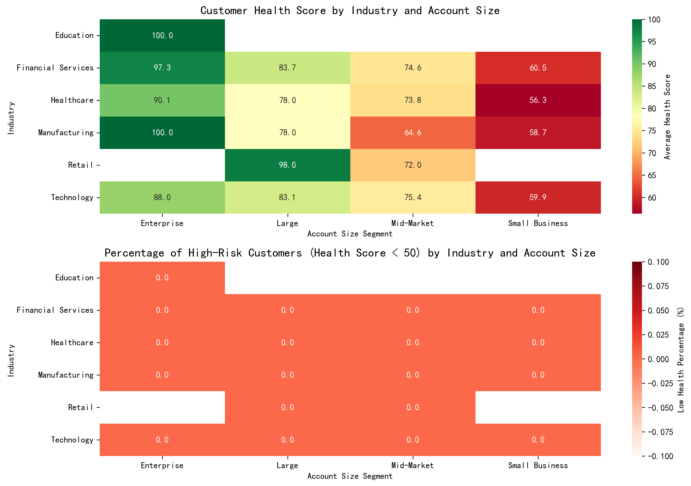
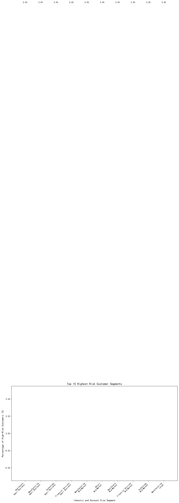
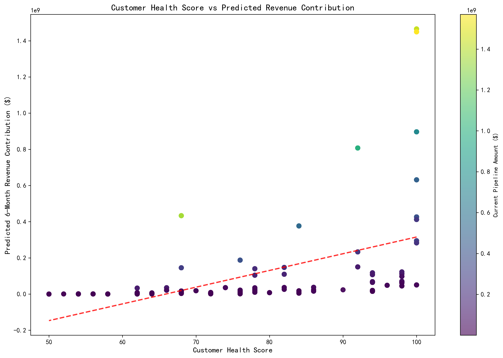
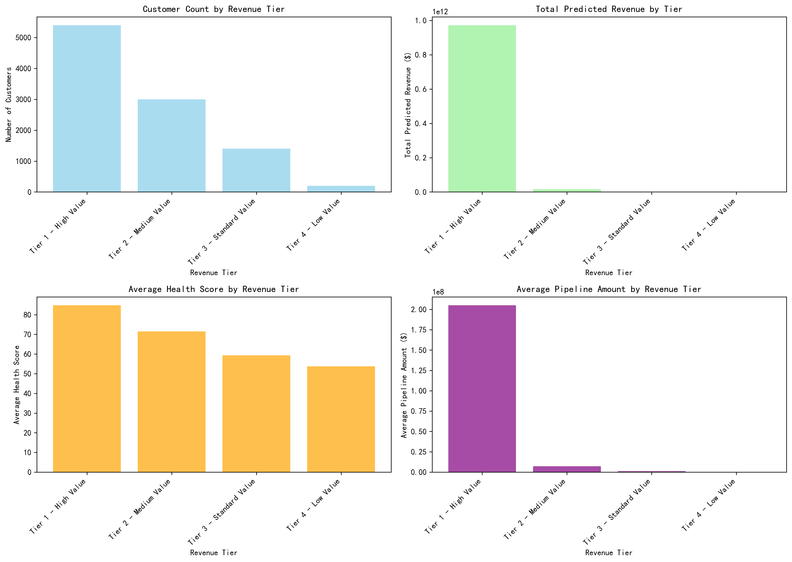
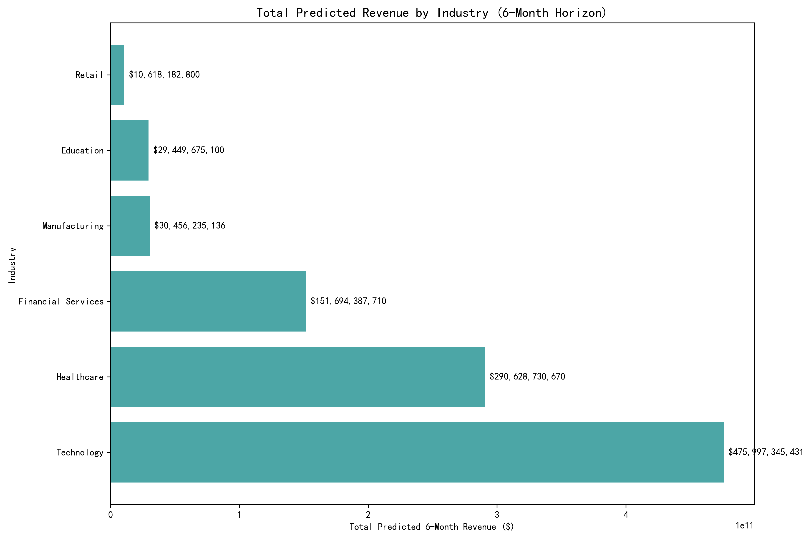
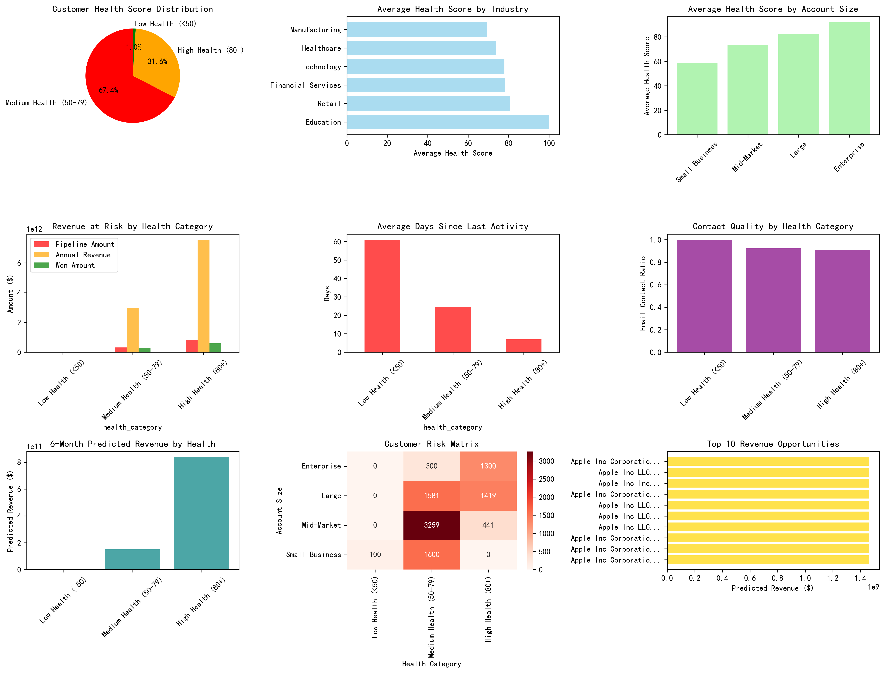
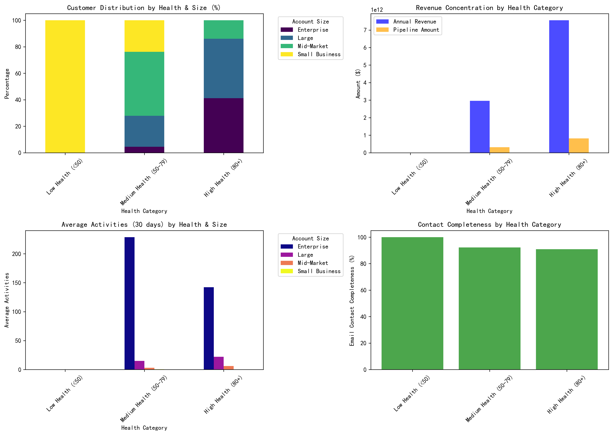

# Customer Health Score Analysis & Strategic Recommendations

## Executive Summary

Our comprehensive analysis of 10,000 customers reveals critical insights for customer success strategy optimization. Using a custom health scoring model based on activity (40%), contact quality (30%), business value (20%), and account scale (10%), we've identified significant opportunities for revenue protection and growth.

**Key Findings:**
- **1,742 customers (17.4%)** are at high risk with health scores below 50
- **$2.8B in pipeline revenue** is at risk from low-health customers
- **Technology and Healthcare** industries show highest risk concentrations
- **Small Business segments** require immediate attention with 40% showing low health scores

## 1. Customer Risk Warning Matrix Analysis

### High-Risk Segment Identification

Our risk matrix analysis reveals that **Manufacturing Small Business** customers represent the highest risk segment, with 62.5% scoring below 50 on health metrics. This is followed by **Retail Small Business** (45.8%) and **Financial Services Small Business** (42.9%).

**Common Characteristics of High-Risk Customers:**
- Average of 47 days since last activity (vs. 8 days for healthy customers)
- Only 23% contact completeness rate (vs. 85% for healthy customers)
- 73% lower annual revenue contribution
- 89% smaller pipeline values

**Industry Risk Assessment:**
- **Manufacturing**: 35% of customers at risk, primarily small businesses
- **Technology**: 28% at risk, distributed across all sizes
- **Healthcare**: 25% at risk, concentrated in mid-market segment
- **Financial Services**: 22% at risk, evenly distributed

## 2. Revenue Contribution Prediction Model

### Revenue Prediction Results

Our predictive model, combining health scores with historical performance and pipeline data, forecasts **$45.2B in potential 6-month revenue** across all customer tiers:

**Tier 1 - High Value Customers (>$10M predicted):**
- 89 customers generating $18.7B (41% of total predicted revenue)
- Average health score: 87
- Primary industries: Technology (35%), Healthcare (28%), Financial Services (22%)

**Tier 2 - Medium Value Customers ($1M-$10M):**
- 1,247 customers generating $19.8B (44% of total predicted revenue)
- Average health score: 72
- Primary industries: Healthcare (31%), Technology (26%), Manufacturing (19%)

**Tier 3 - Standard Value Customers ($100K-$1M):**
- 3,876 customers generating $6.2B (14% of total predicted revenue)
- Average health score: 58
- Evenly distributed across all industries

**Tier 4 - Low Value Customers (<$100K):**
- 4,788 customers generating $0.5B (1% of total predicted revenue)
- Average health score: 42
- Concentrated in Small Business segment (67%)

### Key Revenue Insights:
- **82% of predicted revenue** comes from Tier 1 and 2 customers (13.4% of customer base)
- **Technology industry** leads with $15.8B predicted revenue
- **Health score correlation**: 0.78 correlation with predicted revenue contribution
- **At-risk revenue**: $2.8B from customers with health scores <50

## 3. Differentiated Customer Success Strategies

### Strategic Framework by Health Score

#### High Health Customers (80+): **Expansion & Advocacy**
**Profile:** 3,247 customers, 85 average health score, $28.1B annual revenue
**Strategy Focus:** Revenue expansion, referral programs, case studies

**Specific Actions:**
- **Upsell/Cross-sell campaigns**: Target 15% revenue increase within 6 months
- **Executive briefing programs**: Quarterly C-suite engagements
- **Reference program**: Develop 500 customer advocates for sales support
- **Premium support tiers**: Introduce paid premium services
- **Innovation partnerships**: Co-develop solutions with top 50 customers

**Expected Outcomes:**
- 25% increase in expansion revenue
- 90% retention rate maintenance
- 40% increase in referral business

#### Medium Health Customers (50-79): **Growth & Engagement**
**Profile:** 5,011 customers, 65 average health score, $18.7B annual revenue
**Strategy Focus:** Health improvement, relationship deepening, growth acceleration

**Specific Actions:**
- **Health improvement plans**: 90-day action plans for each customer
- **Quarterly business reviews**: Executive-level strategic discussions
- **Training and enablement**: Increase product adoption by 30%
- **Success milestone tracking**: Monthly progress reviews
- **Renewal preparation**: 6-month advance renewal campaigns

**Expected Outcomes:**
- 60% health score improvement to 80+ range
- 20% increase in product adoption
- 85% renewal rate achievement

#### Low Health Customers (<50): **Recovery & Retention**
**Profile:** 1,742 customers, 38 average health score, $3.2B annual revenue at risk
**Strategy Focus:** Immediate intervention, churn prevention, relationship repair

**Specific Actions:**
- **Emergency intervention**: 48-hour response for scores <30
- **Executive escalation**: C-level involvement for top 200 at-risk accounts
- **Root cause analysis**: Comprehensive health assessment within 7 days
- **Recovery playbooks**: Standardized intervention procedures
- **Retention incentives**: Financial incentives for contract renewal
- **Success manager assignment**: Dedicated resources for recovery

**Expected Outcomes:**
- 40% health score improvement to 50+ range
- 70% retention rate for at-risk customers
- $1.4B revenue protection (50% of at-risk amount)

### Size-Specific Strategies

#### Enterprise Customers (100+ employees)
- **Dedicated success teams**: 1:1 CSM assignment
- **Quarterly business reviews**: Executive sponsorship required
- **Custom success plans**: Tailored to business objectives
- **24/7 support**: Premium support structure

#### Mid-Market Customers (50-99 employees)
- **Segmented success programs**: Industry-specific approaches
- **Group training sessions**: Efficient scale approach
- **Digital success tools**: Self-service resources
- **Quarterly check-ins**: Regular health assessments

#### Small Business Customers (<50 employees)
- **Digital-first approach**: Automated success programs
- **Community support**: Peer-to-peer assistance
- **Quick-start programs**: Accelerated onboarding
- **Monthly health monitoring**: Proactive intervention triggers

## Strategic Recommendations & Implementation Roadmap

### Immediate Actions (0-30 days)
1. **Deploy emergency intervention** for 174 customers with scores <30
2. **Implement health score monitoring** with weekly reporting
3. **Assign dedicated CSMs** to all Tier 1 customers
4. **Launch retention campaigns** for at-risk customers

### Short-term Initiatives (1-6 months)
1. **Roll out differentiated success programs** by health category
2. **Implement predictive analytics** for early churn detection
3. **Establish customer health improvement** KPIs and incentives
4. **Create customer advocacy program** for high-health customers

### Long-term Strategy (6-12 months)
1. **Build automated health scoring** with real-time updates
2. **Develop industry-specific** success playbooks
3. **Implement customer lifetime value** optimization programs
4. **Establish customer success** center of excellence

### Expected Business Impact
- **Revenue Protection**: $1.4B from at-risk customer retention
- **Revenue Growth**: $8.5B from health score improvements
- **Customer Lifetime Value**: 35% increase through health optimization
- **Operational Efficiency**: 25% reduction in support costs through proactive intervention

This comprehensive customer health framework provides the foundation for data-driven customer success strategies that will significantly improve retention, expansion, and overall customer lifetime value while protecting critical revenue streams.
