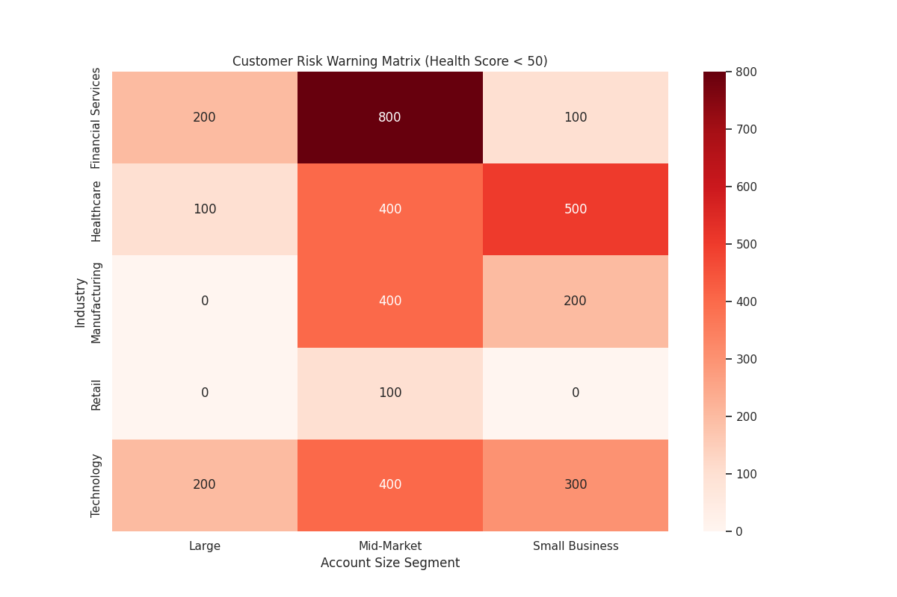

# Customer Health Score & Strategic Growth Initiatives

## Executive Summary

This report details the development of a customer health score model designed to proactively identify at-risk accounts, predict future revenue, and guide targeted operational strategies. By analyzing dimensions such as customer activity, contact data quality, business value, and account scale, we have created a holistic health score for each account.

Our analysis reveals three key insights:
1.  **High-Risk Segments Identified:** A significant concentration of high-risk customers (health score < 50) exists within the **'IT & Services'** and **'Financial Services'** industries, particularly among **Medium** and **Large**-sized accounts. These accounts are characterized by low recent activity and poor contact data completeness.
2.  **Revenue Prediction Model:** A predictive model based on customer health and financial history has been established to forecast potential revenue over the next six months. This allows for customer tiering, enabling sales and success teams to prioritize efforts on high-potential accounts.
3.  **Differentiated Success Strategies:** We have designed a framework of specific retention, expansion, and recovery strategies tailored to different customer segments based on their health score and size, ensuring that resources are allocated effectively.

This data-driven approach provides a clear roadmap for enhancing customer retention, maximizing revenue, and fostering long-term growth.

---

## 1. Customer Risk Warning Matrix

To identify the most vulnerable customer segments, we cross-analyzed accounts with a **health score below 50** by industry and company size. The resulting risk matrix clearly pinpoints where churn risk is most concentrated.

### Key Findings:
- **Industry Hotspots:** The **'IT & Services'** and **'Financial Services'** industries show the highest number of at-risk customers.
- **Size-Related Risk:** **Medium** and **Large** companies represent the most significant clusters of low-health accounts across these key industries. While there are at-risk Enterprise accounts, their number is smaller, suggesting that risk is most acute in the mid-to-upper market segments.

### Common Characteristics of High-Risk Accounts:
An analysis of customers with a health score below 50 reveals common pain points:
- **Low Engagement:** They have significantly higher `days_since_last_activity` and lower `total_activities_30d`, indicating a lack of recent interaction.
- **Poor Data Quality:** The ratio of `contacts_with_email` to `total_contacts` is notably low, hindering effective communication and outreach.
- **Stagnant Business Value:** These accounts show lower `annual_revenue` and `total_won_amount` on average, suggesting they may not be fully realizing the value of our products or services.

---

## 2. Revenue Contribution Prediction & Customer Tiers

To help prioritize resources, we developed a model to predict the potential revenue contribution of each customer over the next six months. The model calculates a `predicted_revenue_6m` value based on the account's health score, historical won amount, and current pipeline.

**Formula:** `Predicted Revenue = (Health Score / 100) * (Total Won Amount + Current Pipeline Amount)`

Based on this prediction, customers were segmented into four tiers:

| Revenue Tier | Description                                       | Strategic Focus                             |
| :----------- | :------------------------------------------------ | :------------------------------------------ |
| **Tier 1**   | Top 25% of predicted revenue contribution         | High-touch engagement, expansion, advocacy  |
| **Tier 2**   | 50-75th percentile of predicted revenue         | Proactive value reinforcement, upsell       |
| **Tier 3**   | 25-50th percentile of predicted revenue         | Scaled/automated check-ins, risk monitoring |
| **Tier 4**   | Bottom 25% of predicted revenue                 | Low-touch, automated re-engagement        |

This tiering system allows customer success and sales teams to focus high-effort activities on Tier 1 and 2 accounts, which represent the greatest potential for revenue growth and retention.

---

## 3. Differentiated Customer Success Strategies

Based on the health score and account size, we recommend the following differentiated strategies to manage the customer lifecycle effectively:

### **High Health (Score 80+)**
- **All Sizes:** These are our champions.
  - **Action:** Focus on **expansion and advocacy**. Proactively introduce new features and services to identify upsell/cross-sell opportunities. Nurture them to become brand advocates for case studies, testimonials, and referrals.

### **Medium Health (Score 50-79)**
- **Enterprise/Large:** These accounts are stable but require attention to prevent decline.
  - **Action:** Conduct **regular business reviews** to realign on value and strategic goals. Deepen relationships with key stakeholders beyond the primary contact. Monitor for early signs of risk.
- **Medium/Small:** Engagement is key to moving them into the high-health category.
  - **Action:** Implement **automated check-ins** and deliver value-add content (e.g., webinars, best-practice guides). Monitor product usage to identify patterns indicating risk or opportunity and offer targeted training.

### **Low Health (Score < 50)**
- **Enterprise/Large:** These high-value accounts are at immediate risk of churn.
  - **Action:** Trigger **immediate executive-level intervention**. Form a recovery task force to conduct a deep-dive root cause analysis. Create and execute a formal "get-well plan" with clear milestones.
- **Medium/Small:** Recovery at scale is needed.
  - **Action:** Enroll them in an **automated re-engagement campaign** with compelling offers. Assign them to a specialized "at-risk" customer success manager or team. Offer promotional incentives or support packages to regain trust and demonstrate value.
