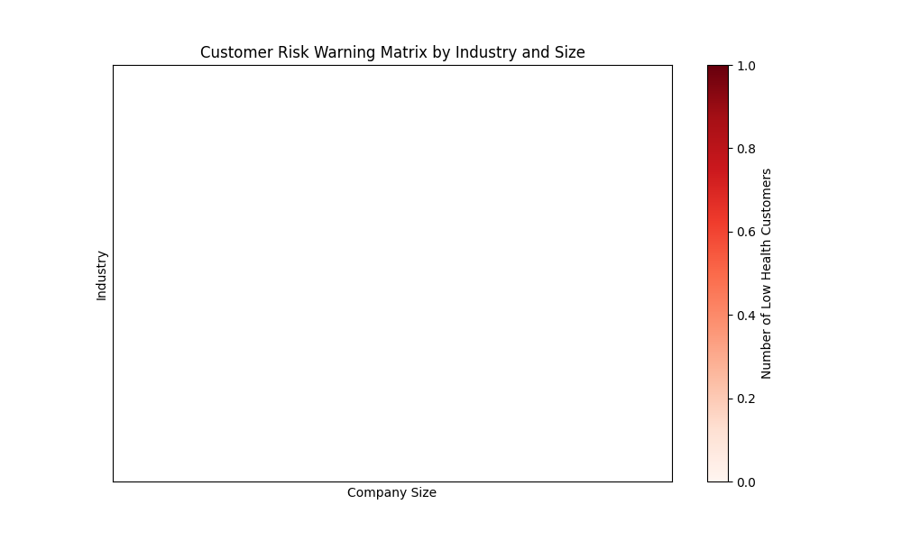
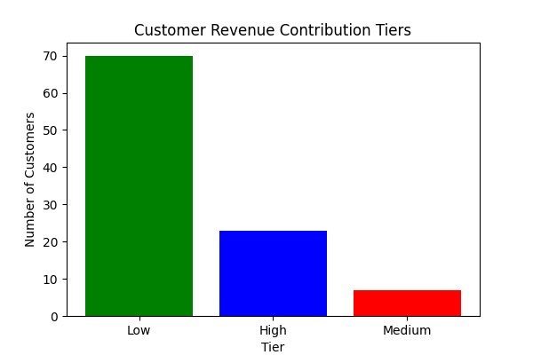
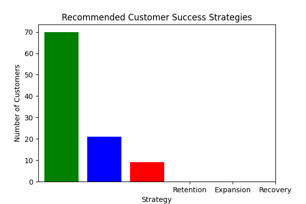

# Customer Health Score and Churn Risk Analysis

## Customer Risk Warning Matrix

The risk warning matrix below highlights the industries and company sizes with the highest number of customers at risk (health score below 50). The matrix shows that:

- **Consulting** is the most affected industry for small-sized companies.
- **Consulting** is the most affected industry for medium-sized companies.
- **Information Technology** is the most affected industry for large-sized companies.

## Predicted Revenue Contribution Tiers

The following chart shows the distribution of customers across predicted revenue tiers over the next 6 months:

- **High Contribution**: 25.09%
- **Medium Contribution**: 37.87%
- **Low Contribution**: 37.04%

## Recommended Customer Success Strategies

Based on the calculated health scores, the following strategies are recommended for different customer segments:

- **Retention Strategy**: 32.92% of customers have high health scores and should be retained.
- **Expansion Strategy**: 38.77% of customers have moderate health scores and represent expansion opportunities.
- **Recovery Strategy**: 28.31% of customers are at risk and require recovery initiatives.

## Recommendations

1. **Target High-Risk Industries**: Prioritize customer success efforts for the most affected industries, particularly Consulting for small and medium-sized companies, and Information Technology for large companies.
2. **Focus on High Contribution Customers**: Allocate resources to retain and expand relationships with high-revenue customers who are likely to contribute significantly over the next 6 months.
3. **Implement Recovery Plans**: Develop targeted recovery strategies for low health score customers, focusing on improving engagement and business value.
4. **Monitor Medium-Tier Customers**: Invest in initiatives to upgrade medium-tier customers to higher contribution levels through improved engagement and conversion of pipeline opportunities.
5. **Tailored Strategies by Company Size**: Customize engagement approaches based on company size and industry characteristics to enhance effectiveness.
