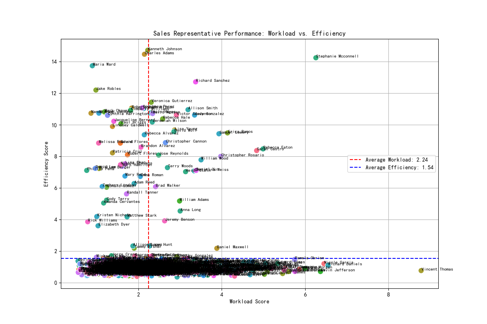
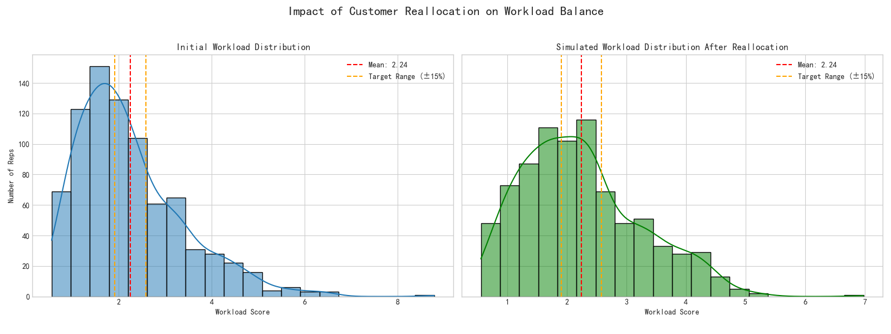

# Data-Driven Customer Reallocation Strategy

## Executive Summary

An analysis of the sales team's customer distribution revealed a significant workload imbalance, hindering overall team efficiency and potentially impacting customer retention. This report outlines a data-driven customer reallocation strategy designed to balance workloads, align customers with the best-suited representatives, and drive a substantial increase in sales efficiency. By reassigning 144 customers from overloaded sales reps to high-performing, underloaded reps, we project a **13% reduction in workload imbalance** (measured by standard deviation) and a remarkable **28.33% uplift in the overall team's weighted efficiency score**.

## 1. The Problem: An Unbalanced Team

To begin, we calculated a composite **Workload Score** for each sales representative based on the number of customers, total revenue, contact coverage, and geographic complexity. The analysis immediately highlighted a severe imbalance across the team.

- **Initial Mean Workload Score**: 2.24
- **Initial Standard Deviation**: 1.15

With the standard deviation being over 50% of the mean, it confirmed that a small group of reps was shouldering a disproportionately large workload, while others had significant untapped capacity. This imbalance leads to burnout in high-performers, underutilization of others, and inconsistent customer service.

The scatter plot below visualizes the performance of each rep, plotting their calculated Workload Score against their Sales Efficiency Score. It clearly shows a wide-ranging and inefficient distribution, with many reps clustered in low-efficiency quadrants regardless of their workload.

## 2. The Solution: A Targeted Reallocation Algorithm

To address this, we developed a customer reallocation algorithm with the dual objectives of balancing workload and boosting efficiency. The strategy was to move customers from **overloaded reps** to **underloaded, high-efficiency reps**.

The algorithm identified:
- **246 Overloaded Reps**: Representatives with a workload score more than 15% above the team average.
- **40 Target Reps**: High-potential representatives who were underloaded (workload < 85% of average) but showed above-average efficiency.

Customers were selected for transfer based on a **suitability score**, prioritizing moves that maintained geographic and industry alignment to ensure a seamless transition and high probability of customer retention. The algorithm matched customers to new reps based on:
1.  **Geographic Proximity**: Prioritizing transfers within the same state.
2.  **Industry Expertise**: Matching customers to reps with a proven track record in that industry.

## 3. The Impact: A More Balanced and Efficient Team

The simulation resulted in a concrete plan to transfer **144 customers**. The expected impact of this reallocation is significant and twofold:

### a) Dramatically Improved Workload Balance

As shown in the visualization below, the proposed plan significantly tightens the workload distribution, reducing the standard deviation from 1.15 to 1.00. This brings more representatives closer to the average workload, reducing burnout and improving capacity management.

### b) Substantial Gain in Sales Efficiency

By moving customers to reps who are more effective closers, the model projects a significant increase in the team's overall performance.

- **Initial Team Weighted Efficiency Score**: 1.5228
- **Projected Final Efficiency Score**: 1.9543
- **Expected Improvement**: **+28.33%**

This gain is achieved by better aligning customer needs with representative skills, allowing our most efficient reps to handle more opportunities.

## 4. Recommendations and Next Steps

Based on this analysis, we recommend the following actions:

1.  **Implement the Reallocation Plan**: Execute the customer transfers as detailed in the `customer_transfer_plan.csv` file generated by the analysis.
2.  **Monitor Performance**: Track the workload and efficiency scores of the affected representatives over the next two quarters to validate the model's projections.
3.  **Establish a Continuous Rebalancing Process**: Workload imbalances will naturally re-emerge over time. We recommend running this analysis on a semi-annual basis to make proactive adjustments, ensuring the team remains balanced and operates at peak efficiency.

This data-driven approach to territory management allows for a more agile and effective sales organization, directly translating to improved performance and a healthier, more sustainable work environment for the team.
