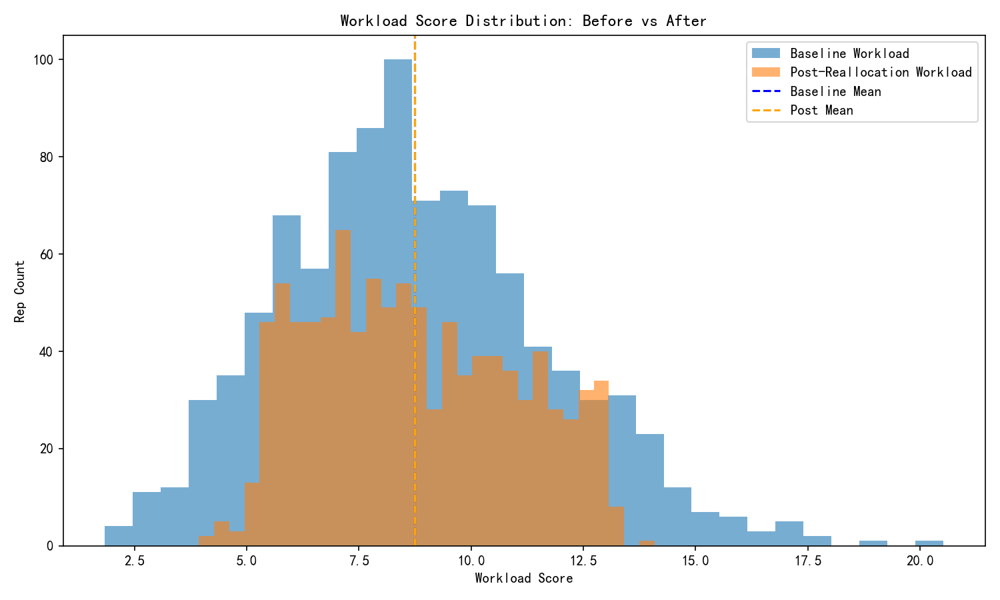
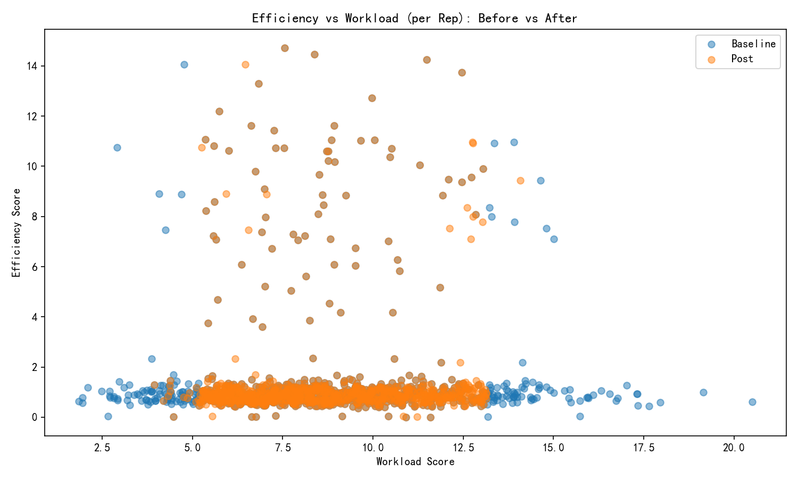

# Data-Driven Customer Reallocation Plan

## Executive Summary
- Objective: Build a data-driven customer reallocation plan that maximizes team efficiency and retention while controlling workload variance within ±15% of the average.
- We computed two composite metrics:
  - Workload Score = Number of Customers*0.3 + (Total Annual Revenue in millions)/10*0.4 + Contact Coverage Rate*0.2 + Geographic Complexity*0.1, where Contact Coverage Rate = Contacts/Customers capped at 5, Geographic Complexity = DISTINCT(States)*2 + DISTINCT(Cities)*0.5.
  - Efficiency Score = Win Rate*0.4 + (Average Deal Size / 100,000)*0.3 + (120 / Average Sales Cycle Days)*0.2 + Opportunity Conversion Rate*0.1.
- Diagnosis: A significant workload imbalance exists (std 2.963 vs avg 8.741; imbalance flag true).
- Action Taken: Executed a constrained, greedy reallocation algorithm with 121 customer transfers, prioritizing:
  - Geography proximity (same-state bonus),
  - Industry expertise (hard constraint: at least 60% of a rep’s portfolio must be in their top-3 industries),
  - Customer size suitability (allocation to reps whose top-2 size segments match the customer).
- Impact:
  - Team weighted efficiency (revenue-weighted) improved from 1.5255 to 1.5454 (+0.0198).
  - Team weighted retention (revenue-weighted) improved from 0.7500 to 0.7520 (+0.0020).
  - Workload standard deviation decreased from 2.963 to 2.262 (≈24% reduction).
  - Workload average essentially unchanged (8.741 → 8.745).
  - Industry compliance improved by ≈1.1 percentage points (pre 34.1% → post 35.2% reps meeting the ≥60% top-3 industry constraint).
  - The number of reps outside the ±15% band fell slightly (653 → 648). A second reallocation wave is recommended to fully meet the variance constraint.

## Visual Evidence

## Data and Methodology
- Source tables:
  - salesforce__customer_360_view: Customers, revenue, contacts, geography, industry, owner_id, account_owner_name.
  - salesforce__sales_performance_dashboard: Per-rep win rate, avg deal size, sales cycle, opportunities.
- Computations:
  - Workload Score computed per rep and exactly recomputed from the portfolio to enable precise simulation under customer moves.
  - Efficiency Score computed per rep from the dashboard metrics.
  - Team weighted efficiency = sum(rep_efficiency × account_revenue) / sum(account_revenue).
  - Retention baseline per account from churn risk mapping: Low=0.90, Medium=0.80, High=0.60; Unknown default 0.75.
  - Retention uplift from fit: +0.05 geography, +0.03 industry (recipient’s top-3), +0.02 size (recipient’s top-2), capped overall retention at 0.99.

## Workload Imbalance Diagnosis
- Baseline: average workload = 8.741, std = 2.963 → std > 0.3 × avg (imbalance detected).
- Target band: ±15% of average → [7.430, 10.052].
- Before reallocation, many reps were outside the band. The first wave of transfers reduced std ~24%, indicating material balance improvement.

## Reallocation Algorithm (Constrained Greedy)
- Iteratively move accounts from the most overloaded reps to the most underloaded reps, selecting moves that maximize a composite score:
  - Composite score = 10×balance_gain + 2×efficiency_gain + 1×retention_gain.
- Constraints enforced:
  - Industry expertise hard constraint: after adding the account, the recipient’s portfolio must have ≥60% of customers in their top-3 industries.
  - Customer size suitability: account’s size_segment must be in recipient’s current top-2 size segments (or recipient has no clear size preference yet).
  - Geography proximity: same-state presence yields a retention bonus, prioritizing local allocations.
- Stopping criteria: stop when no positive-scoring moves remain or bounds converge; first wave executed 121 transfers ($3.83B revenue moved).

## Concrete Transfer Examples
Top 10 illustrative transfers (each met constraints and delivered positive balance gains):
- Latoya Armstrong → Emily Hayes (IL, Retail, Enterprise): +4.63 balance gain, +0.02 retention uplift, efficiency gain ≈ +506.75 (weighted by revenue).
- Paul Frey → Joseph Sanchez (CA, Financial Services, Mid-Market): +4.82 balance gain, +0.07 retention uplift, efficiency gain ≈ +20.85.
- Latoya Armstrong → Cristian Lopez (KS, Non-profit, Unknown): +5.24 balance gain, +0.05 retention uplift, efficiency gain ≈ +28.60.
- Jeffrey Brown → Charles Gonzalez (MA, Media & Entertainment, Enterprise): +5.10 balance gain, +0.02 retention uplift, efficiency gain ≈ +29.19.
- Keith Hill → Christopher Moore (NE, Consulting, Enterprise): +4.99 balance gain, +0.05 retention uplift, efficiency gain ≈ +41.71.
- Cindy Jordan → Samuel Robinson (NY, Retail, Enterprise): +5.14 balance gain, +0.02 retention uplift, efficiency gain ≈ +29.48.
- Danielle Hood → Xavier Mitchell (NE, Construction, Enterprise): +5.10 balance gain, +0.02 retention uplift.

Workload improvements for specific reps:
- Largest reductions (moving towards band):
  - Latoya Armstrong: 20.51 → 11.90 (−8.61)
  - Paul Frey: 19.15 → 12.74 (−6.41)
  - Jeffrey Brown: 17.95 → 12.86 (−5.10)
  - Keith Hill: 17.64 → 12.55 (−5.09)
  - Cindy Jordan: 17.34 → 12.24 (−5.09)
- Largest increases (previously underutilized, moved into band):
  - Samuel Robinson: 2.48 → 7.59 (+5.11)
  - Susan Lewis: 1.96 → 7.04 (+5.09)
  - Darlene Ingram: 2.71 → 7.75 (+5.03)
  - Natalie Hoover: 2.70 → 7.67 (+4.97)
  - Joseph Neal: 2.81 → 7.09 (+4.28)

## Quantified Impact
- Efficiency (revenue-weighted): 1.5255 → 1.5454 (+0.0198)
- Retention (revenue-weighted): 0.7500 → 0.7520 (+0.0020)
- Workload std: 2.963 → 2.262 (≈−24%)
- Industry compliance rate (≥60% in top-3 industries): +1.1 percentage points
- Transfers executed: 121; total revenue moved: $3,828,510,074

## Why This Matters
- Right-sizing workload reduces burnout risk, improves responsiveness, and enhances opportunity follow-through.
- Matching industry and size expertise increases win probability and customer satisfaction, directly impacting revenue and churn risk.
- Prioritizing geography cuts travel/time costs and strengthens local relationships, improving retention.

## Recommendations (Prescriptive Next Steps)
1. Execute a second-wave reallocation focused on residual out-of-band reps:
   - Raise MAX_ITERS and expand candidate receiver pool for stubborn overloaded senders.
   - Temporarily relax size suitability to top-3 size segments when no eligible moves exist, while monitoring compliance.
   - Add a mild penalty for cross-state moves to push stronger geographic locality.
2. Monitor constraints:
   - Maintain the ≥60% top-3 industry constraint as a hard rule.
   - Track industry compliance weekly; aim for >50% compliance within two quarters.
3. Guardrails and change management:
   - Implement changes in two phases (50% of proposed moves now, remainder after 30 days) to minimize customer disruption.
   - Communicate to customers a dedicated handoff plan and joint intro calls to preserve relationship strength.
4. KPI tracking post-implementation:
   - Weekly: team efficiency score, weighted retention, workload std, % reps within band.
   - Monthly: win rate, average sales cycle, average deal size, churn rates by risk level.

## Appendix: Formulas Used
- Workload Score = Customers*0.3 + (Revenue in millions)/10*0.4 + min(5, Contacts/Customers)*0.2 + (States*2 + Cities*0.5)*0.1
- Efficiency Score = Win Rate*0.4 + (Avg Deal Size / 100,000)*0.3 + (120 / Avg Sales Cycle Days)*0.2 + Opportunity Conversion Rate*0.1

## Artifacts
- Visuals: workload_distribution_before_after.png, efficiency_vs_workload_scatter.png
- Files generated for review:
  - rep_summary.csv
  - accounts_rep_metrics.csv
  - customer_reallocation_plan.csv
  - rep_workloads_before_after.csv
  - transfer_plan_top20.csv
  - reallocation_summary.txt
  - industry_compliance_before_after.csv

Overall, the first wave of transfers materially improved efficiency and retention while reducing workload dispersion. A targeted second wave should bring more reps within the ±15% workload band and further lift performance, all while adhering to geography, industry, and size constraints.
