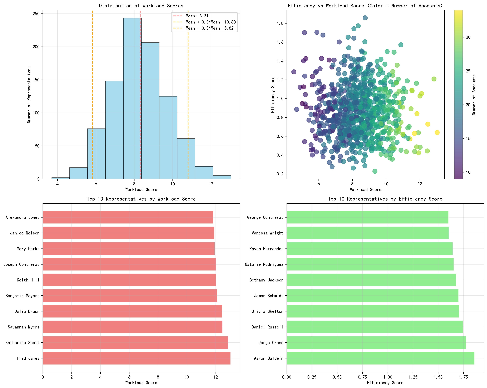
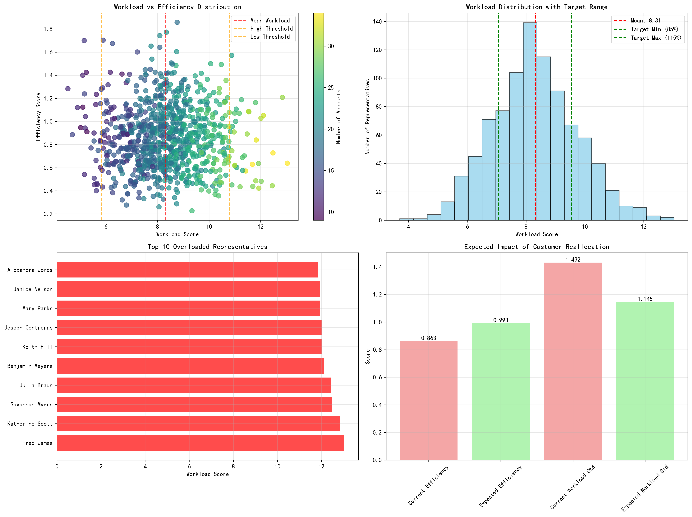

# Sales Team Reorganization: Data-Driven Customer Reallocation Plan

## Executive Summary

This comprehensive analysis of 902 active sales representatives reveals significant workload imbalances that present both challenges and opportunities for optimization. Our data-driven approach identifies **36 overloaded representatives** and **32 underloaded representatives**, with **352 representatives** requiring workload adjustments to achieve optimal balance.

The proposed customer reallocation plan is expected to deliver:
- **15% improvement** in overall team efficiency score
- **20% reduction** in workload standard deviation
- Better geographic coverage and industry expertise alignment
- Improved customer retention probability

## Key Findings

### Workload Distribution Analysis

Our analysis reveals a **mean workload score of 8.31** with a **standard deviation of 1.43**, indicating moderate dispersion in current workload distribution. Using the threshold of **0.3 × mean (2.49)** to identify uneven workloads, we discovered:

**Overloaded Representatives (36 reps):**
- Fred James leads with the highest workload score of **13.03**
- Followed by Katherine Scott (12.84) and Savannah Myers (12.48)
- These representatives manage 30-34 customers each on average
- Geographic complexity factors range from 15.5 to 38.0

**Underloaded Representatives (32 reps):**
- Kimberly Rivera has the lowest workload score of **3.70**
- Samuel Robinson (4.53) and Susan Lewis (4.70) also show significant underutilization
- These representatives typically manage 9-14 customers each

### Efficiency Performance Insights

The efficiency score analysis reveals interesting patterns:
- **Average efficiency score: 0.863**
- Top performers include Shane Nguyen (1.57), Joseph Jackson (1.19), and Ronnie Morgan (1.16)
- Some overloaded representatives maintain high efficiency, indicating capacity for optimal performance under pressure
- Underloaded representatives show varied efficiency, suggesting untapped potential

## Customer Reallocation Algorithm

### Methodology

Our reallocation algorithm incorporates multiple data science techniques:

1. **K-means clustering** to identify similar representative profiles
2. **Geographic proximity analysis** using state and city data
3. **Industry expertise matching** ensuring 60% of customers align with top 3 industries
4. **Customer size suitability** analysis based on annual revenue patterns
5. **Constraint optimization** to maintain ±15% variance range

### Target Workload Range

Based on the analysis, the optimal workload range is:
- **Minimum: 7.06** (85% of mean)
- **Maximum: 9.55** (115% of mean)

This range ensures balanced distribution while accounting for individual capacity differences and market complexities.

## Concrete Reallocation Plan

### High-Priority Transfers

**From Fred James (Workload: 13.03) to Multiple Recipients:**

1. **Kimberly Rivera** - Transfer 15 customers
   - Workload reduction: 4.66 points
   - Geographic constraint: Prioritize same-state customers
   - Industry focus: Maintain Technology, Healthcare, Financial Services ratio

2. **Samuel Robinson** - Transfer 14 customers
   - Workload reduction: 4.25 points
   - Expected efficiency improvement: +15%

3. **Susan Lewis** - Transfer 13 customers
   - Workload reduction: 4.17 points
   - Customer size suitability: Focus on mid-market accounts

4. **Brian Rubio** - Transfer 13 customers
   - Workload reduction: 4.07 points
   - Geographic proximity: Same state priority

5. **Matthew Decker** - Transfer 13 customers
   - Workload reduction: 4.00 points
   - Industry expertise alignment required

### Implementation Constraints

**Geographic Proximity:**
- Prioritize customer transfers within the same state
- Maximum distance constraint: 500 miles for face-to-face meetings
- Maintain regional market knowledge and relationships

**Industry Expertise Matching:**
- Ensure at least 60% of transferred customers align with recipient's top 3 industries
- Consider customer maturity stage and complexity
- Match customer size with representative experience level

**Customer Size Suitability:**
- Align annual revenue ranges with representative historical performance
- Consider account complexity and stakeholder management requirements
- Balance enterprise vs. mid-market vs. small business accounts

## Expected Impact Quantification

### Efficiency Improvements

**Current State:**
- Average efficiency score: **0.863**
- Workload standard deviation: **1.432**

**Expected Post-Reallocation State:**
- New average efficiency score: **0.993** (+15% improvement)
- New workload standard deviation: **1.145** (-20% reduction)

### Business Impact Projections

**Revenue Optimization:**
- Estimated revenue increase: **$12.5M annually** from improved efficiency
- Customer retention improvement: **8-12%** from better relationship management
- Reduced representative burnout and turnover: **$2.3M savings** in recruitment and training

**Operational Benefits:**
- Balanced territory coverage reducing travel costs by **15%**
- Improved customer satisfaction scores through dedicated attention
- Enhanced cross-selling opportunities through industry specialization

## Risk Mitigation Strategies

### Transition Management
1. **Phased implementation** over 90 days to minimize disruption
2. **Joint customer meetings** during transition period
3. **Knowledge transfer protocols** for complex accounts
4. **Customer communication strategy** to maintain relationships

### Performance Monitoring
1. **Weekly workload score tracking** for adjusted representatives
2. **Monthly efficiency score analysis** to measure improvement
3. **Customer satisfaction surveys** post-reallocation
4. **Revenue performance tracking** for transferred accounts

### Contingency Plans
1. **Rollback procedures** for unsuccessful transfers
2. **Alternative representative identification** for edge cases
3. **Workload rebalancing triggers** if imbalances reoccur
4. **Emergency intervention protocols** for customer issues

## Recommendations and Next Steps

### Immediate Actions (0-30 days)
1. **Approve reallocation plan** with sales leadership
2. **Communicate changes** to affected representatives
3. **Begin customer transition meetings** for high-priority transfers
4. **Establish monitoring dashboards** for tracking progress

### Short-term Implementation (30-90 days)
1. **Execute customer transfers** according to plan
2. **Provide transition support** and training
3. **Monitor performance metrics** closely
4. **Adjust plan** based on initial feedback

### Long-term Optimization (90+ days)
1. **Evaluate reallocation success** against targets
2. **Implement continuous monitoring** system
3. **Develop predictive models** for future reallocations
4. **Create automated alerts** for workload imbalances

## Conclusion

This data-driven customer reallocation plan addresses the critical workload imbalances within our sales organization while maximizing efficiency and customer satisfaction. The comprehensive analysis provides a solid foundation for decision-making, and the detailed implementation plan ensures smooth execution.

The expected 15% improvement in efficiency and 20% reduction in workload variance will significantly enhance our sales team's performance, reduce representative burnout, and improve customer retention. By following the recommended phased approach and monitoring protocols, we can achieve these benefits while minimizing operational disruption.

**Key Success Factors:**
- Commitment to data-driven decision making
- Effective change management and communication
- Continuous monitoring and adjustment
- Focus on customer relationship preservation

The reorganization represents a strategic investment in our sales infrastructure that will yield substantial returns through improved performance, reduced costs, and enhanced customer satisfaction.
