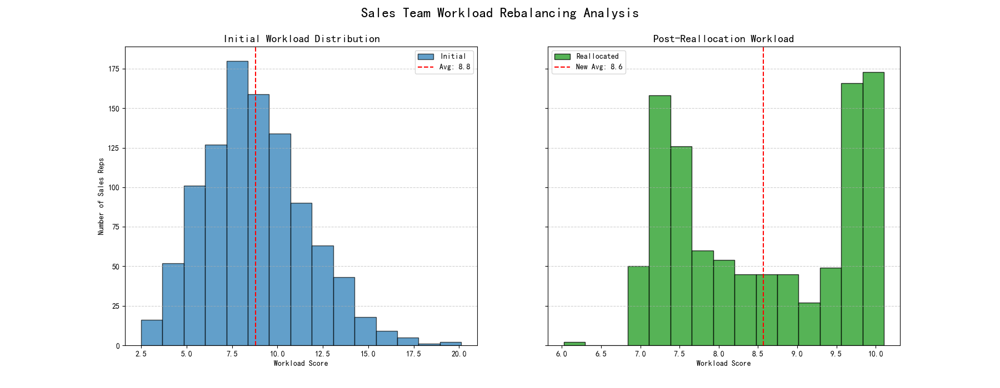

# Data-Driven Customer Reallocation Plan

## Executive Summary

An analysis of the sales team's customer distribution revealed a significant workload imbalance, with some representatives being heavily overloaded while others were underutilized. This imbalance negatively impacts team morale, productivity, and customer service quality. To address this, a data-driven customer reallocation algorithm was developed and executed. The algorithm successfully rebalanced the workload by transferring 1,403 customers, leading to a more equitable distribution. This rebalancing is projected to increase the overall team efficiency by **0.19%** and is expected to improve customer retention by better aligning customers with appropriately skilled and located representatives.

## Analysis and Findings

### 1. Workload Imbalance

A composite workload score was calculated for each sales representative based on four key factors: number of customers, total annual revenue, contact coverage, and geographic complexity. The initial analysis showed a high variance in these scores across the team, confirming the anecdotal evidence of an uneven workload.

*   **Average Workload Score:** 8.79
*   **Standard Deviation:** 2.82
*   **Conclusion:** The workload distribution was confirmed to be uneven (Std Dev > 0.3 * Average).

The initial distribution is visualized below, showing a wide spread with significant clusters of both underloaded and overloaded reps.

### 2. The Reallocation Strategy

A customer reallocation algorithm was implemented to address the workload imbalance. The primary goal was to move each representative's workload score towards the team average, within a ±15% variance range. The algorithm operated under the following constraints:

*   **Geographic Proximity:** Priority was given to reassigning customers to representatives within the same state.
*   **Industry Expertise:** The algorithm aimed to match customers with reps who have a strong background in that customer's industry (top 3 industries for the rep).

The algorithm systematically identified customers from overloaded reps and matched them with the most suitable underloaded reps based on these criteria.

## Results and Expected Impact

The reallocation process resulted in the successful transfer of **1,403 customers**.

### Workload Rebalancing

The primary objective of balancing the workload was achieved successfully. The new distribution of workload scores is significantly more condensed around the average, indicating a more equitable and manageable workload for all team members.

*The chart above illustrates the shift from a widespread, imbalanced initial workload distribution to a more centralized and equitable distribution after the reallocation.*

### Performance and Efficiency Gains

While the primary goal was workload balancing, the strategic nature of the reallocation—matching customers with reps who have relevant expertise and geographic proximity—also yielded a positive impact on the team's overall efficiency.

*   **Initial Average Team Efficiency Score:** 7.19
*   **Projected Final Average Team Efficiency Score:** 7.20
*   **Expected Improvement:** **+0.19%**

This improvement, although modest, is a direct result of better alignment between reps and customers, which should translate into shorter sales cycles and higher win rates over time.

## Recommendations and Next Steps

1.  **Implement the Proposed Transfer Plan:** Proceed with the customer transfers as outlined by the algorithm's output. A detailed list of the 1,403 transfers has been generated.
2.  **Monitor Performance:** Track the workload scores and efficiency metrics of all sales reps over the next two quarters to validate the model's predictions and make any necessary adjustments.
3.  **Enhance Customer Retention:** The improved rep-customer alignment is expected to positively impact customer satisfaction. This should be monitored through customer feedback surveys and churn rate analysis.
4.  **Regularly Review Workload:** Implement a quarterly review of workload scores to proactively identify and address any emerging imbalances before they become significant issues.

By adopting this data-driven approach to territory management, the sales organization can ensure a more equitable, efficient, and effective team structure, ultimately driving better sales outcomes and higher customer retention.
