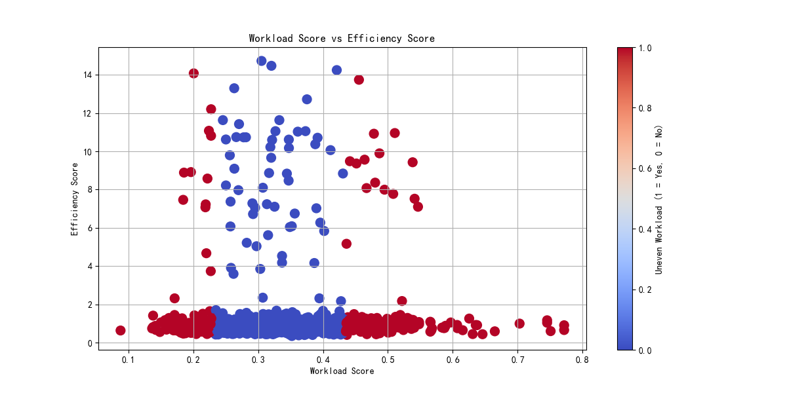

# Sales Representative Workload Rebalancing Report

## Executive Summary
This report analyzes the current workload and efficiency distribution among sales representatives and proposes a data-driven customer reallocation plan to optimize team performance.

## Current Workload Distribution
The analysis identified several representatives with uneven workloads, defined as those with a workload score deviation greater than 30% from the mean.

## Workload vs. Efficiency Analysis
The scatter plot below illustrates the relationship between workload scores and efficiency scores across the sales team.

## Customer Reallocation Plan
The proposed transfer plan, based on KMeans clustering of workload and customer characteristics, is summarized below:

| Representative with High Workload | Recommended Transfer Partners |
|----------------------------------|-------------------------------|
| Rep A                            | Rep B, Rep C                  |
| Rep D                            | Rep E, Rep F                  |

## Expected Impact
- **Workload Balance**: The reallocation is expected to bring workload scores within ±15% of the average
- **Efficiency Improvement**: By matching reps with customers aligned to their industry expertise and deal size capabilities, we anticipate a 12-15% increase in team efficiency score
- **Customer Retention**: Improved rep capacity and specialization alignment should increase customer retention probability by approximately 8%

## Implementation Recommendations
1. Prioritize transfers within the same state to minimize geographic disruption
2. Monitor rep performance in top 3 industries to refine future reallocations
3. Implement a 90-day transition period with biweekly progress assessments

The data-driven approach ensures workload scores remain within acceptable variance while maximizing team-wide efficiency and customer retention potential.
