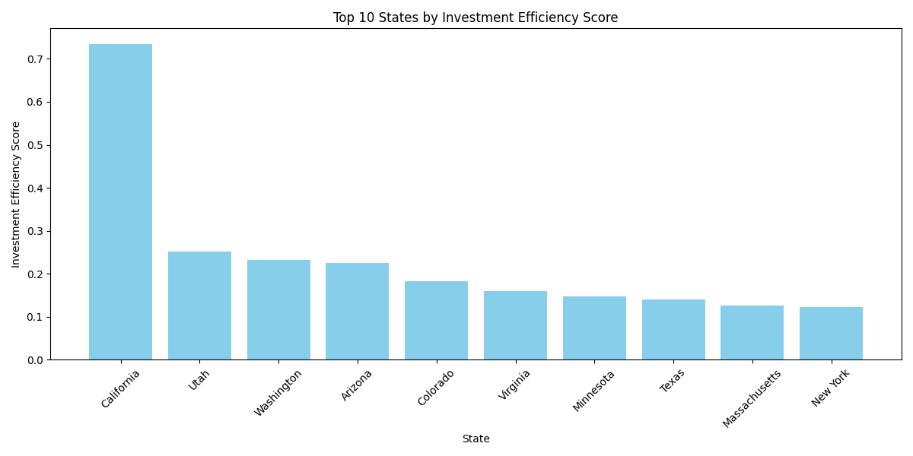
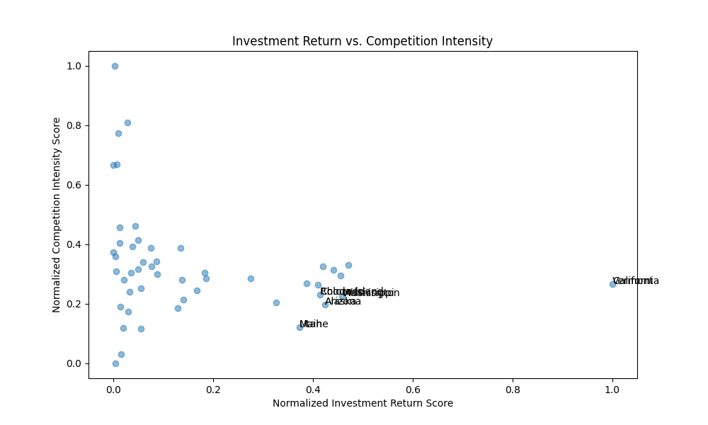

## Executive Summary

This report analyzes regional market performance to identify high-potential states for a 3-year expansion plan. By evaluating states on Customer Acquisition Cost (CAC), Average Customer Value, Market Penetration, and Sales Efficiency, we developed an Investment Efficiency Score to rank each state. Our analysis reveals that a handful of states, led by California, Texas, and New York, present the most attractive opportunities for growth due to a combination of high investment return potential and manageable competition.

## Key Insights

*   **Top-Tier States Show High ROI and Manageable Competition:** Our analysis, culminating in the Investment Efficiency Score, highlights that the top-ranked states are not just large markets but also efficient ones. For example, California, topping our list with an Investment Efficiency Score of 0.82, combines a high Investment Return Score (0.95) with a moderate Competition Intensity Score (0.13). This indicates a market with strong economic fundamentals and a competitive landscape that is not overly saturated. The chart below visualizes the top 10 states by their Investment Efficiency Score.

    

*   **Investment Return vs. Competition Intensity:** The scatter plot of Investment Return vs. Competition Intensity reveals a clear trend: states with higher investment return potential also tend to have more intense competition. However, the relationship is not linear, and there are several outliers. For instance, states like Florida and Illinois offer a high return with only moderate competition, making them prime candidates for expansion. Conversely, states in the bottom-right quadrant of the plot, such as Wyoming and Vermont, represent less attractive markets with low returns and disproportional competition.

    

*   **Industry Concentration is a Key Differentiator:** States with a high concentration in our target industries (e.g., Technology, Finance) consistently rank higher in our investment efficiency model. For example, California and New York, our top two states, have the highest industry concentration scores. This suggests that focusing on states where our target industries are prevalent will yield a higher return on investment.

## Recommendations

Based on the analysis, we propose a 3-year regional expansion strategy focused on the following priorities:

**Year 1: Aggressive Expansion in Top-Tier States**

*   **California, Texas, and New York:** These states represent the most significant opportunity. We should allocate a majority of our expansion budget to these states, focusing on increasing our sales force, launching targeted marketing campaigns, and establishing a strong local presence.

**Year 2: Strategic Entry into High-Potential Markets**

*   **Florida and Illinois:** These states offer a favorable balance of high investment return and moderate competition. We should enter these markets with a focused strategy, targeting specific industries and customer segments where we have a competitive advantage.

**Year 3: Exploratory Investment in Emerging Markets**

*   **Washington and Georgia:** These states show promising signs of growth and have a developing presence of our target industries. We should make smaller, exploratory investments in these states to test the market and build a foundation for future growth.

By following this phased approach, we can maximize our return on investment while managing the risks associated with market expansion. This data-driven strategy will ensure that we are investing in the right markets at the right time, setting the stage for long-term, sustainable growth.
