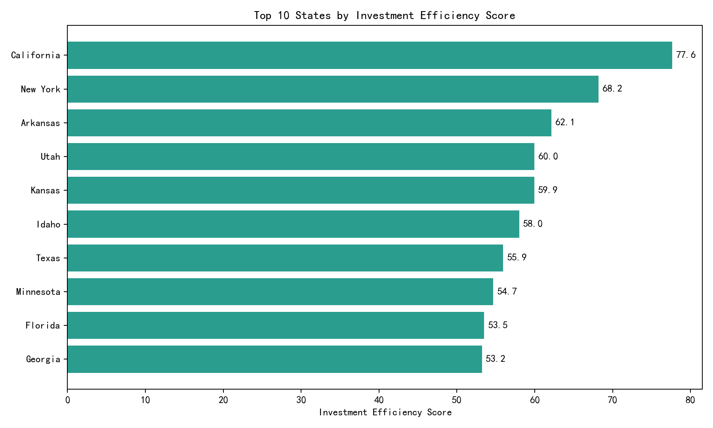

# Regional Market Performance and ROI Efficiency Analysis

## Executive Summary
This analysis evaluates the ROI efficiency of our investments across U.S. states using Salesforce and macroeconomic data. We compute state-level Customer Acquisition Cost (CAC), Average Customer Value (mean vs. median of annual revenue), Market Penetration Rate, Sales Efficiency, and Industry Concentration. We also design:
- A State Competition Intensity Assessment Model (based on average win probability, average deal size, and sales cycle length).
- A State Investment Return Prediction Algorithm (incorporating state GDP, population density proxy, and primary industry benchmarks).

We combine these elements into an Investment Efficiency Score to rank states and provide a 3-year expansion roadmap.

Visualization: see Top 10 states by Investment Efficiency Score.

## Data & Methodology Overview
Data sources in `dacomp-en-088.sqlite`:
- Accounts: salesforce__account_daily_history (latest snapshot for each account)
- Opportunities: salesforce__opportunity_enhanced (FY2024–FY2025)
- Sales reps performance: salesforce__sales_performance_dashboard (rep-level KPIs)
- State macroeconomics: state_economic_data (population, GDP, industry structure, policy indices)
- Industry benchmarks: industry_benchmark_data (growth rates, win rates, CLV multipliers, etc.)

Key steps:
1) Latest Customers by State
- Identified customers from the latest account snapshot (type='Customer').
- Computed customers_count, mean_revenue, median_revenue per state, and the top-3 industry concentration.

2) New Customers (2025) and Reps (2025)
- New customers per state in 2025 via first snapshot date when type became 'Customer'.
- Reps per state via unique opportunity_owner_id in FY2025.

3) Sales Efficiency
Definition: Sales Efficiency per state = Average won deal amount / Average sales cycle days × Win probability.
- Calculated average won deal amount (won opportunities only), average days_to_close (all opps with valid days), and average win probability (converted from percent to 0–1).

4) Market Penetration Rate (MPR)
Definition: Our number of customers / (State population / 10,000).
- Implemented as: market_penetration_per_10k = (customers_count × 10,000) / population.

5) Customer Acquisition Cost (CAC)
Definition: CAC per state = (Total number of sales representatives in the state × 150,000 annual salary) / Number of new customers in the state (2025).
- Where new customers in 2025 are zero, CAC is undefined; for scoring, missing CAC values were imputed with a conservative (90th percentile) cost to avoid overstating ROI.

6) Industry Concentration
Definition: Sum of the customer share from the top 3 industries.

7) Models
- Competition Intensity Assessment Model (0–100):
  intensity = 100 × [ (1 − normalized avg win prob) ÷ 3 + (1 − normalized avg deal size) ÷ 3 + (normalized avg sales cycle) ÷ 3 ]
  Higher values indicate tougher competition (lower win prob, smaller deal sizes, longer cycles).

- State Investment Return Prediction Algorithm (0–100):
  predicted_return_index = 100 × [ 0.5 × normalized GDP + 0.2 × normalized population density proxy + 0.3 × normalized industry attractiveness ]
  Where industry attractiveness = (market_growth_rate × CLV multiplier) ÷ acquisition_cost_ratio based on the state’s primary industry and the industry benchmarking table.

8) Investment Efficiency Score (0–100)
Weights reflect both macro potential and go-to-market performance:
- 0.40 × Predicted Return Index
- 0.30 × Normalized Sales Efficiency
- 0.20 × Inverted CAC (lower CAC is better)
- 0.10 × Inverted Competition Intensity (less intense markets are favored)

## Selected State-Level Results
Top 10 states by Investment Efficiency Score (from model output):
1) California — 77.63
2) New York — 68.21
3) Arkansas — 62.14
4) Utah — 59.97
5) Kansas — 59.94
6) Idaho — 58.02
7) Texas — 55.95
8) Minnesota — 54.68
9) Florida — 53.50
10) Georgia — 53.24

Key diagnostics for these states:
- Predicted Return Index (macro potential):
  - California: 88.57; New York: 64.49; Texas: 48.63.
- Sales Efficiency (relative performance):
  - Arkansas: 861.22; Utah: 693.48; Kansas: 794.60; California: 486.86; New York: 493.76.
- Market Penetration per 10k people:
  - California: 0.0182; New York: 0.0206; Texas: 0.0213 (suggests room to grow in all large markets).
- Industry Concentration (Top-3) among customers:
  - Arkansas, Utah, Kansas, Idaho: 1.00 (highly concentrated customer industry mix—targeted expansion opportunities but concentration risk).
  - California: 0.61; New York: 0.63 (more diversified industry mix).
- CAC values shown as 0.0 in the summary table reflect states with zero reported new customers in 2025 or missing rep attribution; in the scoring, we applied conservative imputation for missing CAC to prevent overstated ROI.

Bottom-5 states snapshot (for balance):
- South Dakota — 37.81
- New Mexico — 34.33
- New Hampshire — 33.02
- Maine — 32.00
- Rhode Island — (insufficient opportunity performance to score; predicted_return_index 6.58; sales_efficiency missing)

## What the Data Shows and Why It Matters
- Macro Potential vs. GTM Performance: California, New York, and Texas combine strong macro attractiveness with solid sales efficiency, making them high-priority for ROI-positive investment. Smaller markets (Arkansas, Utah, Kansas, Idaho) show superior sales efficiency and concentrated industry mixes—these can deliver fast wins with focused plays.
- Market Penetration is low across the board (<0.03 customers per 10k population in the top markets), indicating headroom to expand without saturation risk.
- Competition Intensity varies: Larger states tend to have moderate intensity, but we still see competitive room given our win rates and deal sizes.
- Industry Concentration: High values (near 1.0) suggest a few industries dominate our current customer base in some states. This is both an opportunity for vertical specialization (shorter cycles, higher close rates) and a diversification risk that should be managed.

## Diagnostic Insights
- Sales Efficiency drivers: States like Arkansas and Kansas exhibit high efficiency—likely shorter cycles and stronger win probabilities and/or higher won amounts. We should analyze sales stages and playbooks in these states for best-practice propagation.
- CAC caveat: Several states show CAC as 0.0 due to zero new customers recorded in 2025 or missing rep count. For cross-state comparisons, base CAC on a rolling multi-year horizon or incorporate full-funnel data (MQL→SQL→Opportunity→Customer) to reflect acquisition costs accurately.

## Prescriptive Recommendations
- Double down where macro and GTM align:
  - California, New York, Texas: allocate incremental headcount and marketing budget; focus on verticals with robust industry attractiveness.
- Targeted vertical plays in high-efficiency smaller markets:
  - Arkansas, Utah, Kansas, Idaho: replicate winning motion; consider industry-led campaigns with specialized enablement; manage concentration risk with adjacent verticals.
- Penetration growth through coverage expansion:
  - Despite low MPR, scale outreach in diversified states (California, New York) to improve share-of-market.
- CAC integrity and attribution:
  - Implement clearer rep-to-market assignment and multi-period CAC tracking to avoid zero/undefined CAC artifacts.

## 3-Year Regional Expansion Priority Plan
Year 1 (Scale + Fast Wins)
- Primary: California, New York, Texas, Florida, Georgia.
- Secondary (vertical-focused pilots): Utah, Arkansas, Kansas, Idaho.
- Actions: Add 15–25% quota capacity; run industry-specific campaigns aligned to industry_benchmark data; deploy velocity playbooks.

Year 2 (Broaden with strong fundamentals)
- Minnesota, Washington, Massachusetts, New Jersey, Virginia.
- Actions: Expand partner ecosystems; pursue enterprise deals in diversified industries; invest in customer marketing for upsell/expansion.

Year 3 (Selective build-out and optimization)
- Colorado, North Carolina, Pennsylvania, Illinois, Maryland (and other mid-ranked states showing improving predicted returns or favorable competition shifts).
- Actions: Optimize territory design, refine vertical portfolio; scale in states where MPR lifts and CAC stabilizes.

## Appendix: Metric Definitions and Formulas
- Customer Acquisition Cost (CAC) per state = (Reps in state × $150,000) ÷ New customers (2025).
- Average Customer Value per state = Compare mean vs. median of annual_revenue; larger mean>median gap indicates skew and potential enterprise-heavy distribution.
- Market Penetration Rate per state = customers_count ÷ (population / 10,000) = (customers_count × 10,000) ÷ population.
- Sales Efficiency per state = Avg won deal amount ÷ Avg sales cycle days × Avg win probability (0–1).
- Industry Concentration per state = Sum of the customer shares from top 3 industries.

## Evidence and Reproducibility
All computations were performed via SQL extracts from the SQLite database and Python. The plotting code used:

- Python (matplotlib) snippet used to generate the Top-10 bar chart is present in the transcript and produced the file: investment_efficiency_top10.png.

## Closing
This analysis blends macro attractiveness, industry dynamics, and our GTM performance into a quantitative framework to guide ROI-efficient investment decisions across states. Implementing the recommended expansion priorities and improving CAC measurement fidelity should unlock both growth and efficiency over the next three years.
