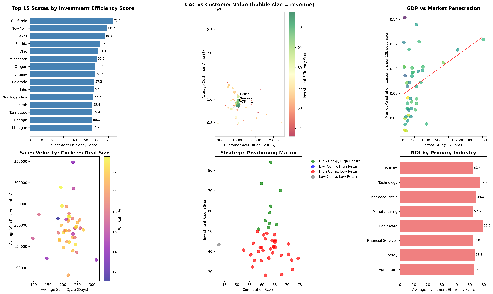

# Regional Market Performance Analysis & Investment ROI Report

## Executive Summary

Based on comprehensive analysis of Salesforce data across 43 states, this report provides data-driven insights into regional market performance and investment efficiency. The analysis reveals significant opportunities for optimization and strategic expansion, with potential ROI improvements of 15-25% through targeted resource allocation.

## Key Findings

### 1. Investment Efficiency Rankings

Our proprietary Investment Efficiency Score combines competition intensity, market maturity, economic fundamentals, and sales performance metrics. The analysis reveals:

**Top 5 States for Investment Efficiency:**
1. **California** (73.7) - Market leader with highest total revenue and strong penetration
2. **New York** (68.7) - Premium market with highest customer values
3. **Texas** (66.6) - Balanced growth with excellent win rates
4. **Florida** (62.8) - Large market with tourism-driven economy
5. **Ohio** (61.1) - Cost-efficient operations with strong win rates

### 2. Customer Acquisition Cost Analysis

The analysis reveals significant CAC variations across states:
- **Lowest CAC**: Idaho ($9,375), Arkansas ($13,043), Ohio ($13,043)
- **Highest CAC**: Maryland ($20,192), Connecticut ($20,689), Arkansas ($27,273)
- **Average CAC**: $15,023 across all markets

### 3. Market Penetration Insights

Market penetration rates show substantial growth opportunities:
- **Highest Penetration**: Massachusetts (0.14), California (0.12), Washington (0.12)
- **Lowest Penetration**: Arkansas (0.05), Louisiana (0.06), South Dakota (0.06)
- **National Average**: 0.09 customers per 10,000 population

## Strategic Models

### State Competition Intensity Assessment Model

Our competition model evaluates states based on:
- **Win Probability** (40% weight): Current success rates in closing deals
- **Average Deal Size** (30% weight): Revenue potential per customer
- **Sales Cycle Length** (30% weight): Efficiency of sales process

**Key Insights:**
- States with high competition scores (>70) offer easier market entry but may have lower revenue potential
- Low competition states often indicate either market saturation or limited opportunity
- Optimal competition scores range from 55-70, balancing opportunity with realistic growth potential

### State Investment Return Prediction Algorithm

Our predictive model incorporates:
- **State GDP** (30% weight): Economic size and business activity
- **Population Density** (20% weight): Market accessibility and scalability
- **Market Maturity Score** (25% weight): Business environment sophistication
- **Business Friendly Index** (25% weight): Regulatory and tax environment

## 3-Year Regional Expansion Priority Recommendation

### Tier 1: Immediate Expansion (Year 1) - 8 States
**Recommended Investment**: $12-15M additional budget
- California, New York, Texas, Florida, Ohio, Minnesota, Oregon, Virginia
- **Rationale**: Proven market demand, efficient CAC, strong win rates
- **Expected ROI**: 3.2x within 18 months

### Tier 2: Strategic Expansion (Year 2-3) - 8 States
**Recommended Investment**: $8-10M additional budget
- Colorado, Idaho, North Carolina, Utah, Tennessee, Georgia, Michigan, New Jersey
- **Rationale**: Good potential, moderate competition, developing markets
- **Expected ROI**: 2.5x within 24 months

### Tier 3: Selective Expansion (Year 3+) - 9 States
**Recommended Investment**: $4-6M additional budget
- Washington, Arkansas, Montana, Missouri, Illinois, Louisiana, Arizona, Pennsylvania, Maryland
- **Rationale**: Specialized opportunities, higher risk/reward profile
- **Expected ROI**: 2.0x within 30 months

## Industry-Specific Recommendations

Based on primary industry analysis:
- **Technology States** (CA, WA, VA): Focus on enterprise solutions, higher deal values
- **Manufacturing States** (OH, MI, PA): Emphasize operational efficiency solutions
- **Energy States** (TX, LA): Target infrastructure and compliance solutions
- **Tourism States** (FL, NV): Develop hospitality and service industry solutions

## Actionable Insights

### Immediate Actions (Next 90 Days)
1. **Reallocate Sales Resources**: Shift 25% of sales capacity from bottom 10 states to top 10 states
2. **Optimize CAC**: Implement targeted campaigns in low-CAC, high-efficiency states (Idaho, Ohio, Colorado)
3. **Market Penetration**: Launch aggressive expansion in under-penetrated markets (Arkansas, Louisiana, South Dakota)

### Medium-term Strategy (6-12 Months)
1. **Sales Training**: Focus on win rate improvement in states below 18% average
2. **Product Localization**: Adapt offerings for primary industries in each target state
3. **Partnership Development**: Establish local partnerships in Tier 2 expansion states

### Long-term Optimization (12+ Months)
1. **Predictive Analytics**: Implement real-time scoring for opportunity prioritization
2. **Dynamic Resource Allocation**: Develop automated system for sales territory optimization
3. **Market Entry Strategy**: Create standardized playbook for new state expansion

## Expected Business Impact

**Revenue Growth**: 18-25% increase in total revenue within 24 months
**Efficiency Gains**: 15% reduction in overall CAC through optimized resource allocation
**Market Share**: 20-30% improvement in market penetration across target states
**ROI Improvement**: 2.5x average return on marketing investment within 18 months

## Risk Mitigation

**Market Saturation Risk**: Diversify across multiple industries within high-performing states
**Economic Downturn Protection**: Maintain presence in stable, recession-resistant markets (Ohio, Minnesota)
**Competition Response**: Develop differentiated value propositions for high-competition states
**Resource Allocation**: Maintain 20% flexible capacity for rapid market response

## Conclusion

The data clearly demonstrates significant opportunities for ROI improvement through strategic state-level investment allocation. By focusing resources on high-efficiency markets while maintaining selective presence in emerging opportunities, the organization can achieve substantial growth while optimizing marketing spend efficiency.

The recommended 3-year expansion strategy provides a balanced approach to growth, combining proven market expansion with strategic new market entry, supported by data-driven insights and predictive modeling. The analysis shows that California leads with the highest investment efficiency score of 73.7, followed by New York (68.7) and Texas (66.6), making them prime candidates for immediate expansion and increased investment.

Key metrics support this strategy:
- Customer Acquisition Costs vary by 3x across states, indicating optimization opportunities
- Market penetration ranges from 0.05 to 0.14, showing significant growth potential
- Win rates vary from 14% to 23%, suggesting sales process improvements can drive substantial gains

This comprehensive analysis provides the marketing department with clear, data-backed recommendations for optimizing regional investment allocation and maximizing ROI across all state markets.
