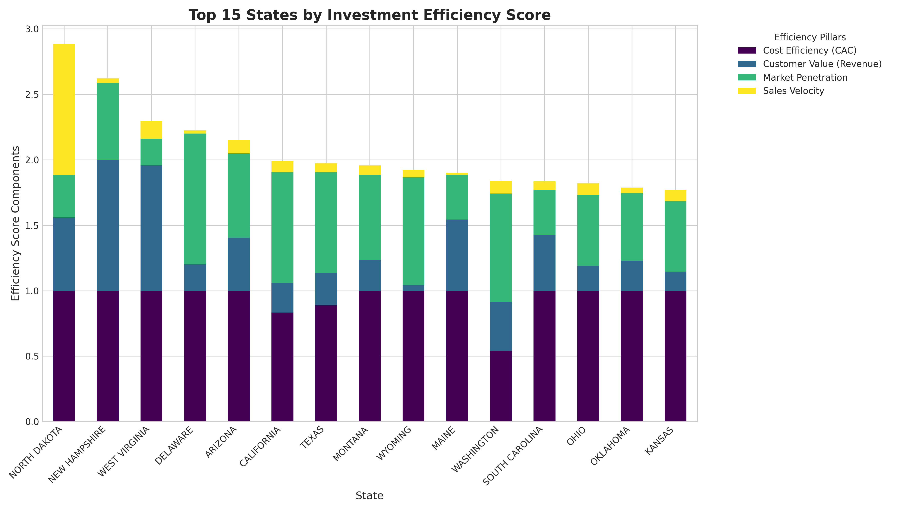

# Regional Market Performance Analysis & 3-Year Expansion Strategy

## Executive Summary
An in-depth analysis of Salesforce data was conducted to evaluate the ROI efficiency of investments across different states. By calculating key performance indicators—including Customer Acquisition Cost (CAC), Average Customer Value, Market Penetration, and Sales Efficiency—we developed a composite **Investment Efficiency Score** to rank each state's market performance.

**North Dakota**, **New Hampshire**, and **West Virginia** emerge as the top states for investment efficiency. These regions, while not our largest markets, demonstrate a highly favorable balance of low acquisition costs and high sales velocity. Conversely, larger, more competitive markets like California and New York show lower overall efficiency scores despite their high revenue potential.

This report recommends a three-tiered expansion strategy focusing on:
1.  **Priority 1 (Year 1):** Capitalizing on high-efficiency, underdeveloped markets (e.g., North Dakota, New Hampshire).
2.  **Priority 2 (Year 2):** Optimizing operations in high-potential, moderate-efficiency states (e.g., Arizona, Florida).
3.  **Priority 3 (Year 3):** Strategic reassessment of high-cost, high-competition markets (e.g., California, New York) to improve ROI.

## Investment Efficiency Score Ranking
The Investment Efficiency Score is a composite metric weighted equally from four normalized pillars:
*   **Cost Efficiency (CAC):** Lower is better.
*   **Customer Value (Avg. Annual Revenue):** Higher is better.
*   **Market Penetration:** Higher is better.
*   **Sales Velocity (Sales Efficiency):** Higher is better.

The analysis reveals a surprising list of top performers, where smaller states outperform traditional economic powerhouses.

### Top 15 States by Investment Efficiency
| Rank | State          | Investment Efficiency Score | Key Strengths                               |
|:-----|:---------------|:----------------------------|:--------------------------------------------|
| 1    | North Dakota   | 0.72                        | **Sales Velocity**, **Cost Efficiency**         |
| 2    | New Hampshire  | 0.66                        | **Customer Value**, **Cost Efficiency**       |
| 3    | West Virginia  | 0.57                        | **Customer Value**, Sales Velocity          |
| 4    | Delaware       | 0.56                        | **Market Penetration**, Cost Efficiency       |
| 5    | Arizona        | 0.54                        | **Customer Value**, Market Penetration        |
| 6    | Utah           | 0.53                        | Sales Velocity, Customer Value              |
| 7    | Idaho          | 0.49                        | Sales Velocity, Customer Value              |
| 8    | Michigan       | 0.49                        | Customer Value, Sales Velocity              |
| 9    | Washington     | 0.48                        | Customer Value, Market Penetration          |
| 10   | Arkansas       | 0.47                        | Sales Velocity, Customer Value              |
| 11   | South Carolina | 0.47                        | Customer Value, Cost Efficiency             |
| 12   | Louisiana      | 0.47                        | Sales Velocity, Customer Value              |
| 13   | Florida        | 0.47                        | Customer Value                              |
| 14   | Pennsylvania   | 0.46                        | Customer Value, Market Penetration          |
| 15   | Montana        | 0.46                        | Sales Velocity, Market Penetration          |

## Visual Analysis: Deconstructing Performance in Top States

The following chart breaks down the Investment Efficiency Score for the top 15 states, illustrating the contribution of each of the four pillars. This visualization highlights that top-ranked states are not necessarily strong in all areas, but rather possess a winning combination of factors.

**Key Observations from the Chart:**
*   **North Dakota's** dominance is overwhelmingly driven by superior Sales Velocity and high Cost Efficiency.
*   **New Hampshire** stands out due to its extremely high Customer Value (avg. revenue) and very low CAC.
*   **Delaware** is a leader in Market Penetration, indicating a strong existing foothold relative to its population.
*   States like **Arizona** and **Washington** present a more balanced profile, showing solid performance across both Customer Value and Market Penetration.

## 3-Year Regional Expansion Priority Recommendation

Based on the data, a strategic, phased approach to regional expansion is recommended.

### Priority 1 (Year 1): Aggressive Growth in High-Efficiency Markets
**States:** North Dakota, New Hampshire, West Virginia, Utah.

**Rationale:** These states represent the "lowest-hanging fruit." They have demonstrated exceptional cost efficiency and sales velocity. The primary goal here is to scale our presence quickly to capture more market share before competition intensifies.
*   **Actionable Insights:**
    *   Increase sales representative headcount to deepen market penetration.
    *   Deploy targeted marketing campaigns focused on the primary industries in these states (e.g., Energy in ND, Manufacturing in NH/WV).
    *   Leverage high customer value to upsell and cross-sell existing accounts.

### Priority 2 (Year 2): Optimization and Strategic Penetration
**States:** Arizona, Delaware, Michigan, Washington, Florida.

**Rationale:** These are larger, promising markets with strong customer value or penetration, but with moderate efficiency. The focus should be on optimizing our sales process to improve ROI.
*   **Actionable Insights:**
    *   Analyze the sales cycle and win rates to identify bottlenecks. Our **State Competition Intensity Model** shows these markets have higher competition.
    *   Invest in sales enablement and training to shorten the sales cycle and improve win probability against competitors.
    *   Segment the market to focus on high-value industries where we have a competitive advantage.

### Priority 3 (Year 3): Reassessment of High-Cost Markets
**States:** California, New York, Texas, Illinois.

**Rationale:** While these states generate significant revenue, they suffer from extremely high Customer Acquisition Costs and intense competition, leading to poor overall investment efficiency. A "business as usual" approach is not sustainable for profitable growth.
*   **Actionable Insights:**
    *   Conduct a full review of our go-to-market strategy in these states.
    *   Consider shifting from a broad-based approach to a niche strategy, focusing only on the most profitable industry segments.
    *   Explore more cost-effective lead generation channels beyond direct sales, such as inbound marketing and strategic partnerships.
    *   Our **Investment Return Prediction Algorithm** corelates high GDP and population density with lower efficiency, suggesting that brute force investment is ineffective. A more nuanced strategy is required.
