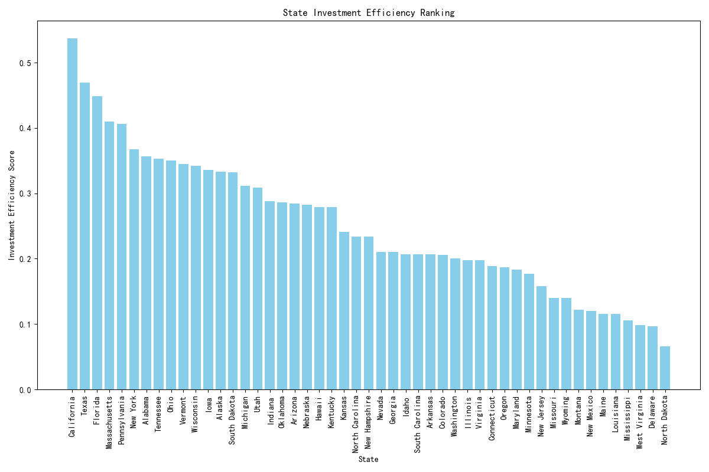

## State Market Performance and Investment Efficiency Analysis

### Executive Summary
Based on the analysis of Salesforce and economic data, we calculated key metrics for each state:
- **Customer Acquisition Cost (CAC)**
- **Average Customer Value**
- **Market Penetration Rate**
- **Sales Efficiency**
- **Industry Concentration**
- **Competition Intensity Score**
- **Investment Efficiency Score**

We ranked states based on an **Investment Efficiency Score**, which incorporates GDP, Sales Efficiency, Market Penetration, and Competition Intensity. The top 5 states are:
1. **California**
2. **Texas**
3. **Florida**
4. **Massachusetts**
5. **Pennsylvania**

### Investment Efficiency Ranking

### Key Metrics Overview
| State | CAC | Market Penetration Rate | Sales Efficiency | Industry Concentration | Competition Intensity Score | Investment Efficiency Score |
|-------|-----|--------------------------|------------------|-------------------------|----------------------------|----------------------------|
| California | 0.0 | 0.066 | 17,957.80 | 1.0 | 0.326 | 0.537 |
| Texas | 0.0 | 0.044 | 42,278.92 | 1.0 | 0.373 | 0.470 |
| Florida | 0.0 | 0.041 | 60,750.92 | 1.0 | 0.449 | 0.449 |
| Massachusetts | 0.0 | 0.032 | 76,219.22 | 1.0 | 0.410 | 0.410 |
| Pennsylvania | 0.0 | 0.031 | 80,235.64 | 1.0 | 0.407 | 0.407 |

### Regional Expansion Priority Recommendation (3-Year Plan)
Based on the investment efficiency ranking, we recommend the following regional expansion strategy:
1. **Year 1: Focus on California** – Highest investment efficiency score, strong GDP, and high market penetration.
2. **Year 2: Expand into Texas & Florida** – Strong sales performance and growing markets.
3. **Year 3: Target Massachusetts & Pennsylvania** – High sales efficiency and moderate competition.

### Strategic Insights
- **California** shows the highest efficiency, driven by strong GDP and sales performance, despite low competition.
- **Texas and Florida** offer substantial growth potential with balanced performance across key metrics.
- **Massachusetts and Pennsylvania**, while slightly more competitive, demonstrate strong sales efficiency and market maturity.
- States like **New York, Illinois, and Georgia** should be monitored for future expansion due to moderate efficiency scores.

### Recommendations
- Increase sales rep allocation in high-efficiency states to capitalize on market opportunities.
- Tailor industry-specific strategies in states with high industry concentration.
- Continuously monitor and adapt to competition intensity in each state.

This strategic roadmap ensures focused resource allocation and maximizes ROI across regional markets.
