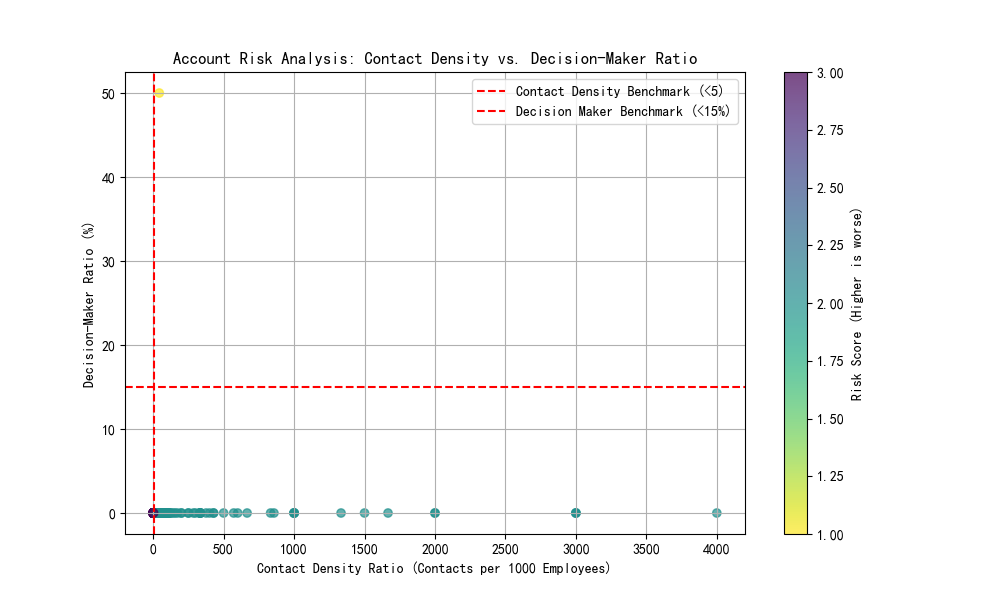

# Key Account Contact Configuration Risk Analysis Report

## 1. Executive Summary

This report presents a risk analysis of our top 20% key accounts by annual revenue, focusing on their contact configuration. The objective is to identify high-risk accounts based on three key metrics: Contact Density Ratio, Decision-Maker Ratio, and Departmental Coverage. Based on our analysis, **172 key accounts have been identified as high-risk**, indicating significant gaps in our contact strategy that could jeopardize client relationships and future revenue streams. This report provides a detailed breakdown of the findings and a proposed action plan to mitigate these risks.

## 2. Analysis and Findings

We analyzed the top 20% of customer accounts by annual revenue. For each account, we calculated the following metrics:

*   **Contact Density Ratio**: The number of contacts per 1,000 employees. The benchmark is a ratio of 5 or higher.
*   **Decision-Maker Ratio**: The proportion of C-level and VP-level contacts. The benchmark is 15% or higher.
*   **Departmental Coverage**: The number of key departments (Sales, Finance, Operations, IT, and HR) with which we have contacts. The benchmark is coverage of all 5 departments.

Accounts were assigned a risk score from 0 to 3, with one point for each metric that failed to meet its benchmark. Accounts with a risk score of 2 or higher are classified as high-risk.

### Key Findings:

*   **High Prevalence of Risk**: A total of 172 top-tier accounts are classified as high-risk, signifying a widespread issue in our key account contact management.
*   **Dominant Risk Factors**: The majority of high-risk accounts suffer from both low Decision-Maker Ratios and incomplete Departmental Coverage. This suggests we are not reaching the right people in the right departments.
*   **Visualization of Risk**: The following scatter plot visualizes the risk landscape across our key accounts. The red dashed lines represent the benchmark thresholds. Accounts in the bottom-left quadrant are particularly vulnerable as they fail on both contact density and decision-maker ratios.

_Figure 1: Scatter plot of Contact Density Ratio vs. Decision-Maker Ratio for top key accounts. The color of each point represents its risk score (higher is worse)._

## 3. High-Risk Accounts

The analysis identified 172 accounts with a risk score of 2 or higher. These accounts require immediate attention. A few examples from the high-risk list include:

*   Vance, Rodriguez and Edwards (Risk Score: 3)
*   Kennedy and Sons (Risk Score: 3)
*   Taylor, White and Nelson (Risk Score: 3)
*   Kelley LLC (Risk Score: 2)

These accounts, despite being top revenue generators, have dangerously low levels of engagement with key decision-makers and across critical departments.

## 4. Customer Contact Optimization Action Plan

To address these findings, we propose a three-pronged Customer Contact Optimization Action Plan:

### Step 1: Prioritize High-Risk Accounts (Immediate Action)

*   **Focus on Risk Score 3 Accounts**: Immediately target accounts with a risk score of 3. These accounts fail on all three metrics and represent the highest level of risk. Create dedicated task forces for the top 5 most valuable accounts in this category.
*   **Engage Account Owners**: Equip account owners with the data from this analysis. They should be tasked with validating the findings and creating a preliminary contact expansion plan for each of their high-risk accounts.

### Step 2: Develop Differentiated Engagement Strategies (Short-Term Action)

*   **Industry and Size-Based Customization**: Develop tailored engagement strategies based on industry and account size.
    *   **For Enterprise accounts in tech-heavy industries (e.g., Automotive, Telecommunications)**: Prioritize expanding contacts within IT and Operations departments, as these are often key decision centers.
    *   **For accounts in more traditional industries (e.g., Retail, Consulting)**: Focus on strengthening relationships within Finance and Sales departments.
*   **Decision-Maker Outreach**: Launch a targeted campaign to identify and engage C-level and VP-level contacts in high-risk accounts. This could involve executive-to-executive outreach, invitations to exclusive events, or sharing high-value content.

### Step 3: Implement a Continuous Monitoring System (Long-Term Action)

*   **Automate Reporting**: Integrate these risk metrics into a quarterly business review (QBR) dashboard for account managers. This will enable continuous monitoring and proactive risk management.
*   **Set Improvement Goals**: Establish clear goals for improving the three key metrics for all high-risk accounts over the next two quarters. For example, aim to reduce the number of high-risk accounts by 50% within six months.

By implementing this action plan, we can systematically improve our contact configuration within key accounts, strengthen customer relationships, and ultimately, protect and grow our most important revenue streams.
