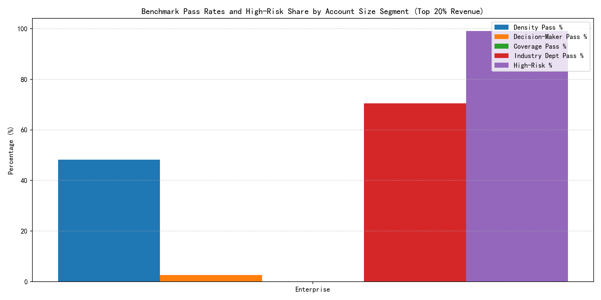
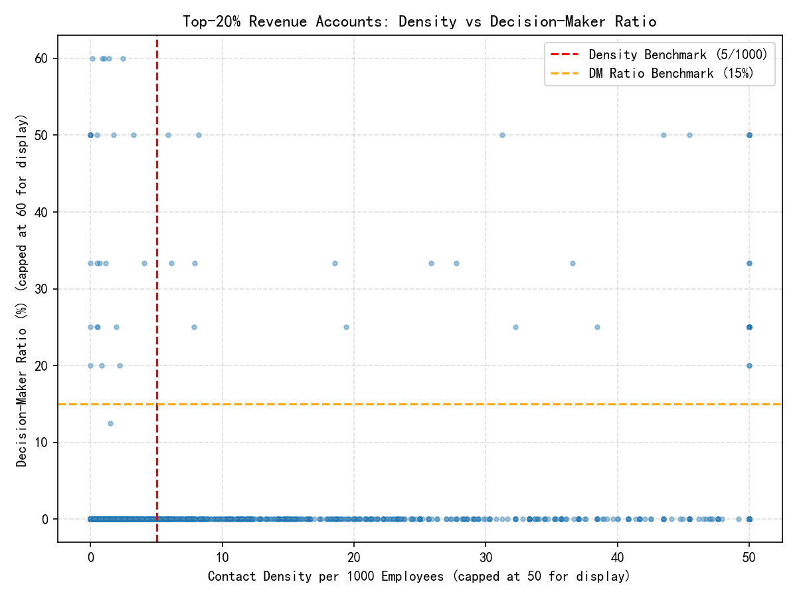

# Contact Configuration Risk Monitoring for Top-20% Revenue Accounts

## Executive Summary
We evaluated the top-20% revenue accounts (n=2,000) on three core contact risk dimensions: Contact Density (contacts per 1,000 employees), Decision-Maker Ratio (share of C-/VP-level contacts), and Departmental Coverage (Sales, Finance, Operations, IT, HR). Using differentiated standards by customer size and industry, we found materially elevated risk:

- Density pass rate: 48.3%; Decision-maker pass rate: 2.65%; Coverage pass rate: 0.0%; Industry-required department pass rate: 70.45%.
- Overall high-risk rate: 99.15% (fail count ≥2), with 953 High, 712 Moderate, 318 Severe, and only 17 Low risk.
- Departmental gaps are most acute in IT and HR; coverage_count distribution: 0 depts (804), 1 dept (818), 2 depts (322), 3 depts (53), 4 depts (3), 5 depts (0).
- Industries with the highest high-risk rates (min 20 accounts) include Agriculture, Telecommunications, Technology, Healthcare, Retail. IT coverage is missing for 96–100% of accounts in these industries; HR is missing for ~80–89%.

The immediate risk is concentration risk in key revenue accounts without sufficient senior stakeholder reach or departmental breadth. The prescriptive plan below prioritizes Severe and High accounts, adds the minimum number of contacts and senior decision-makers, and closes department gaps with industry-specific emphasis.

## Differentiated Assessment Standards
Baseline benchmarks: Density ≥ 5 per 1,000 employees; Decision-Maker Ratio ≥ 15%; Coverage: 5 key departments.

By size segment (applied for monitoring; in this top-quintile sample, all are Enterprise):
- Enterprise: Density ≥ 6.0; Decision-Maker Ratio ≥ 18%; Coverage ≥ 5.
- Mid-Market: Density ≥ 5.0; Decision-Maker Ratio ≥ 15%; Coverage ≥ 4.
- SMB: Density ≥ 4.0; Decision-Maker Ratio ≥ 12%; Coverage ≥ 3.
- Small: Density ≥ 3.5; Decision-Maker Ratio ≥ 10%; Coverage ≥ 3.
- Unknown: Density ≥ 5.0; Decision-Maker Ratio ≥ 15%; Coverage ≥ 4.

Industry-critical departments (must-have):
- Financial Services/Banking/Insurance: Finance.
- Manufacturing/Industrial/Retail/E-commerce/Healthcare/Pharma: Operations.
- Information Technology/Software/Telecommunications: IT.

Accounts missing the industry-critical department are flagged regardless of coverage count.

## What the Data Shows
- Nearly half (48.3%) meet density, but almost none meet decision-maker and coverage thresholds under Enterprise standards, indicating quality and breadth gaps rather than raw volume alone.
- Coverage gaps are pervasive: 80%+ of accounts lack IT or HR contacts; only three accounts cover four departments, none cover all five.
- Decision-maker shortfall is acute: only 2.65% pass the ≥18% Enterprise threshold, indicating insufficient C-/VP-level access.
- By industry, high-risk clustering appears in sectors where IT and Operations are critical, reinforcing the need for industry-specific coverage rules.

## Visual Diagnostics
- Segment-level pass rates and high-risk share

- Density vs Decision-Maker Ratio scatter against baseline benchmarks

Observations from visuals:
- High-risk share is extremely high among Enterprise accounts due to strict coverage and decision-maker criteria.
- The scatter shows a large population sitting below both the density and decision-maker thresholds, with a long tail of extremely high apparent density (often driven by very small employee counts) that still lacks senior representation.

## Risk Identification and Tiers
We define risk tiers by number of failed dimensions (density, decision-maker, coverage, industry-critical dept):
- Severe (fail 4): 318 accounts; High (fail 3): 953; Moderate (fail 2): 712; Low (≤1): 17.
- Average department gaps: Severe 4.44, High 4.22, Moderate 4.04, Low 3.53.

Scaled contact expansion needs by tier:
- High: add ~6,953 contacts and ~876 decision-makers; avg dept gaps ~4.22.
- Severe: add ~3,575 contacts and ~265 decision-makers; avg dept gaps ~4.44.
- Moderate: add ~203 contacts and ~727 decision-makers; avg dept gaps ~4.04.

Interpretation: High/Severe tiers require volume and breadth; Moderate needs fewer total contacts but a much higher upgrade in seniority mix.

## Prioritization Framework
Rank accounts by:
1) Tier (Severe → High → Moderate → Low)
2) Annual revenue (descending)
3) Industry-critical department missing (True first)
4) Decision-maker ratio (ascending)
5) Density gap (descending)

Top-10 prioritized accounts and action gaps were exported to priority_top10_actions.csv, including:
- add_contacts_needed to meet density minimum
- add_dm_needed to reach decision-maker ratio minimum
- missing_departments list and whether the industry-critical department is missing

These are the first targets for immediate remediation.

## Prescriptive Action Plan
1) Close Departmental Coverage Gaps (breadth)
- Minimum: At least 1 named contact per each of Sales, Finance, Operations, IT, HR for Enterprise accounts.
- Industry-critical first:
  - Tech/Software/Telco: Add CIO/CTO/VP IT; IT Security for security-influenced products.
  - Financial Services: Add CFO/Controller/VP Finance.
  - Manufacturing/Retail/Healthcare/Pharma: Add COO/Head of Ops/Supply Chain/Plant Ops.
  - HR-Tech plays: Add CHRO/VP People.
- Tactics: org chart mapping, cross-functional warm intros via existing champions, executive sponsor outreach, targeted events/webinars by function.

2) Upgrade Seniority Mix (quality)
- Target Decision-Maker Ratio: Enterprise ≥18%. For accounts with sufficient total contacts but low ratio, prioritize adding C-/VP-level rather than increasing overall volume.
- Titles to target: CEO (if strategic), CFO, COO, CIO/CTO/CISO, CMO, CHRO, EVP/SVP/VP equivalents by function.
- Tactics: executive programs, board/sponsor intros, ABM sequences personalized to executive pain points, invite to CABs.

3) Right-Size Density (volume)
- Enterprise target density ≥6/1,000: For under-density accounts, add total contacts proportionally to employee count.
- Avoid low-value contact inflation; each new contact should map to a key persona or buying-center role.

4) Time-Boxed Execution Plan
- 0–2 weeks: Complete coverage baseline (at least 1 contact for industry-critical department across Severe and High accounts). Assign account team OKRs.
- 2–6 weeks: Lift decision-maker ratio by +5–8 pp in Severe/High via executive-cadre additions. Run 1:1 executive outreach and event invites.
- 6–12 weeks: Achieve full 5-dept coverage for Enterprise and density thresholds across High; maintain cadence in Moderate accounts.
- Monthly: Review scorecard; accounts failing any two metrics stay in active remediation.

5) Monitoring & Alerts
- Account scorecard fields:
  - Contact Density per 1,000 employees
  - Decision-Maker Ratio (% of contacts at C-/VP)
  - Departmental Coverage Count (0–5), plus flags for each dept
  - Industry-critical department flag
  - Composite Risk Tier (Severe/High/Moderate/Low)
- Alerts:
  - Immediate: if Decision-Maker Ratio < half of threshold or industry-critical dept missing
  - Weekly: if Density below threshold for 2 consecutive weeks
  - Quarterly: if Coverage < target for segment

6) Team Guidance & Enablement
- Provide role-specific persona lists and talk tracks per industry.
- Use LinkedIn Sales Navigator and customer referrals to source named executives; leverage existing customers for peer introductions.
- Instrument field activity targets: e.g., 2 new executive intros and 1 new department contact per top-50 Severe/High account per month.

## Tailored Standards (for rollout beyond this sample)
- Enterprise: Density ≥6; DM ≥18%; Coverage=5; Required dept by industry.
- Mid-Market: Density ≥5; DM ≥15%; Coverage=4; Required dept by industry.
- SMB: Density ≥4; DM ≥12%; Coverage=3; Required dept by industry.
- Small: Density ≥3.5; DM ≥10%; Coverage=3; Required dept by industry.

Use these as default; adjust by product (e.g., security products require IT decision-maker regardless of industry; financial products require Finance).

## Expected Outcomes
- By executing the action plan on Severe/High tiers first, we expect:
  - Within 6–12 weeks: +3–5 pp Decision-Maker Ratio uplift across the top-200 accounts; 100% industry-critical department coverage; 60–70% of Severe/High reaching density targets; 3+ departments covered per account on average.
  - Reduced renewal and expansion risk through diversified stakeholder maps and improved executive access.

## Deliverables
- Visuals: segment_risk_pass_rates.png; density_vs_dm_scatter.png
- Detailed per-account metrics with risk flags: top_accounts_contact_risk_assessment.csv
- Top-10 prioritized actions: priority_top10_actions.csv
- Industry risk summary: industry_risk_summary.csv
- Expansion needs by tier: expansion_totals_by_tier.csv

## Notes on Methods
- Top-20% accounts were identified via revenue quintiles.
- Decision-makers identified by title parsing (Chief, CxO, President, VP/SVP/EVP/AVP patterns); departments normalized from department/title text to the five key categories.
- Risk tiers reflect failures against size- and industry-adjusted thresholds across four checks: density, decision-maker ratio, coverage, and industry-critical department.

If you want, I can package this into a CRM dashboard spec with fields, scoring logic, and alert rules, or generate owner-level task lists for the top 100 accounts based on the above prioritization.
