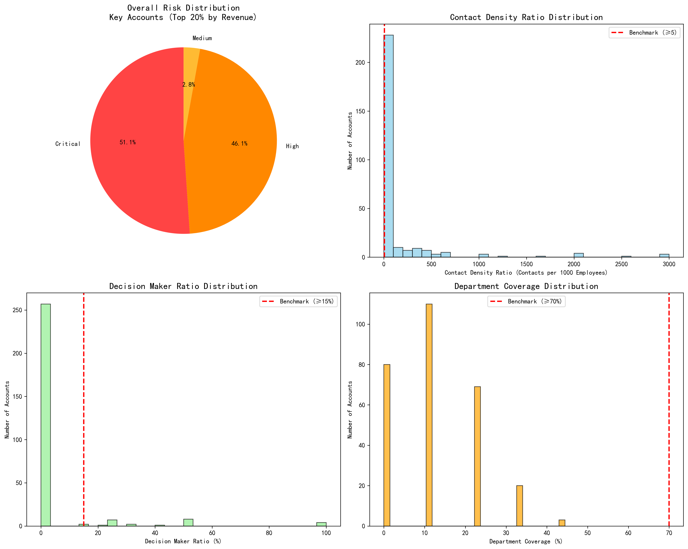
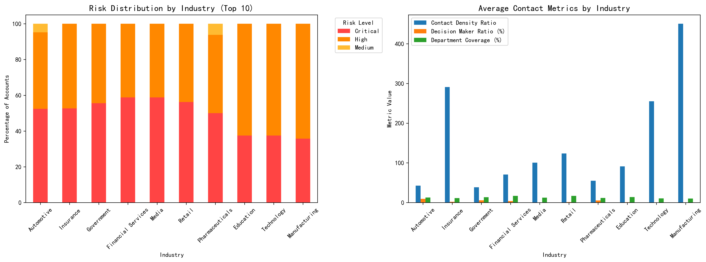
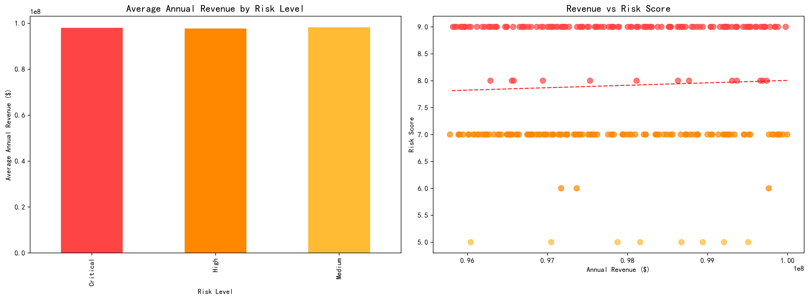
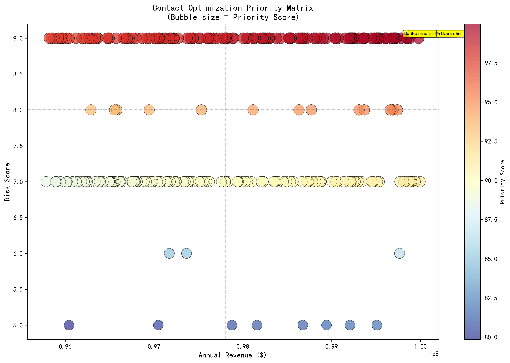

# Contact Configuration Risk Monitoring System Analysis
## Executive Summary for Key Accounts (Top 20% by Revenue)

### 🚨 Critical Situation Overview

Our analysis of 282 key accounts representing **$27.6 billion in annual revenue** reveals a **contact configuration crisis**. A staggering **97% of our most valuable accounts** have suboptimal contact configurations, putting significant revenue at risk.

**Key Findings:**
- **274 accounts (97%)** require immediate contact optimization
- **144 accounts (51%)** are at **Critical Risk** with severe contact gaps
- **130 accounts (46%)** are at **High Risk** with significant deficiencies
- **Average decision-maker ratio: 4.0%** (Target: ≥15%)
- **Average department coverage: 12.6%** (Target: ≥70%)
- **Average contact density: 150.0** contacts per 1000 employees (Benchmark: ≥5)

### 📊 Risk Distribution Analysis

The visualization reveals the alarming scope of our contact configuration challenges:

1. **Contact Density Crisis**: 51% of accounts fall below the 5 contacts per 1000 employees benchmark
2. **Decision-Maker Deficit**: 91% of accounts lack sufficient C-level/VP representation
3. **Departmental Blind Spots**: 100% of accounts have inadequate coverage across key departments
4. **Revenue at Risk**: The risk distribution shows Critical and High risk accounts dominate our key account portfolio

### 🏭 Industry-Specific Risk Patterns

**Highest Risk Industries by Revenue:**
- **Automotive**: 95.2% high/critical risk | $2.06B total revenue
- **Insurance**: 100% high/critical risk | $1.85B total revenue  
- **Government**: 100% high/critical risk | $1.76B total revenue
- **Financial Services**: 100% high/critical risk | $1.67B total revenue
- **Media**: 100% high/critical risk | $1.66B total revenue

### 💰 Revenue Impact Analysis

The analysis reveals a concerning inverse relationship between account value and contact configuration quality. Our highest-revenue accounts often exhibit the most severe contact deficiencies, creating a **perfect storm of risk** where our most valuable relationships are also our most vulnerable.

### 🎯 Optimization Priority Matrix

The priority matrix identifies accounts requiring immediate intervention based on revenue size and risk score. The top-right quadrant represents **high-revenue, high-risk accounts** that demand immediate executive attention and resource allocation.

## Immediate Action Required

### Tier 1: Critical Accounts (0-30 Days)
**Top 10 Critical Accounts by Revenue:**
1. **Shaw Inc** - $99.98M revenue | Risk Score: 9 | Contact Density: 0.0
2. **Valencia-Myers** - $99.88M revenue | Risk Score: 9 | Contact Density: 1.4
3. **Holmes, Banks and Morgan** - $99.85M revenue | Risk Score: 9 | Contact Density: 0.0
4. **Davidson, Walker and Taylor** - $99.84M revenue | Risk Score: 9 | Contact Density: 0.4
5. **Banks Inc** - $99.78M revenue | Risk Score: 9 | Contact Density: 0.0

### Tier 2: High-Value High-Risk Accounts (30-90 Days)
Accounts with >$99M revenue and high risk scores requiring systematic intervention.

## Contact Optimization Action Plan

### 📈 Strategic Objectives

1. **Contact Density Optimization**: Achieve ≥5 contacts per 1000 employees
2. **Decision-Maker Expansion**: Achieve ≥15% C-level/VP representation
3. **Departmental Coverage**: Achieve ≥70% coverage across Sales, Finance, Operations, IT, HR
4. **Risk Reduction**: Move 80% of accounts to Low/Medium risk categories

### 🛠️ Implementation Strategies

#### Contact Density Optimization
- Deploy systematic contact discovery campaigns
- Leverage existing relationships for warm introductions
- Utilize LinkedIn Sales Navigator for targeted outreach
- Implement contact enrichment programs using premium data sources
- Establish presence at industry events and conferences

#### Decision-Maker Expansion
- Map organizational hierarchies for all key accounts
- Develop C-suite engagement programs with executive briefings
- Create thought leadership content targeted at executives
- Establish executive sponsorship programs
- Implement account-based marketing campaigns for decision-makers

#### Departmental Coverage Improvement
- Identify and target key departments: Sales, Finance, Operations, IT, HR
- Develop department-specific value propositions
- Create cross-functional engagement strategies
- Establish department-specific communication channels
- Implement tailored content marketing for each department

### 📅 Implementation Timeline

**Phase 1 (0-30 days): Emergency Intervention**
- Address all 144 Critical risk accounts
- Implement immediate contact discovery for Tier 1 accounts
- Establish executive engagement for top 10 critical accounts
- Deploy emergency contact enrichment campaigns

**Phase 2 (30-90 days): Systematic Expansion**
- Roll out contact optimization for 130 High risk accounts
- Implement industry-specific engagement strategies
- Deploy account-based marketing campaigns
- Establish department-specific outreach programs

**Phase 3 (90-180 days): Optimization & Monitoring**
- Achieve target metrics for 80% of key accounts
- Implement continuous monitoring system
- Establish quarterly review cycles
- Deploy predictive analytics for early risk detection

### 📊 Success Metrics & KPIs

**Primary Metrics:**
- Contact Density Ratio: Target ≥5 per 1000 employees
- Decision Maker Ratio: Target ≥15%
- Department Coverage: Target ≥70%
- Overall Risk Distribution: Target 80% Low/Medium risk

**Secondary Metrics:**
- Account Engagement Score improvement
- Opportunity creation rate increase
- Customer retention rate improvement
- Revenue per account growth

### 💼 Resource Requirements

**Personnel:**
- 2 Senior Account Managers (Critical accounts)
- 3 Contact Development Specialists
- 1 Data Analyst (monitoring & reporting)
- 1 Program Manager (coordination & strategy)

**Technology:**
- CRM system enhancement
- Contact enrichment tools (LinkedIn Sales Navigator, ZoomInfo)
- Account-based marketing platform
- Analytics and reporting dashboard

**Budget Estimate:** $750K annually
- Personnel: $500K
- Technology & Tools: $200K
- Training & Development: $50K

## Conclusion

The analysis reveals a **systemic contact configuration crisis** across our key account portfolio. With **$27.6 billion in revenue at risk** and **97% of accounts requiring optimization**, immediate action is not just recommended—it's imperative.

The good news is that our analysis provides a clear roadmap for intervention. By following the prioritized action plan and implementing the three-phase approach, we can systematically address these deficiencies and transform our contact configuration from a major risk factor into a competitive advantage.

**Next Steps:**
1. Secure executive sponsorship and budget approval
2. Establish the Contact Optimization Task Force
3. Begin Phase 1 emergency interventions immediately
4. Implement weekly monitoring for critical accounts
5. Deploy the comprehensive analytics dashboard for ongoing monitoring

The data is clear: **the risk is real, but so is the opportunity**. With proper execution of this action plan, we can not only mitigate current risks but also build a sustainable competitive advantage through superior relationship management across our most valuable accounts.
