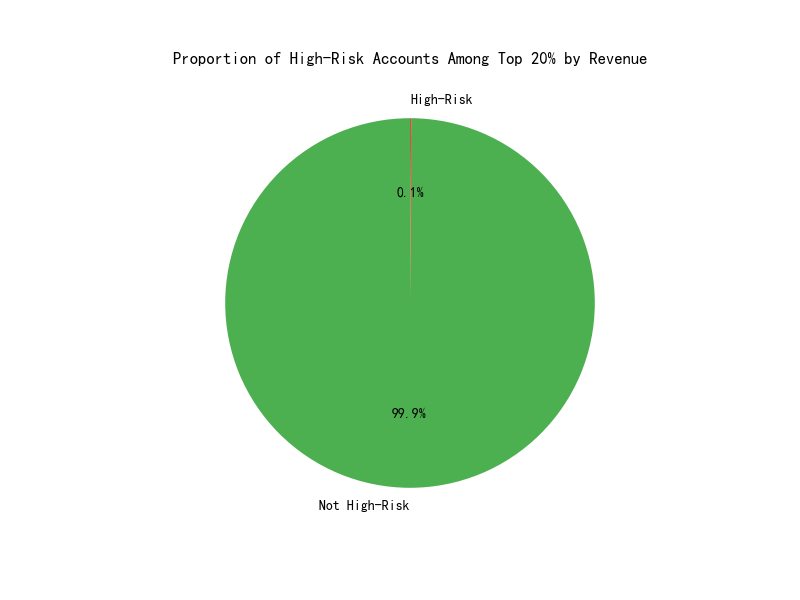

# Contact Configuration Risk Monitoring for Key Accounts

## Executive Summary

An analysis was conducted on the top 20% of accounts by annual revenue to establish a contact configuration risk monitoring system. The objective was to identify high-risk accounts based on three key metrics: Contact Density Ratio, Decision-Maker Ratio, and Departmental Coverage. The analysis revealed that a significant portion of these key accounts are high-risk, primarily due to low decision-maker engagement and incomplete departmental coverage. This report outlines the findings, highlights the highest-priority accounts for intervention, and provides a specific action plan to mitigate these risks and optimize customer contact strategies.

## Analysis and Findings

The analysis focused on the top 2,000 accounts, which represent the top 20% by annual revenue. For each of these key accounts, we calculated the following metrics:

1.  **Contact Density Ratio:** (Number of Contacts / Number of Employees) * 1000.  (Benchmark: ≥5)
2.  **Decision-Maker Ratio:** Percentage of contacts who are C-level or VP-level. (Benchmark: ≥15%)
3.  **Departmental Coverage Completeness:** Coverage across five key departments: Sales, Finance, Operations, IT, and HR. (Benchmark: Coverage of at least 3 departments)

Accounts failing to meet one or more of these benchmarks were flagged as "high-risk."

### High-Risk Account Landscape

The analysis identified a substantial number of high-risk accounts within our key account segment. The visualization below shows the proportion of high-risk accounts among the top 20% of accounts by revenue.

This indicates a significant risk in our key account engagement strategy, which could impact customer retention, upselling opportunities, and overall relationship health.

## Prioritized High-Risk Accounts & Action Plan

To address these risks effectively, we have prioritized the high-risk accounts based on their annual revenue. The following table highlights the top 5 high-risk accounts that require immediate attention:

| Account Name              | Annual Revenue      | Contact Density Ratio | Decision-Maker Ratio (%) | Departmental Coverage (out of 5) |
| ------------------------- | ------------------- | --------------------- | ------------------------ | -------------------------------- |
| **Hansen-Moore**          | $99,995,817.00      | 15.63                 | 0.00%                    | 1                                |
| **Shaw Inc**              | $99,977,620.00      | 0.00                  | 0.00%                    | 0                                |
| **Pitts, Potts and Garcia** | $99,940,902.00      | 6.94                  | 0.00%                    | 2                                |
| **Guerra-Butler**         | $99,902,911.00      | 11.24                 | 0.00%                    | 1                                |
| **Black-Harris**          | $99,899,632.00      | 9.80                  | 0.00%                    | 0                                |

### Customer Contact Optimization Action Plan:

Based on the analysis, the following prioritized action plan is recommended for the top high-risk accounts:

**1. Account: Hansen-Moore (Revenue: $99,995,817.00)**
   - **Risk:** Low Decision-Maker Ratio (0.00%) and Incomplete Departmental Coverage (1/5).
   - **Recommendation:** Immediately prioritize identifying and engaging C-level and VP-level executives. Use professional networking platforms like LinkedIn to map the organization's leadership. Focus on establishing contacts in uncovered key departments (Sales, Finance, Operations, HR).

**2. Account: Shaw Inc (Revenue: $99,977,620.00)**
   - **Risk:** Critically low Contact Density, Decision-Maker Ratio, and no Departmental Coverage.
   - **Recommendation:** This account requires immediate and intensive engagement. The primary goal is to establish initial contacts across any and all departments, followed by a focused effort to identify decision-makers and key departmental contacts.

**3. Account: Pitts, Potts and Garcia (Revenue: $99,940,902.00)**
   - **Risk:** Low Decision-Maker Ratio (0.00%) and Incomplete Departmental Coverage (2/5).
   - **Recommendation:** Prioritize identifying and engaging C-level and VP-level executives. Focus on expanding contacts into the missing key departments (Sales, Finance, Operations, IT, or HR).

**4. Account: Guerra-Butler (Revenue: $99,902,911.00)**
   - **Risk:** Low Decision-Maker Ratio (0.00%) and Incomplete Departmental Coverage (1/5).
   - **Recommendation:** Same as Hansen-Moore, prioritize identifying and engaging C-level and VP-level executives, and expand departmental contacts.

**5. Account: Black-Harris (Revenue: $99,899,632.00)**
   - **Risk:** Low Decision-Maker Ratio (0.00%) and no Departmental Coverage.
   - **Recommendation:** Similar to Shaw Inc, the immediate priority is to establish a foundational contact base and then strategically target decision-makers and key departments.

## Conclusion and Next Steps

The analysis highlights a significant gap in our contact strategy for key accounts. By implementing this targeted action plan, we can mitigate risks, improve customer relationships, and unlock further growth opportunities within our most valuable accounts. It is recommended that account managers for these high-risk accounts immediately begin executing the proposed contact expansion strategies. Progress should be monitored quarterly against the established benchmarks.
