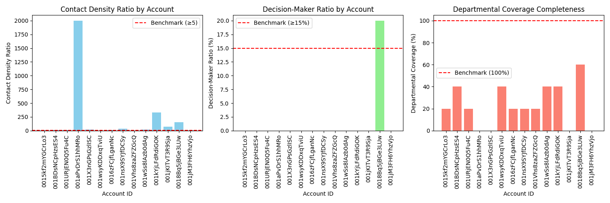

## Key Account Contact Configuration Risk Monitoring Analysis

The analysis focuses on evaluating key accounts in the top 20% by annual revenue according to three metrics:

1. **Contact Density Ratio** (Benchmark: ≥5)
2. **Decision-Maker Ratio** (Benchmark: ≥15%)
3. **Departmental Coverage Completeness** (Benchmark: 100% across five key departments: Sales, Finance, Operations, IT, and HR)

### Insights from the Data

- **Contact Density Ratio:**
  - Most accounts fall below the benchmark of 5, with only a few accounts meeting or exceeding it.
  - Account `001aPvDrS1hhMRo` has a very high ratio (2000.0), which may indicate an outlier or data inconsistency.

- **Decision-Maker Ratio:**
  - All accounts fall significantly below the 15% benchmark. Most accounts have a ratio of 0%, indicating a lack of C-level or VP-level contacts.
  - Account `0018Bq5jBGe3LUw` is the only one with a Decision-Maker Ratio of 20%, making it the only account meeting the benchmark.

- **Departmental Coverage Completeness:**
  - Most accounts have incomplete coverage, with none achieving 100% coverage across all five departments.
  - Account `0018Bq5jBGe3LUw` again performs the best with 60% coverage.

### High-Risk Accounts

Accounts falling below the benchmarks are considered high-risk. Based on the metrics:
- **Contact Density Risk:** Most accounts are at risk; special attention is needed for accounts with very low ratios.
- **Decision-Maker Risk:** All accounts except `0018Bq5jBGe3LUw` are at risk due to low or zero decision-maker contact ratios.
- **Departmental Coverage Risk:** All accounts are at risk due to incomplete coverage.

### Recommendations

#### 1. Contact Expansion Strategy
- **Targeted Contact Acquisition:** Focus on increasing the number of contacts, particularly for accounts with low Contact Density Ratios.
- **Prioritize Decision-Makers:** Prioritize acquiring C-level and VP-level contacts to improve the Decision-Maker Ratio, starting with accounts that are closest to the benchmark.

#### 2. Departmental Coverage Enhancement
- **Gap Analysis:** Conduct a detailed gap analysis for each account to identify missing departments and prioritize engagement with those departments.
- **Cross-Departmental Engagement:** Develop cross-functional outreach programs to ensure full departmental coverage.

#### 3. Industry and Account-Specific Benchmarks
- **Customized Benchmarks:** Develop industry-specific and account-size-specific benchmarks to better reflect real-world conditions and improve relevance.
- **Risk-Based Prioritization:** Use the risk assessment to prioritize accounts for engagement based on the severity of their risk profile.

### Conclusion

The analysis identifies several high-risk accounts based on the defined benchmarks. The recommended action plan focuses on expanding contact networks, prioritizing decision-makers, and improving departmental coverage. Customized benchmarks and prioritization strategies will further enhance the effectiveness of the contact configuration risk monitoring system.

