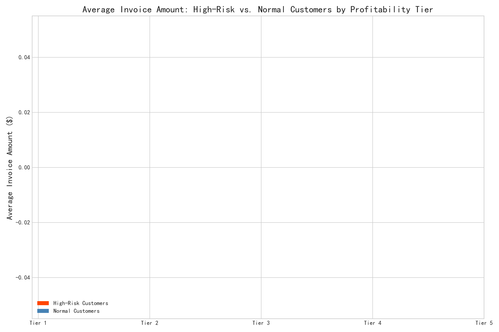

# Urgent Action Required: Mitigating a Looming Customer Debt Crisis

### Executive Summary

An analysis of customer payment behavior has uncovered a severe and escalating financial risk. A specific group of high-risk customers, characterized by low payment rates and high outstanding balances, now poses a significant threat to our liquidity and profitability. These customers account for **$42.86 million in outstanding debt**, and our cash flow forecast anticipates **zero risk-adjusted inflow over the next six months**, signaling a potential write-off of this entire amount. This situation is compounded by a company-wide decline in the collection rate for three consecutive months.

However, these high-risk customers are also valuable, contributing **13.8% of total gross profit**. This report details the characteristics of this high-risk group, quantifies the financial threat, and proposes a tiered risk-management strategy to recover outstanding debt, mitigate future losses, and protect cash flow without simply terminating valuable relationships.

---

### The Problem: A Growing Financial Risk

Our analysis confirms that customer payment behavior is deteriorating. Two key indicators highlight the urgency of the situation:

1.  **Declining Collection Rate:** The company-wide `collection_rate_percentage` has fallen for **3 consecutive months**, with a total drop of **5.78 percentage points**. This trend indicates a systemic issue with collecting payments that extends beyond a single customer segment.
2.  **Concentrated "At-Risk" Debt:** We have identified a high-risk customer segment with payment rates below 75% and balances exceeding $15,000. This group's total outstanding balance is **$42,858,037**. This represents the immediate potential loss if these customers default.

Our risk warning model paints a grim picture: the **$42.86M at-risk balance is infinitely larger than the $0 in risk-adjusted cash inflow forecasted over the next six months**. This implies a high probability of default and a severe, imminent threat to our liquidity.

---

### Profile of a High-Risk Customer: High Value, High Risk

While these customers are problematic, they are not insignificant. They are responsible for nearly 14% of gross profit. The key differentiator lies in their transaction behavior. As the chart below illustrates, high-risk customers consistently have a higher average invoice amount than "normal" customers across every profitability tier.

**Insight:** The very factor that makes these customers valuable—their large purchase volumes—also makes them dangerous. A single unpaid invoice from this group has a much larger negative impact than an unpaid invoice from a normal customer. The highest-profitability customers (Tier 1 and Tier 2) in the high-risk group show the largest disparity in invoice amounts, representing a critical conflict between value and risk.

---

### Recommendations: A Tiered Customer Management & Risk Control Strategy

A one-size-fits-all approach will fail. It would either be too aggressive, alienating valuable customers, or too passive, allowing the debt crisis to worsen. We recommend a tiered strategy based on the calculated risk score and outstanding balance.

#### **Tier 1: Immediate Intervention (Highest Risk Scores)**
This group represents the most immediate threat.
*   **Action:** Immediately assign these accounts to a dedicated collections team.
*   **Strategy:** Pause all new credit extensions. Proactively contact customers to renegotiate payment terms, such as breaking large outstanding balances into smaller, weekly installments. If communication fails, initiate formal debt recovery procedures.

#### **Tier 2: Proactive Monitoring (Moderate Risk Scores)**
This group is at risk of graduating to Tier 1. The goal is prevention.
*   **Action:** Implement automated, but personalized, communication sequences.
*   **Strategy:** Offer small discounts for early payment on outstanding invoices. Review and potentially lower their credit limits to reduce future exposure. Require partial upfront payments for large new orders.

#### **Tier 3: Systemic Solutions (All Customers)**
The declining overall collection rate indicates a need for systemic improvements to our credit and collections processes.
*   **Action:** Overhaul the customer onboarding and credit-checking process.
*   **Strategy:**
    *   **Dynamic Credit Limits:** Implement a system where a customer's credit limit is dynamically adjusted based on their real-time payment behavior.
    *   **Automated Reminders:** Ensure automated payment reminders are sent before, on, and after the invoice due date.
    *   **Enforce Late Fees:** Consistently apply and collect on contractually-stipulated late fees to discourage delinquent behavior.

### Conclusion

We are facing a critical juncture where a significant portion of our profit-generating customer base also poses a grave financial risk. The forecasted inability to collect on nearly $43 million in debt requires immediate and decisive action. By adopting a data-driven, tiered approach, we can actively manage this crisis, converting at-risk debt into cash, preventing further deterioration in our customer portfolio, and building a more resilient financial foundation for the future.
