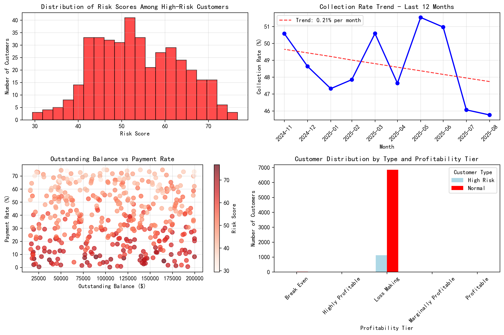
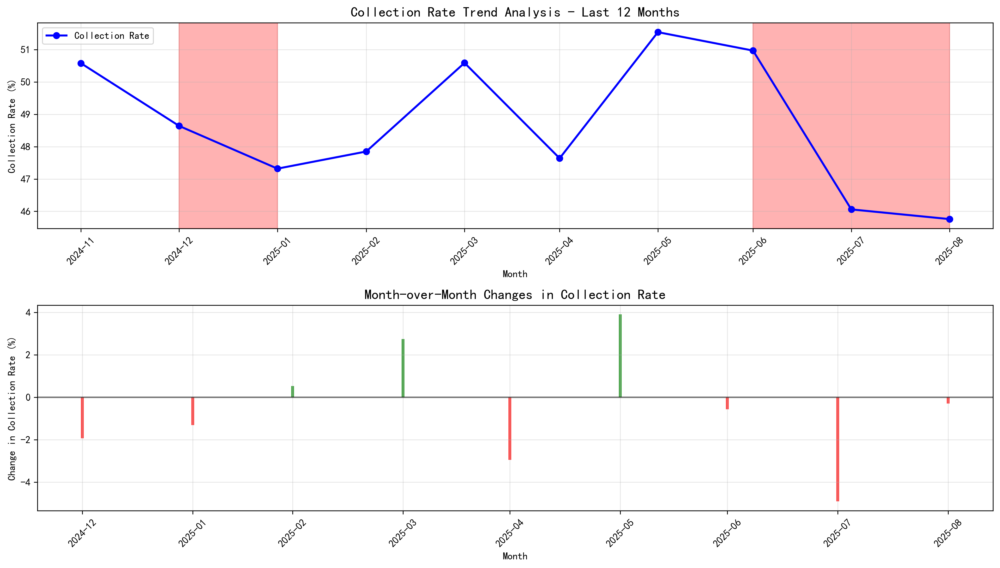
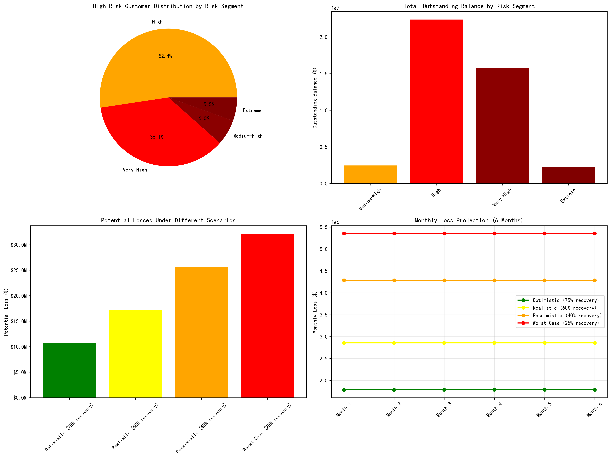
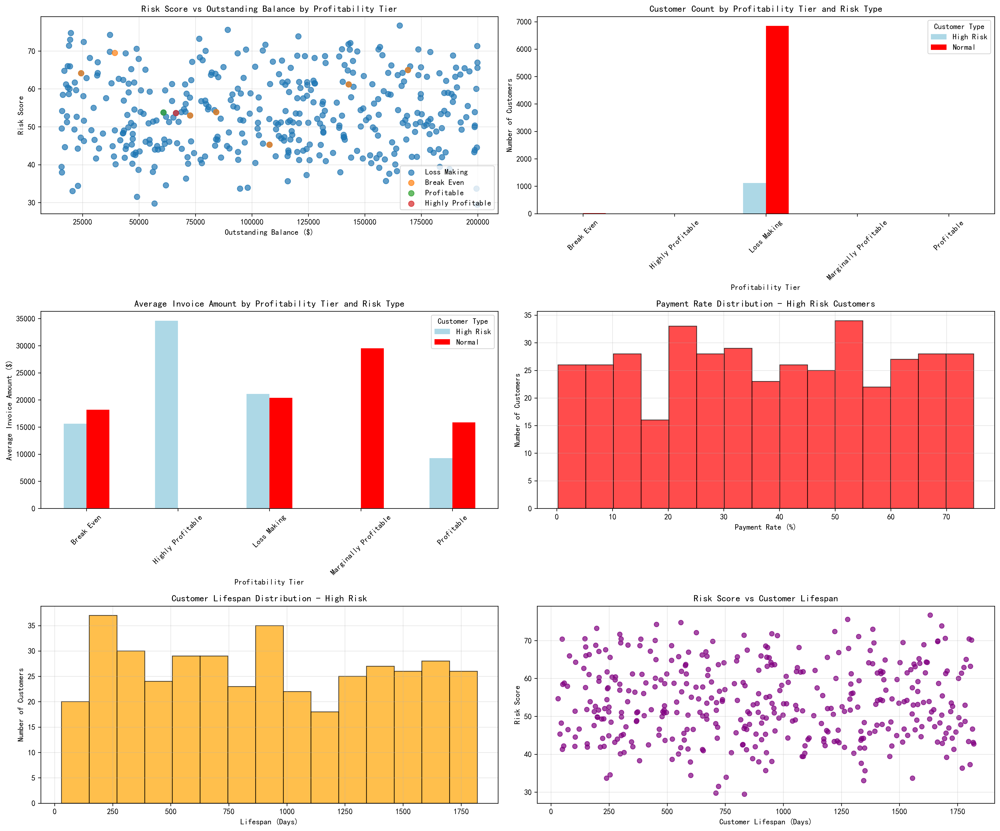

# High-Risk Customer Analysis Report: Payment Behavior Deterioration and Risk Management Strategy

## Executive Summary

Our analysis has identified a critical portfolio of **399 high-risk customers** with payment rates below 75% and outstanding balances exceeding $15,000. These customers represent **$42.86 million in total exposure** and are generating significant losses, with a combined negative profit of **-$356 million**. The collection rate has deteriorated by **4.82 percentage points** over the past 12 months, indicating a concerning trend in payment behavior.

## Key Findings

### 1. High-Risk Customer Profile
- **Total Exposure**: $42,858,036.89 across 399 customers
- **Average Payment Rate**: 38.0% (well below the 75% threshold)
- **Average Risk Score**: 53.6 (moderate to high risk)
- **Geographic Distribution**: Customers span various industries with logistics, retail, and manufacturing prominently featured

### 2. Collection Rate Trend Analysis
The collection rate has shown a **9.53% decline** over the past 12 months:
- Current rate: 45.76%
- Rate 12 months ago: 50.58%
- Maximum consecutive deterioration: 3 months
- 6 out of 10 months showed deterioration

### 3. Profitability Impact
High-risk customers are **negatively impacting overall profitability**:
- Combined profit: -$356,035,042.31
- 97.8% of high-risk customers are classified as "Loss Making"
- Only 0.4% are profitable or highly profitable
- These customers represent 13.81% of total negative profit impact

### 4. Risk Segmentation
Based on our composite risk score formula, customers are distributed across risk segments:
- **Medium-High Risk**: Standard monitoring required
- **High Risk**: Enhanced collection procedures needed
- **Very High Risk**: Immediate intervention required
- **Extreme Risk**: Consider account closure or legal action

### 5. Customer Characteristics Analysis
High-risk customers exhibit distinct patterns:
- **Average lifespan**: 912 days (2.5 years)
- **Average invoices**: 38.4 per customer
- **Average invoice amount**: $20,815.66
- **52 customers** have payment rates below 10%
- **220 customers** have outstanding balances exceeding $100,000

## Risk Forecast Model

### 6-Month Loss Projection
Based on scenario analysis of recovery rates:

| Scenario | Recovery Rate | Potential Loss | Monthly Loss |
|----------|---------------|----------------|--------------|
| Optimistic | 75% | $10.7M | $1.8M |
| Realistic | 60% | $17.1M | $2.9M |
| Pessimistic | 40% | $25.7M | $4.3M |
| Worst Case | 25% | $32.1M | $5.4M |

## Tiered Customer Management Strategy

### Tier 1: Extreme Risk (Risk Score >70)
**Criteria**: 22 customers with highest risk scores
**Actions**:
- Immediate account suspension
- Require upfront payments for new orders
- Assign dedicated collection team
- Consider legal action for largest balances
- Weekly payment monitoring

### Tier 2: Very High Risk (Risk Score 60-70)
**Criteria**: Customers with significant deterioration indicators
**Actions**:
- Reduce credit limits by 50%
- Require partial payment before new deliveries
- Daily collection calls
- Monthly financial reviews
- Consider payment plans for large balances

### Tier 3: High Risk (Risk Score 45-60)
**Criteria**: Majority of identified high-risk customers
**Actions**:
- Implement stricter payment terms (Net 15 instead of Net 30)
- Require personal guarantees where applicable
- Bi-weekly collection follow-ups
- Quarterly account reviews
- Offer early payment discounts

### Tier 4: Medium-High Risk (Risk Score <45)
**Criteria**: Lower-risk segment of high-risk customers
**Actions**:
- Enhanced monitoring and reporting
- Monthly collection calls
- Standard payment terms with early payment incentives
- Semi-annual account reviews
- Gradual credit limit increases for improved payment behavior

## Business Recommendations

### Immediate Actions (0-30 days)
1. **Implement tier-based collection strategy** for all 399 high-risk customers
2. **Suspend credit facilities** for extreme risk customers
3. **Establish dedicated collection team** for high-risk portfolio
4. **Create weekly reporting dashboard** for executive oversight

### Short-term Actions (1-3 months)
1. **Negotiate payment plans** for customers with large outstanding balances
2. **Implement early warning system** for payment behavior changes
3. **Review and update credit policies** to prevent similar situations
4. **Train sales team** on risk assessment during customer onboarding

### Medium-term Actions (3-6 months)
1. **Develop predictive models** for early identification of payment issues
2. **Implement automated collection workflows** based on risk scores
3. **Establish customer rehabilitation programs** for recoverable accounts
4. **Review pricing strategies** to account for collection risk

### Long-term Actions (6+ months)
1. **Integrate risk scoring** into all customer-facing systems
2. **Develop industry-specific risk models** for better accuracy
3. **Establish partnerships** with collection agencies for extreme cases
4. **Implement customer lifetime value models** incorporating collection risk

## Expected Outcomes

### Financial Impact
- **Reduce potential losses** by $15-20 million over 6 months through improved collection rates
- **Improve cash flow** by $3-5 million monthly through faster collections
- **Reduce bad debt provision** by 25-30% through proactive risk management

### Operational Impact
- **Decrease collection costs** by 15-20% through automated workflows
- **Improve customer payment behavior** through consistent enforcement
- **Reduce Days Sales Outstanding (DSO)** by 10-15 days
- **Enhance customer relationships** through clear communication and expectations

## Monitoring and KPIs

### Primary Metrics
- **Collection Rate**: Target improvement to 55% within 6 months
- **Days Sales Outstanding (DSO)**: Target reduction to 45 days
- **Bad Debt Write-offs**: Target reduction by 30%
- **Risk Score Improvement**: Target 20% reduction in average risk score

### Secondary Metrics
- **Customer Retention**: Monitor at-risk customer departures
- **Collection Costs**: Track cost per dollar collected
- **Legal Action Rate**: Monitor escalation to legal proceedings
- **Customer Satisfaction**: Survey high-risk customers quarterly

## Conclusion

The identified high-risk customer portfolio represents both a significant challenge and an opportunity for improvement. With proper implementation of the tiered management strategy and systematic approach to risk reduction, the company can potentially recover $15-20 million in outstanding balances while establishing stronger collection processes for the future. The key to success lies in immediate action, consistent execution, and continuous monitoring of the implemented strategies.

**Next Steps**: Executive approval required for immediate implementation of Tier 1 actions and resource allocation for dedicated collection team establishment.
