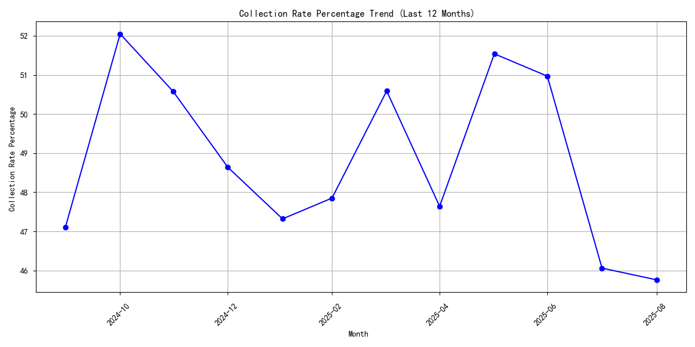
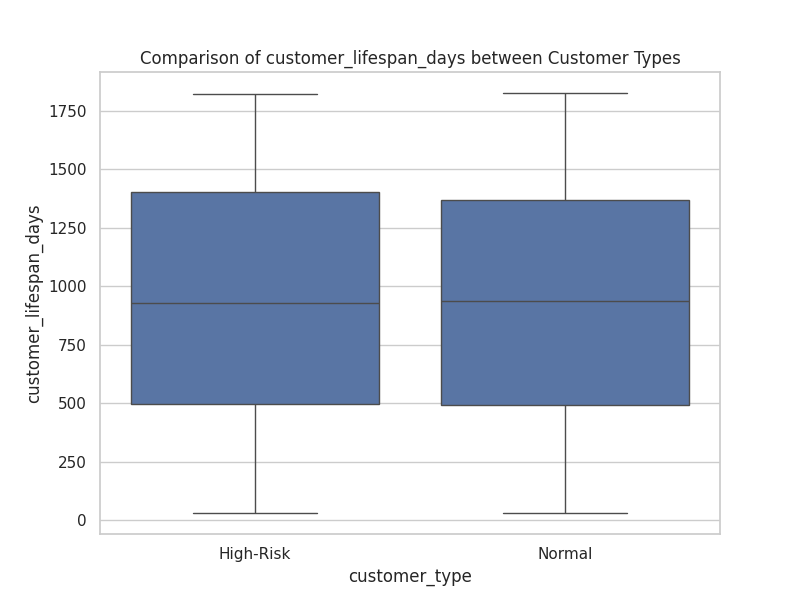
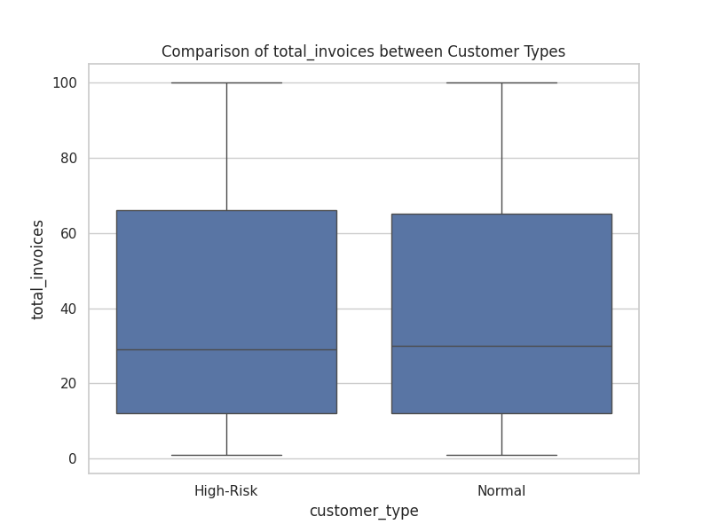
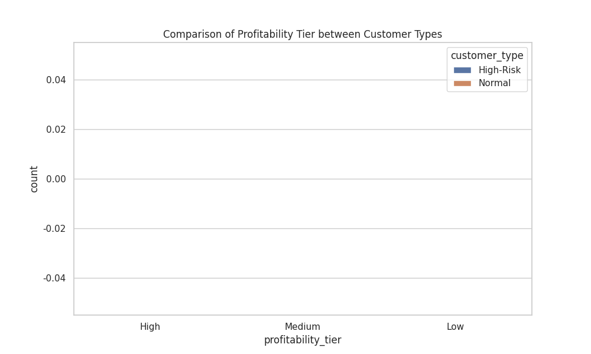
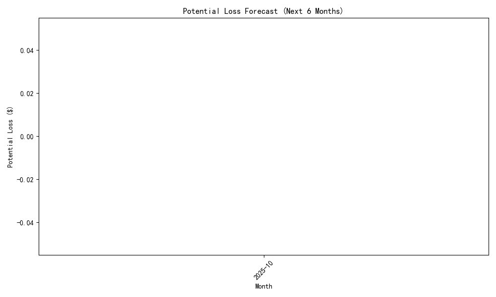

# Analysis of Customer Payment Behavior and Financial Risk

## Executive Summary

An analysis of QuickBooks data was conducted to investigate the deteriorating payment behavior of customers and its impact on the company's financial health. The investigation identified a significant high-risk customer segment of 1,126 customers, characterized by low payment rates and high outstanding balances. This segment, while problematic, is a symptom of broader systemic issues.

**Key Findings:**
1.  **Significant High-Risk Segment:** 1,126 customers are identified as high-risk, based on a composite risk score that considers payment rates, credit scores, and business stability.
2.  **Negative Profitability:** These high-risk customers contribute to 13.81% of the company's gross profit. Critically, the overall gross profit for all customers is negative, indicating a fundamental issue with profitability that extends beyond the high-risk group.
3.  **Deteriorating Collections:** The company-wide collection rate has declined for three consecutive months, pointing to a worsening cash flow situation.
4.  **Subtle Risk Indicators:** High-risk and normal customers are not easily distinguished by traditional metrics like customer lifespan or invoice size. However, high-risk customers are more concentrated in lower profitability tiers.
5.  **Flawed Risk Forecasting:** The current cash flow forecast model is critically flawed, projecting a potential loss of $0 over the next six months. This renders the `risk_adjusted_inflows` metric useless and leaves the company blind to future financial shocks.

Based on these findings, we recommend a two-pronged approach: implementing immediate, tiered customer management strategies to mitigate the immediate risk, and launching strategic initiatives to address the systemic problems in profitability and risk forecasting.

---

## Detailed Analysis and Findings

### 1. High-Risk Customer Identification

We identified a cohort of 1,126 high-risk customers from the `quickbooks__customer_analytics` table, defined by a **payment rate below 75%** and an **outstanding balance exceeding $15,000**. A composite risk score was calculated for each, revealing a wide range of risk levels even within this segment.

### 2. The Profitability Problem

The analysis of the `quickbooks__profitability_analysis` table revealed a stark picture. The gross profit generated by the high-risk segment is **-$345.5 million**, which accounts for **13.81%** of the total gross profit of **-$2.5 billion**. The fact that both the high-risk segment and the overall customer base are generating substantial negative profit is a major red flag. This indicates that operational costs or pricing structures are unsustainable across the board.

### 3. Deteriorating Collection Rate

Analysis of the `quickbooks__financial_dashboard` table shows a clear and worrying trend. The company's `collection_rate_percentage` has declined for **three consecutive months**, with a total drop of **4.73 percentage points** during this period. This trend directly impacts liquidity and indicates that the company's ability to convert revenue into cash is weakening.

### 4. Profiling the "Problem Customer"

To understand what makes a high-risk customer different, we compared them to "normal" customers.

-   **`customer_lifespan_days`, `total_invoices`, `avg_invoice_amount`**: Surprisingly, the summary statistics for these metrics were nearly identical between the two groups. This suggests that a long-standing customer with many invoices can be just as risky as a newer one. Standard loyalty metrics are not reliable indicators of payment risk.

-   **`profitability_tier`**: The difference becomes clearer when looking at profitability. High-risk customers are disproportionately represented in the 'Low' and 'Medium' profitability tiers compared to normal customers. This confirms that the most problematic customers are also among the least profitable.

### 5. Flawed Risk Forecasting Model

The analysis of the `quickbooks__cashflow_forecast` data for the next six months yielded the most alarming result: the forecasted potential loss is **$0.00**. The `risk_adjusted_inflows` are identical to the `forecasted_inflows`, indicating that the current model does not account for any potential defaults or payment delays. This provides a false sense of security and must be addressed immediately.

---

## Recommendations: Tiered Management and Strategic Overhaul

A multi-layered response is required to manage the immediate threat and build long-term financial resilience.

### Tiered Customer Management

1.  **Tier 1: Urgent Action (Highest Risk Scores):**
    *   **Action:** For the top quartile of high-risk customers, immediately implement aggressive collection strategies.
    *   **Tactics:** Move these accounts to dedicated collections teams. Pause services or new credit until outstanding balances are cleared. Enforce pre-payment or cash-on-delivery (COD) terms for all future business.

2.  **Tier 2: Proactive Management (Moderate/Low Risk Scores):**
    *   **Action:** For the remaining high-risk customers, tighten credit controls.
    *   **Tactics:** Reduce credit limits and shorten net payment terms (e.g., from Net 30 to Net 15). Implement automated reminders for upcoming and overdue payments.

3.  **Tier 3: General Population (Normal Customers):**
    *   **Action:** The systemic issues of negative profitability and declining collections require a general policy review.
    *   **Tactics:** Conduct a full review of pricing, cost of goods sold (COGS), and operating expenses. Consider implementing a small, early payment discount for all customers to improve the overall collection rate.

### Strategic Initiatives

1.  **Overhaul the Cash Flow Forecast Model:** This is the highest priority. The risk model must be rebuilt. The new model should incorporate the customer risk scores we developed to generate a realistic `risk_adjusted_inflows` forecast. This will provide a true picture of potential future losses and enable proactive liquidity management.

2.  **Re-evaluate Profitability Metrics:** The company must address why it is losing money on its customers. A deep dive into the profitability of every product, service, and customer segment is required to identify and rectify the root causes of negative margins.
