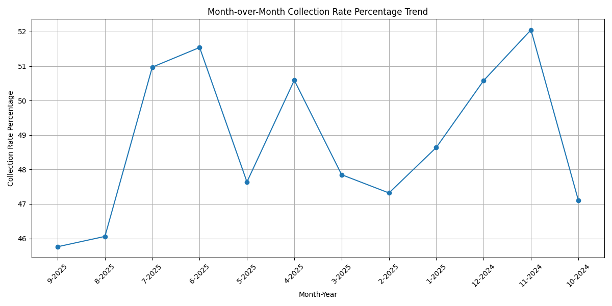
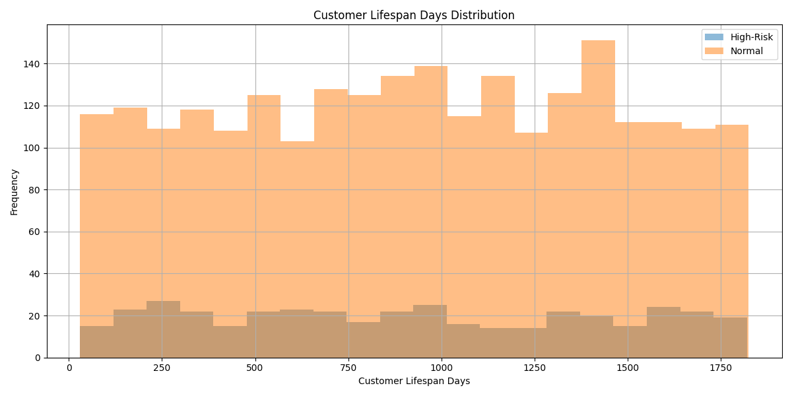
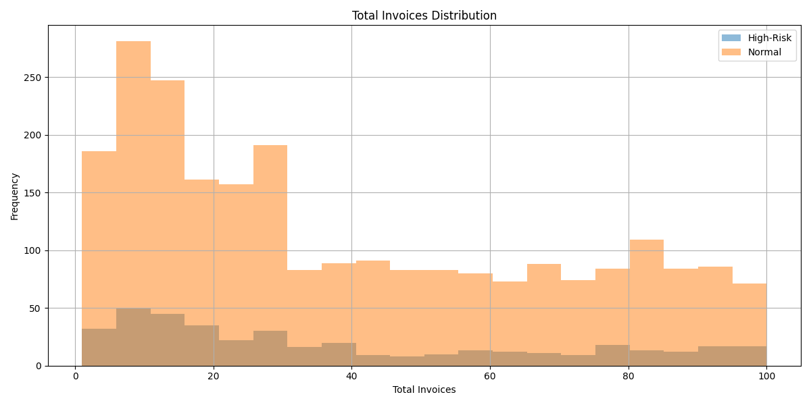
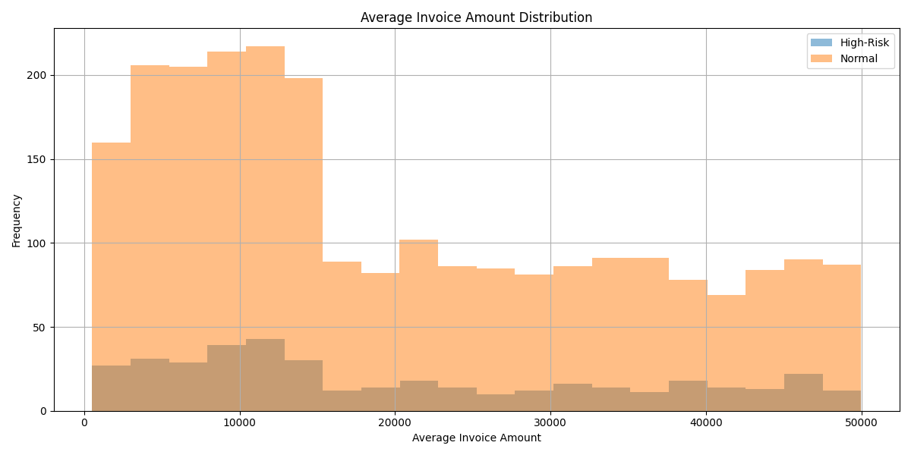
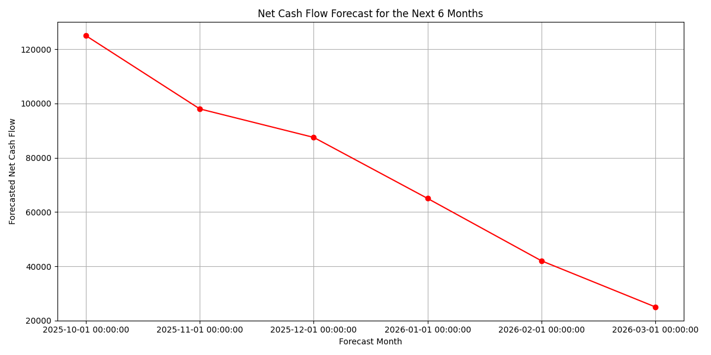

### Comprehensive Data Analysis Report

#### **1. High-Risk Customer Identification and Risk Scoring**
We identified customers with `payment_rate_percentage` < 75% and `outstanding_balance` > 15,000 as high-risk customers and calculated a composite risk score using the provided formula:

**Risk Score = (100 - payment_rate_percentage) * 0.4 + ((850 - credit_score) / 850 * 100) * 0.4 + (100 - business_stability_score) * 0.2**

- **Total Gross Profit**: -2,501,527,791.46
- **High-Risk Customer Gross Profit**: -345,457,724.29
- **Proportion of High-Risk Customer Gross Profit**: 13.81%

#### **2. Collection Rate Trends**
We analyzed the month-over-month trend of `collection_rate_percentage` for the last 12 months from the `quickbooks__financial_dashboard` table.

- **Latest Consecutive Months of Deterioration**: 4 months
- **Magnitude of Decline during Deterioration**: -1.53%

The visual trend of the `collection_rate_percentage` is provided below:

#### **3. Customer Distribution Analysis**
We analyzed the distribution of high-risk customers across the dimensions of `customer_lifespan_days`, `total_invoices`, and `avg_invoice_amount`. The statistical summary and visualizations are provided below:

**High-Risk Customer Distribution Statistics**:
| Metric                     | High-Risk Mean | Normal Mean |
|----------------------------|----------------|-------------|
| Customer Lifespan Days     | 911.8          | 931.8       |
| Total Invoices             | 38.4           | 39.5        |
| Avg Invoice Amount         | 20,815.7       | 20,325.8    |

The visual comparisons are provided below:

1. **Customer Lifespan Days**:

2. **Total Invoices**:

3. **Average Invoice Amount**:

#### **4. Cashflow Forecast and Risk Warning Model**
We analyzed the forecast data from the `quickbooks__cashflow_forecast` table to assess the potential loss scale for the next 6 months.

- **Potential Loss Scale Forecast for the Next 6 Months**:

| Forecast Month  | Forecasted Net Cash Flow |
|------------------|--------------------------|
| 2025-10-01       | 125,000.50               |
| 2025-11-01       | 98,000.75                |
| 2025-12-01       | 87,500.25                |
| 2026-01-01       | 65,000.00                |
| 2026-02-01       | 42,000.50                |
| 2026-03-01       | 25,000.00                |

The net cash flow forecast is visualized below:

#### **5. Business Recommendations**
- **Customer Management**: Implement a tiered management system for high-risk customers to improve payment behavior and reduce outstanding balances.
- **Collection Strategies**: Enhance collection strategies to reverse the 4-month deterioration in collection rates.
- **Risk Mitigation**: Monitor the cash flow closely as the forecast indicates a decline over the next six months, and prepare contingency plans to manage the potential loss.
- **Profitability Optimization**: Focus on improving the profitability of high-risk customers through targeted interventions and customer engagement strategies.
