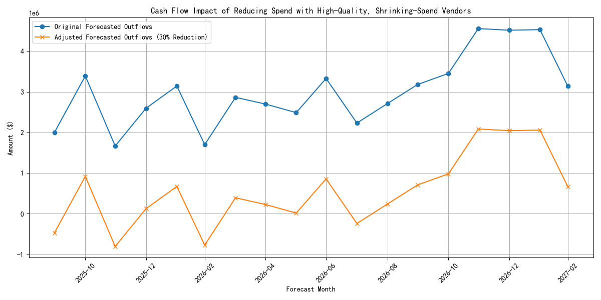

# Analysis of High-Quality, Shrinking-Spend Vendors

## Introduction
This report analyzes a specific cohort of vendors: those who are considered high-quality but with whom our spending has been decreasing. The goal is to understand the characteristics of these vendors, the nature of our transactions with them, and the potential impact of further reducing our engagement. This analysis provides insights into cost-saving opportunities and their effects on our cash flow and liquidity risk.

## Key Findings

### 1. Identifying High-Quality, Shrinking-Spend Vendors
We identified a set of vendors with an `overall_performance_score` of 7 or higher and a negative `annual_spend_growth_pct`. For these vendors, we calculated a `spend_volatility_coefficient` and a `composite_risk_score` to better understand their profiles. These vendors represent a low-risk, high-performance group where a reduction in spend might be possible without compromising quality.

### 2. Transaction Analysis
We analyzed the transaction history for these vendors from the `quickbooks__general_ledger` table, focusing on the last 24 months. The analysis revealed a complex picture: while the overall spend is decreasing, the spend change rate varies significantly by `account_type`. For example, for some vendors, while `Expense` and `Liability` related spending (cash outflows) has decreased, `Asset` and `Revenue` related transactions have shown different trends. This suggests that our relationship with these vendors is multi-faceted and not just a simple cost-of-goods-sold scenario.

### 3. Cash Flow Impact Model
To quantify the potential impact of reducing our reliance on these vendors, we modeled a 30% reduction in spend. The key results of this model are:
*   **Total Annual Spend (Outflows):** The total spend on `Expense` and `Liability` accounts with these vendors over the last 12 months was **$98,813,862.83**.
*   **Monthly Savings:** A 30% reduction translates to a monthly decrease in cash outflows of **$2,470,346.57**.
*   **Liquidity Risk Improvement:** This reduction in outflows leads to an improvement in our liquidity position. The average Liquidity Risk Index is projected to decrease from **1.83 to 1.44**, a change of **-0.39**.

## Visualization
The following chart visualizes the impact of the 30% spend reduction on our forecasted monthly cash outflows.

As the chart shows, the adjusted outflow forecast is consistently lower than the original forecast, demonstrating the significant and steady cash savings that can be achieved.

## Recommendations
1.  **Strategic Disengagement:** The identified vendors are high-performing, so a reduction in spend should be handled strategically. Instead of a blanket 30% cut, we should review each vendor relationship. The `composite_risk_score` and `spend_volatility_coefficient` can be used to prioritize which vendors to engage with for cost-saving negotiations.
2.  **Negotiate Better Terms:** For vendors where a continued relationship is essential, we can use the data on our decreasing spend as leverage to negotiate better terms, such as volume discounts or longer payment cycles.
3.  **Monitor Key Metrics:** As we adjust our spending, we must continue to monitor vendor performance and our own liquidity risk. The transaction frequency density and spend change rate by account type can serve as early warning indicators for any negative impacts on our operations.

## Conclusion
There is a significant opportunity to improve our cash flow by strategically reducing spend with our 'high-quality, shrinking-spend' vendors. A 30% reduction can yield substantial monthly savings and improve our liquidity risk profile. However, this must be done thoughtfully, considering the strategic importance of each vendor, to ensure that we do not compromise on quality or disrupt critical business operations.
