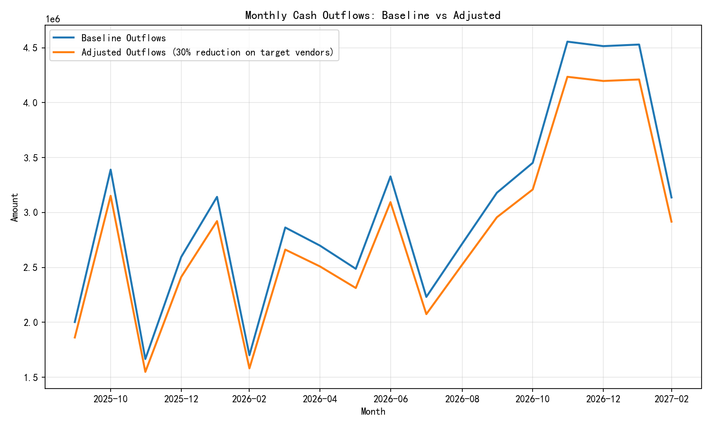

"# High-Quality, Shrinking-Spend Vendors: Diagnostics, Cash Flow Impact, and Actions

Executive summary
- 342 vendors meet the criteria of high-quality, shrinking-spend (annual_spend_growth_pct < 0 and overall_performance_score >= 7).
- Average spend volatility coefficient (spend_volatility / total_lifetime_spend): 0.945; average composite score per formula: 0.782.
- Across the last 12 months, these vendors account for 23.4% of total cash outflows. Under a 30% collaboration reduction with this cohort, forecasted monthly outflows decline by roughly 7.0% on average.
- Liquidity risk index (LRI = Outflows / Inflows) improves on average by 0.072 across the forecast horizon, with 2 months crossing from LRI > 1 (cash-strained) to LRI ≤ 1 (safer zone).

What we analyzed and how
- Identified vendors: From quickbooks__vendor_performance, vendors with annual_spend_growth_pct < 0 and overall_performance_score >= 7. Computed:
  - Spend volatility coefficient = spend_volatility / total_lifetime_spend.
  - Composite score (per prompt): payment_completion_rate * 0.4 + (business_value_score/10) * 0.6.
- Spend dynamics (last 12 vs prior 12 months): Using quickbooks__general_ledger for those vendors, calculated for each vendor_id and account_type:
  - last12_spend, prior12_spend, spend_change_rate = (last12 - prior12) / prior12.
  - Transaction frequency density = number of transactions / active days (distinct transaction dates).
- Cash flow impact model: From quickbooks__cashflow_forecast, adjusted forecasted_outflows by reducing the share attributable to these vendors by 30%, then recomputed the liquidity risk index (LRI = Outflows / Inflows) pre/post adjustment.

Key quantitative findings
1) Vendor cohort profile
- Count: 342 vendors; total lifetime spend across this cohort ~28.47M.
- Average spend volatility coefficient: 0.945.
- Average composite score: 0.782.
- Correlation between composite score and spend volatility coefficient: -0.009 (no linear relationship).
- Threshold diagnostics:
  - Composite score ≥ 0.8: 183 vendors.
  - Volatility coefficient ≥ 1.0: 70 vendors.
  - Both high (composite ≥ 0.8 and volatility ≥ 1.0): 40 vendors.

2) Spend change, by account type (last 12m vs prior 12m)
- Summary (account_type -> median spend_change_rate, mean frequency density):
  - Expense: median -7.0%; mean freq density ~1.005 (about 1 txn per active day).
  - Asset: median -4.1%; mean freq density ~1.005.
  - Liability: median -0.48%; mean freq density ~1.005.
  - Revenue: median +0.40%; mean freq density ~1.006.
- Share of vendor-account pairs with negative spend change:
  - Expense: 52.0% negative
  - Asset: 50.9% negative
  - Liability: 49.1% negative
  - Revenue: 48.8% negative
Interpretation: The shrinkage is most pronounced in Expense and Asset classes, consistent with cost containment and capex throttling. Transaction frequency per active day hovers around 1, indicating cadence is steady but average amounts per transaction have likely declined.

3) Outflow exposure and forecast impact
- Last 12 months: Outflows attributable to the target vendors are 23.416% of total outflows.
- Assuming a 30% collaboration reduction on this specific cohort, the reduction factor on total outflows is 0.30 × 0.23416 ≈ 7.025%.
- Forecast results (18-month horizon):
  - Average monthly outflow reduction: 211,469
  - Total reduction: 3,806,450
  - LRI improvement (average): -0.072 (lower is better if LRI = Outflows / Inflows)
  - All 18 months show LRI improvement; 2 months cross from LRI > 1 to LRI ≤ 1, moving the plan out of cash-strained territory in those months.

Visuals
- Outflows: baseline versus adjusted under a 30% reduction for the target vendor cohort

- Target vendors: composite score versus spend volatility coefficient

Methodological notes and definitions
- Spend change rate by vendor_id and account_type:
  - last12 window: 2024-10-15 to 2025-10-14; prior12 window: 2023-10-15 to 2024-10-14.
  - spend_change_rate = (sum(|amount| in last12) - sum(|amount| in prior12)) / sum(|amount| in prior12).
  - Frequency density = transactions / active days (distinct transaction dates), by vendor and account_type.
- Cash flow impact:
  - Computed the last-12-month share of outflows attributable to the target vendors from the ledger.
  - Adjusted forecasted_outflows by 1 - 0.30 × share.
  - Liquidity Risk Index (LRI) = Outflows / Inflows, computed baseline and adjusted per forecast month.
- Assumption: The forecasted_outflows are proportionally reducible relative to the vendor cohort’s observed outflow share. This offers a conservative, portfolio-level view of cash flow sensitivity.

Implications
- Diagnostic: Expense and Asset accounts show the strongest contraction, suggesting intentional cost reduction and slowed investments. The steady frequency density suggests vendor engagement cadence is intact; spend per transaction is likely the lever that changed.
- Predictive: If management reduces collaboration with this cohort by 30%, outflows are forecast to drop ~7% on average, and LRI improves consistently, with a couple of months moving from strained to safer liquidity.
- Prescriptive:
  1) Protect strategic capacity: Among the 40 vendors with both high composite scores and high volatility coefficients, conduct a vendor-by-vendor review. For these, volatility may reflect irregular procurement patterns or project cycles; ensure reductions do not jeopardize critical capabilities.
  2) Renegotiate before reducing: The composite score emphasizes payment completion and business value (likely strong partners). Prioritize renegotiation (pricing, tiers, SLAs, volume commitments) over blunt spend cuts to preserve value while capturing savings.
  3) Targeted optimization in Expense and Asset categories: With median spend declines of -7.0% and -4.1%, deepen category strategies:
     - Expense: Consolidate to top performers within this cohort, pilot demand management, and implement approval thresholds for tail spend.
     - Asset: Re-sequence capex, apply total cost of ownership (TCO) models, and increase repair/refurbish where feasible.
  4) Working capital and terms: Consider term extensions with non-critical vendors in this cohort to smooth outflows further, while using early-payment discounts selectively on high-value SKUs where ROI > WACC.
  5) Monitor KPI suite monthly: Track (a) LRI trend, (b) vendor-level spend_change_rate and freq_density, and (c) volatility coefficients. If LRI > 1 persists, adjust procurement cadence and terms; if volatility spikes for strategic vendors, re-baseline forecasts and stock buffers.

Appendix: Selected figures for reference
- Vendor cohort size: 342
- Average composite score (0–1 scale): 0.782
- Average spend volatility coefficient: 0.945
- Outflow exposure of target cohort: 23.416% (last 12 months)
- Forecast horizon: 18 months
- Total forecasted outflow reduction (assumed scenario): 3.81M
- Average monthly outflow reduction: 0.211M
- Average LRI baseline vs adjusted: 1.019 → 0.947 (delta -0.072)
- Months crossing to safer LRI (≤1): 2

Files produced (in working directory)
- hq_shrinking_vendors.csv: Target vendor list with computed metrics.
- vendor_accounttype_spend_change.csv: Vendor-account_type last12 vs prior12 spend and frequency density.
- cashflow_adjusted_forecast.csv: Baseline and adjusted forecast, with LRI calculations.
- acct_summary.csv: Account-type aggregation for reporting.
- outflows_baseline_vs_adjusted.png and risk_vs_volatility_scatter.png: Visualizations referenced above.

Note on interpretation of the composite score
Per the requested formula, the “composite risk score” is driven by payment_completion_rate and business_value_score; in practice, higher values on these inputs typically indicate lower vendor risk and higher value. Treat lower composite scores as relatively higher risk exposure (and thus higher priority for mitigation
