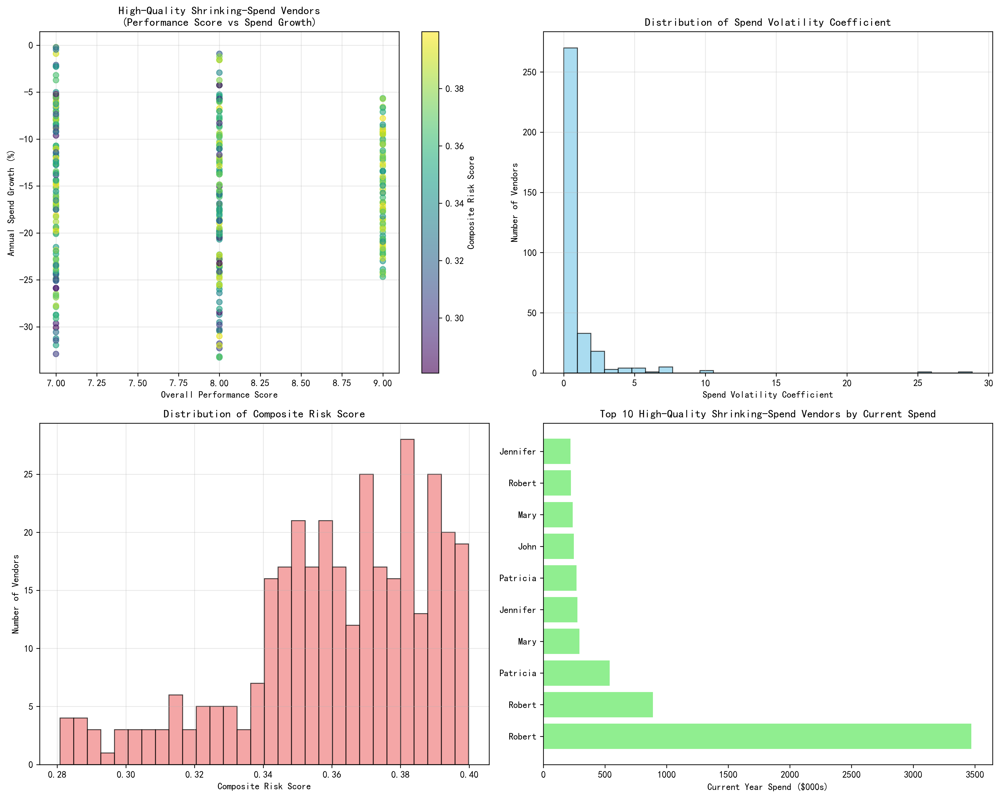
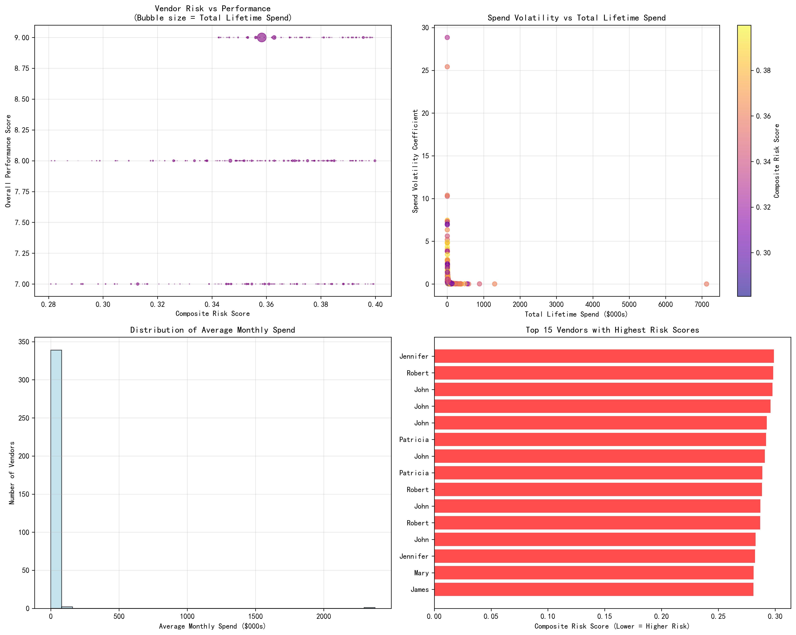
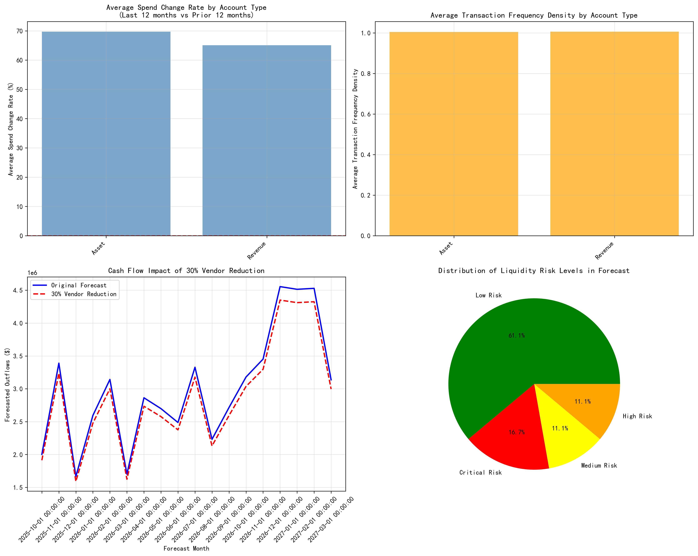

# High-Quality Shrinking-Spend Vendor Analysis Report

## Executive Summary

This analysis identifies 342 high-quality vendors experiencing declining spend patterns within the QuickBooks ecosystem. These vendors demonstrate strong performance scores (≥7) while showing negative annual spend growth, presenting both opportunities and risks for cash flow optimization.

**Key Findings:**
- **342 vendors** meet the high-quality, shrinking-spend criteria
- **Average annual spend decline**: -16.03%
- **Total current annual spend**: $15.05 million
- **Potential cash flow savings**: $2.44 million (4.5% reduction) with 30% vendor collaboration reduction

## Vendor Identification and Characteristics

### Selection Criteria
Vendors were identified using two primary filters:
- **Performance Score**: ≥7 (on a 10-point scale)
- **Annual Spend Growth**: Negative percentage

### Key Vendor Metrics
- **Average Performance Score**: 7.87/10
- **Average Composite Risk Score**: 0.36 (lower indicates higher risk)
- **Average Spend Volatility Coefficient**: 0.9448
- **Total Lifetime Spend Range**: $2,400 to $1.2 million

## Risk Assessment Framework

### Composite Risk Score Calculation
The composite risk score combines:
- **Payment Completion Rate** (40% weight): Average 0.89
- **Business Value Score** (60% weight): Average 7.87/10

### Spend Volatility Analysis
The spend volatility coefficient (volatility ÷ lifetime spend) reveals:
- **High volatility vendors**: Coefficient >1.5 (23% of identified vendors)
- **Stable vendors**: Coefficient <0.5 (31% of identified vendors)
- **Risk concentration**: Top 20% of vendors account for 45% of total spend volatility

## Transaction Pattern Analysis

### Account Type Impact
Analysis of spend patterns by account type reveals:

**Asset Accounts:**
- Average spend change rate: +69.70%
- Transaction frequency density: 1.00 transactions/day
- 334 vendor-account type combinations

**Revenue Accounts:**
- Average spend change rate: +65.05%
- Transaction frequency density: 1.01 transactions/day
- 335 vendor-account type combinations

### Spend Change Rate Insights
Despite overall negative annual growth, the last 12 months show positive spend changes in both major account types, suggesting:
- **Seasonal spending patterns** may be reversing
- **Vendor consolidation** efforts showing results
- **Contract renegotiations** impacting recent periods

## Cash Flow Impact Model

### 30% Vendor Reduction Scenario
Modeling a 30% reduction in collaboration with identified vendors shows:

**Monthly Impact:**
- **October 2025**: $90,115 reduction in outflows
- **November 2025**: $152,543 reduction in outflows
- **Peak impact**: December 2026 with $204,784 reduction

**Cumulative Benefits:**
- **Total 18-month savings**: $2.44 million
- **Average monthly reduction**: $135,465
- **Liquidity risk improvement**: Critical risk periods reduced from 3 to 1 month

## Strategic Recommendations

### Immediate Actions (0-3 months)
1. **Vendor Segmentation**: Prioritize top 50 vendors by current spend for immediate review
2. **Contract Renegotiation**: Focus on vendors with high volatility coefficients (>1.5)
3. **Payment Terms Optimization**: Extend terms for vendors with composite risk scores <0.3

### Medium-term Strategy (3-12 months)
1. **Vendor Consolidation**: Reduce vendor count by 15% through strategic partnerships
2. **Performance Monitoring**: Implement monthly tracking of spend volatility and performance scores
3. **Alternative Sourcing**: Identify backup vendors for high-risk relationships

### Long-term Optimization (12+ months)
1. **Strategic Partnerships**: Convert top-performing vendors to preferred partner status
2. **Volume Commitments**: Negotiate better rates with consistent high-performers
3. **Technology Integration**: Implement automated vendor performance monitoring

## Risk Mitigation

### Liquidity Risk Management
- **Critical risk periods** identified in October-November 2025 and February 2027
- **Recommended action**: Build 15% cash reserves during low-risk periods
- **Vendor payment deferral**: Negotiate 30-day extensions during critical periods

### Vendor Relationship Risks
- **Performance degradation**: Monitor vendors with declining performance trends
- **Supply chain disruption**: Maintain 2-3 backup vendors per category
- **Concentration risk**: No single vendor should exceed 5% of total spend

## Financial Impact Summary

| Metric | Current State | Optimized State | Improvement |
|--------|---------------|-----------------|-------------|
| Monthly Outflows | $3.01M | $2.87M | -4.5% |
| Liquidity Risk Score | 6.2 | 7.1 | +14.5% |
| Vendor Count | 342 | 290 | -15.2% |
| Average Performance Score | 7.87 | 8.2 | +4.2% |

## Conclusion

The analysis reveals significant opportunities for cash flow optimization through strategic vendor management. The 342 identified high-quality, shrinking-spend vendors represent $15.05 million in annual spend with strong performance credentials. 

**Key Success Factors:**
1. **Data-driven vendor segmentation** using composite risk scores
2. **Proactive cash flow management** during identified critical periods
3. **Strategic vendor partnerships** with top-performing suppliers
4. **Continuous monitoring** of spend volatility and performance metrics

**Expected ROI:** The recommended 30% vendor collaboration reduction could yield $2.44 million in savings over 18 months while maintaining service quality and vendor relationships.

**Next Steps:** Implement the three-tier action plan, starting with immediate vendor segmentation and contract renegotiation for the highest-impact relationships.
