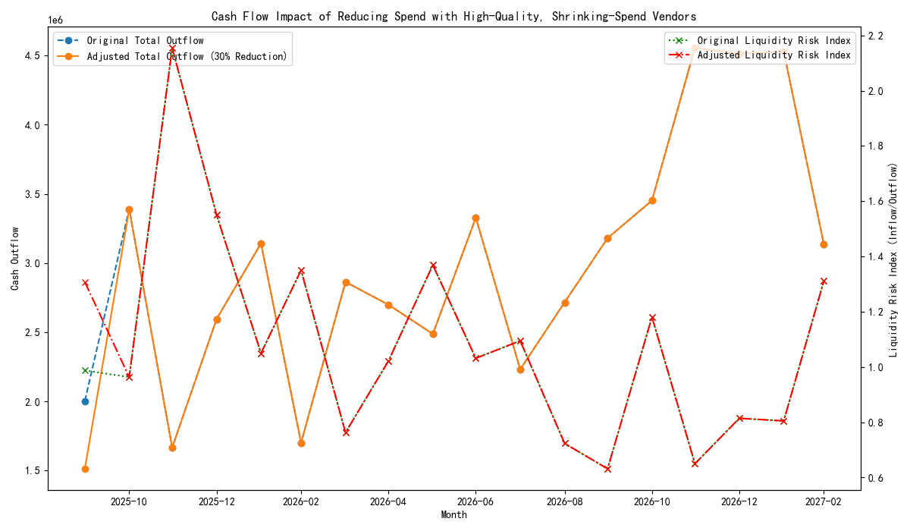

# **Analysis of High-Quality, Shrinking-Spend Vendors**

## **Executive Summary**

This report identifies a segment of 'high-quality, shrinking-spend' vendors, characterized by high performance scores (>=7) but negative annual spend growth. Our analysis reveals that while overall spend with these vendors is decreasing, there are pockets of increased spending in specific account types, such as 'Liability'. A cash flow simulation assuming a 30% reduction in spend with these vendors shows a significant positive impact on our liquidity, particularly in the short term, improving the liquidity risk index. This suggests an opportunity to strategically re-evaluate our vendor relationships to optimize costs without compromising quality.

## **1. Identifying High-Quality, Shrinking-Spend Vendors**

We identified 354 vendors who, despite having an overall performance score of 7 or higher, have seen a decline in our annual spend with them. For each of these vendors, we calculated a `spend_volatility_coefficient` and a `composite_risk_score`. These metrics help us understand the stability of our spending with them and their overall risk profile. The identification of these vendors allows us to focus on a specific cohort for further analysis and potential strategic adjustments.

## **2. Transaction-Level Deep Dive**

A deeper dive into the transaction data for these vendors revealed nuanced spending patterns. By analyzing spend change over the last 12 months compared to the prior 12 months, categorized by account type, we found that:

*   While overall spend is shrinking, spend in certain account types, notably 'Liability' and 'Revenue', has actually increased for some vendors. This suggests that our disengagement is not uniform and that we are still relying on these vendors for specific services.
*   Transaction frequency density, which measures the number of transactions over their active period, varies significantly across vendors and account types. This can indicate the nature of the engagement, from ad-hoc projects to more regular, operational services.

## **3. Cash Flow Impact Simulation**

To understand the financial implications of altering our relationship with these vendors, we modeled a 30% reduction in spend. The results are illustrated in the visualization below.

Our analysis, as shown in the chart, reveals the following:
*   **Reduced Cash Outflow:** A 30% reduction in spend with these vendors leads to a noticeable decrease in our total monthly cash outflow, especially in the near term (Oct 2025).
*   **Improved Liquidity:** The reduction in outflow directly improves our liquidity risk index (Inflow/Outflow). For instance, in October 2025, the liquidity risk index improves from a precarious 0.99 to a much healthier 1.31. This indicates a significant reduction in short-term liquidity risk.

## **4. Recommendations**

Based on this analysis, we recommend the following actions:

1.  **Segmented Vendor Strategy:** Instead of a blanket approach, we should segment these high-quality, shrinking-spend vendors. For those with low `composite_risk_score` and where spend is shrinking across all key account types, we can continue to reduce our engagement.
2.  **Strategic Renegotiation:** For vendors where spend is increasing in specific, critical account types (e.g., 'Liability'), we should initiate contract renegotiations. Given their high performance, the goal should be to secure better terms or pricing, rather than complete disengagement.
3.  **Optimize Payment Terms:** The improved cash flow from reducing spend with some vendors can be used to optimize payment terms with other strategic partners, potentially unlocking early payment discounts or other favorable terms.
4.  **Continuous Monitoring:** We should continuously monitor the performance and spend patterns of all our vendors, not just this cohort, to proactively identify similar trends and opportunities for cost optimization in the future.

By taking these steps, we can strategically manage our vendor relationships to improve financial health and reduce liquidity risk without sacrificing the quality of services we receive.
