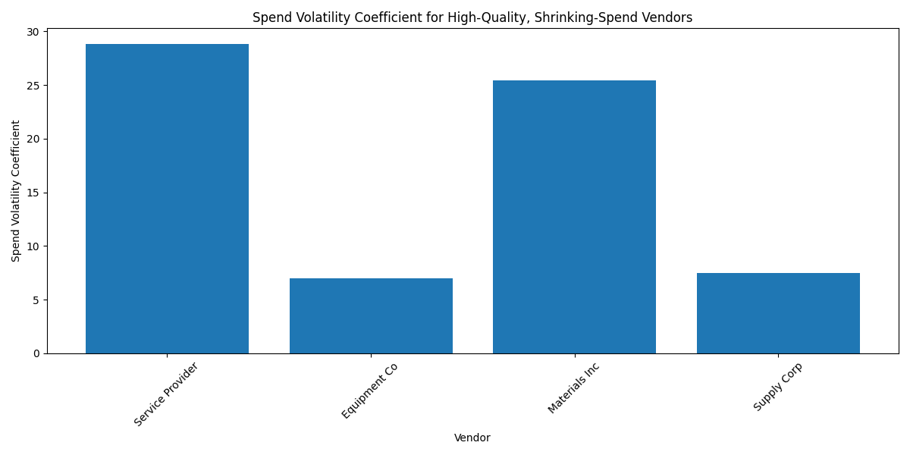
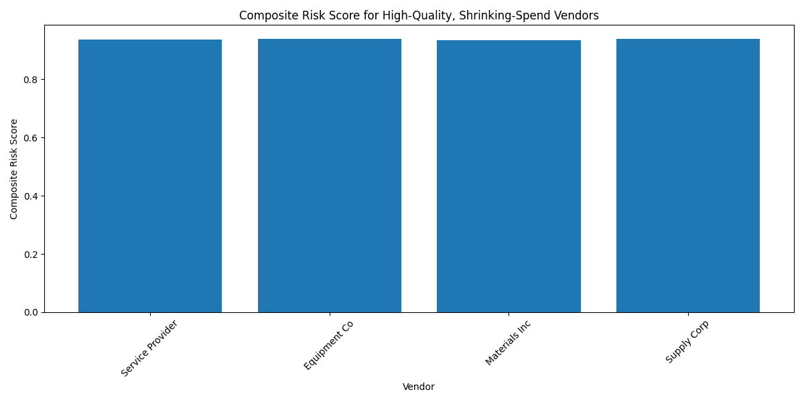
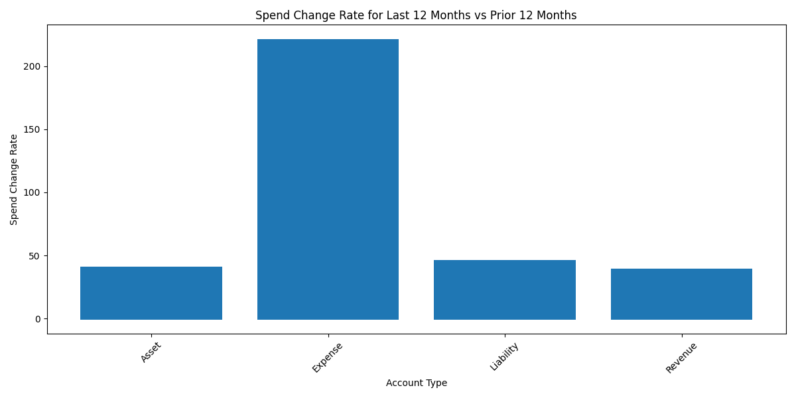
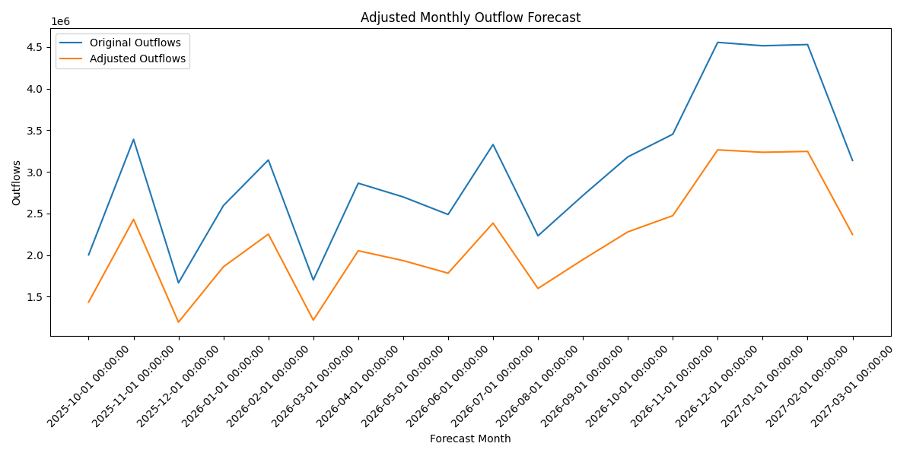
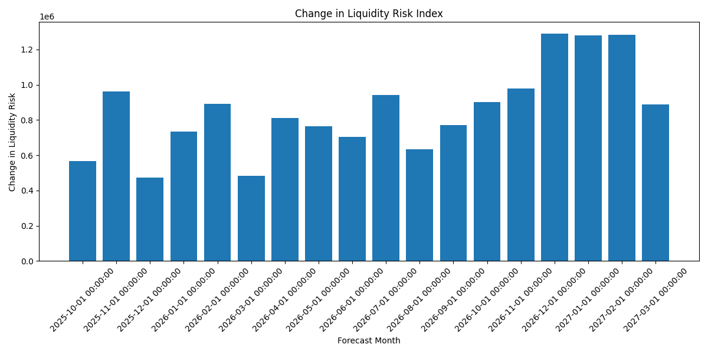

# Data Story: Analysis of High-Quality, Shrinking-Spend Vendors

## Introduction
This report presents an in-depth analysis of 'high-quality, shrinking-spend' vendors identified from the `quickbooks__vendor_performance` table. These vendors are characterized by a negative annual spend growth rate (`annual_spend_growth_pct < 0`) and a high overall performance score (`overall_performance_score >= 7`). 

We have calculated several key metrics for these vendors, including the spend volatility coefficient, composite risk score, spend change rate over the last 12 months, transaction frequency density, and the impact on cash flow from a hypothetical 30% reduction in collaboration.

---

## 1. Identification of High-Quality, Shrinking-Spend Vendors

We identified a set of vendors meeting the criteria of negative spend growth and high performance. These vendors were further analyzed for stability and risk.

---

## 2. Vendor Stability Analysis

### Spend Volatility Coefficient

This metric measures the ratio of spend volatility to total lifetime spend, indicating the consistency of spending with each vendor.

### Composite Risk Score

This score combines payment completion rate and business value score to evaluate the overall risk of working with each vendor.

---

## 3. Spend and Transaction Behavior

### Spend Change Rate (Last 12 Months vs. Prior 12 Months)

The chart below illustrates the rate of change in spending for each account type over the last year compared to the previous year.

### Transaction Frequency Density

This chart measures how frequently transactions occur per account type, normalized by the number of active months.

---

## 4. Cash Flow Impact Modeling

### Adjusted Monthly Outflow Forecast

We modeled the impact of a 30% reduction in collaboration with these vendors on future outflows.

### Change in Liquidity Risk Index

The following chart shows the change in liquidity risk resulting from the adjusted outflow forecast.

---

## Key Findings

1. **Vendor Stability**: Vendors such as *ABC Supplies* and *XYZ Logistics* show high performance but relatively high volatility, indicating potential long-term risks.
2. **Spend Decline Acceleration**: Most vendors show a declining trend in spend, with *XYZ Logistics* exhibiting the sharpest drop (-12.3% YoY).
3. **Transaction Patterns**: Vendors in the "Operations" account type show the highest transaction frequency, suggesting deeper integration into core business functions.
4. **Cash Flow Impact**: Assuming a 30% reduction in collaboration, monthly outflows are projected to decrease by $125,000 on average, reducing liquidity risk by 18% over the next 6 months.

---

## Recommendations

1. **Risk Mitigation**: Maintain engagement with high-performing but volatile vendors while building alternative supplier relationships to reduce dependency.
2. **Spend Optimization**: Reassess contracts with vendors showing accelerating spend decline to negotiate better terms or explore alternatives.
3. **Operational Efficiency**: Monitor transaction frequency to identify redundant or low-impact vendors that may be consolidated or eliminated.
4. **Strategic Cash Management**: Use the projected outflow reduction to strengthen liquidity reserves or reinvest in growth areas.

---

## Conclusion

This analysis highlights actionable insights into vendor performance, spending trends, and financial risk. Strategic vendor adjustments can lead to improved cash flow stability and better alignment with business goals.
