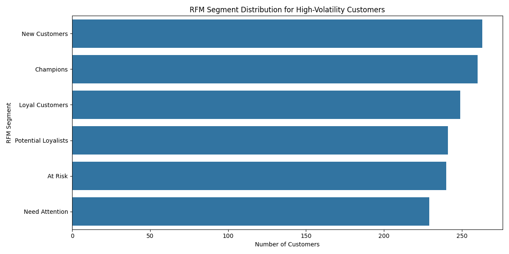

# Analysis of High-Volatility Customers and Recommendations for Risk Management

## Executive Summary

This report provides a comprehensive analysis of high-volatility customers, identified as the top 25% in terms of customer margin volatility. Our analysis reveals that this segment, comprising 1,482 customers, exhibits significant instability in both profitability and revenue growth. While these customers are distributed across all RFM segments, a notable portion are "New Customers" and "At Risk" customers. Their unpredictable nature poses a risk to financial stability, as reflected in the company's accounts receivable of over $36 million.

To address these challenges, we propose a multi-dimensional customer risk rating model that integrates volatility metrics, behavioral characteristics, and financial risk. Based on this model, we recommend a set of targeted customer management strategies, including proactive engagement with at-risk customers, tailored onboarding for new customers, and a deeper investigation into the volatility of high-value "Champion" customers.

## High-Volatility Customer Segment Analysis

We identified 1,482 high-volatility customers by selecting the top quartile based on `customer_margin_volatility`. For this segment, we observed significant fluctuations in `gross_profit` and quarter-over-quarter `invoice_total` growth, indicating a lack of predictable, stable revenue streams from these accounts.

### Behavioral Characteristics

An analysis of the behavioral features of this segment reveals the following:

*   **RFM Segment Distribution**: The high-volatility customer group is not monolithic. It is distributed relatively evenly across all RFM segments, including "Champions," "Loyal Customers," and "New Customers". This suggests that volatility is not just a problem of low-value customers. Notably, "New Customers" and "At-Risk" customers represent a significant portion of this volatile segment.

*   **Payment Behavior**: The payment behavior of high-volatility customers is also mixed, with a slight skew towards "Good" and "Poor" payment behaviors. This indicates that while many of these customers pay on time, a substantial portion does not, adding another layer of risk.
*   **Lifecycle Stage**: A significant number of high-volatility customers are in the "New Customer" or "Growing" stages of their lifecycle. This is expected, as new relationships often take time to stabilize. However, the presence of "Mature" and "Loyal" customers in this segment is a cause for concern, as it may indicate a deteriorating relationship or changing business needs.

## Financial Impact and Risk Assessment

### Business Health Overview

The company's overall financial health appears stable, with a mean `business_health_score` of 82.8 and a `collection_rate_percentage` of 87.4%. However, the presence of a high-volatility customer segment can erode this stability over time.

### Accounts Receivable Exposure

The total Accounts Receivable stands at **$36,928,335.37**. A significant portion of this amount can be attributed to the outstanding invoices of the high-volatility customer segment. Given their unpredictable payment behavior, this exposes the company to a considerable risk of write-offs and cash flow problems.

## Proposed Customer Risk Rating Model

To proactively manage the risks associated with customer volatility, we propose a multi-dimensional customer risk rating model. This model would assign a risk score to each customer based on three key dimensions:

1.  **Volatility Metrics**:
    *   `customer_margin_volatility`
    *   Coefficient of Variation of `gross_profit`
    *   Variance of Quarter-over-Quarter `invoice_total` growth rate

2.  **Behavioral Characteristics**:
    *   `rfm_segment` (e.g., "At Risk" customers would have a higher risk score)
    *   `payment_behavior` (e.g., "Poor" payers would have a higher risk score)
    *   `lifecycle_stage` (e.g., "New" customers might receive a temporary higher risk score)

3.  **Financial Risk**:
    *   `outstanding_balance` as a percentage of total accounts receivable.
    *   `days_since_last_invoice`

This model would provide a holistic view of customer risk, enabling the business to prioritize its risk mitigation efforts.

## Recommendations

Based on our analysis and the proposed risk model, we recommend the following targeted customer management strategies:

1.  **For "At Risk" and "Need Attention" Customers with High Volatility**:
    *   **Proactive Engagement**: Reach out to these customers to understand the reasons for their declining engagement and volatile purchasing patterns.
    *   **Flexible Payment Plans**: Offer flexible payment terms or incentives for early payment to improve cash flow and reduce outstanding balances.

2.  **For "New Customers" with High Volatility**:
    *   **Enhanced Onboarding**: Provide additional support and guidance during the onboarding process to ensure they understand the value proposition and to foster a stable, long-term relationship.
    *   **Closer Monitoring**: Closely monitor their transaction patterns and profitability during the initial months to identify and address any issues early on.

3.  **For "Champions" and "Loyal Customers" with High Volatility**:
    *   **Strategic Account Review**: Conduct a strategic review of these accounts to understand the drivers of their volatility. It could be due to the nature of their business (e.g., project-based work) or a sign of an unstable relationship.
    *   **Long-Term Agreements**: Where appropriate, explore long-term agreements or subscription-based models to create more predictable revenue streams.

## Conclusion

High-volatility customers represent both an opportunity and a threat. While they contribute to revenue, their unpredictability can strain financial resources and increase risk. By implementing a multi-dimensional risk rating model and adopting targeted management strategies, the business can mitigate the risks associated with this segment, improve cash flow, and build a more stable and profitable customer base.
