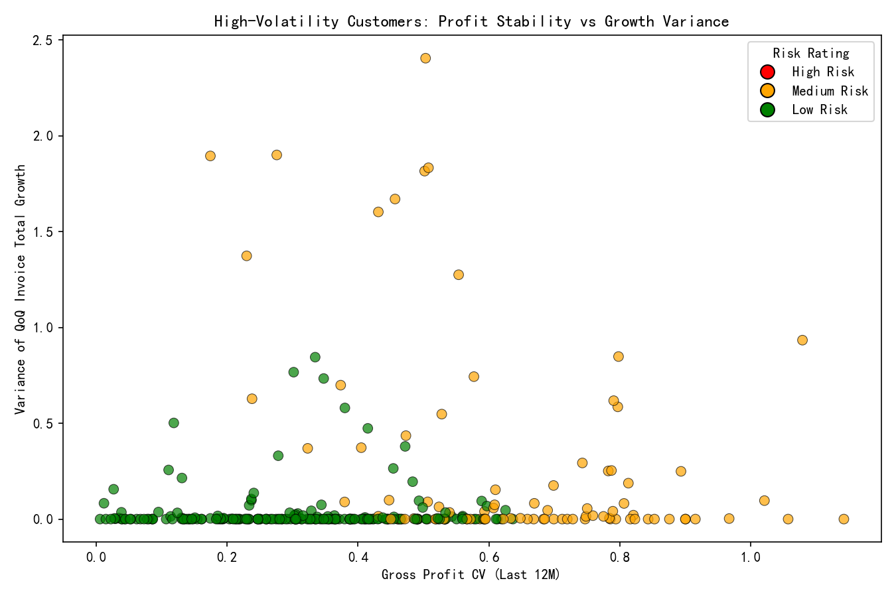

# Customer Volatility, Profit Stability, and Risk: An Integrated Analysis

## Executive Summary
- High-volatility segment definition: top 25% by customer_margin_volatility from profitability data.
- Size of cohort: 700 customers.
- Profit stability:
  - Median gross_profit CV (last 12 months): 0.364.
  - Median variance of quarter-over-quarter (QoQ) invoice_total growth: 0.0 (note: many customers have sparse or stable quarterly activity; variance computed over last 6 quarters where available).
- Behavioral relationships:
  - HV cohort spans lifecycle stages: New (206), Loyal (179), Mature (158), Growing (157).
  - HV cohort RFM composition: Champions (133), New Customers (128), Loyal Customers (119), Potential Loyalists (115), At Risk (109), Need Attention (96).
  - Payment behavior in HV: Excellent (178), Good (176), Average (176), Poor (170) — volatility is not exclusively driven by poor payers.
  - Weak correlation between profit CV and revenue trend correlation: 0.045; CV vs payment_rate_percentage was not conclusive due to missing values.
- Financial impact:
  - Average HV share of monthly revenue: 2.12% (median 0.0%), suggesting HV revenue is concentrated in a few months.
  - Correlation between HV revenue share and business_health_score over the last 12 months: -0.1602 (slight negative association).
  - Differential impact on collection rate: HV collection rate minus overall averaged +165.25 pp. This is likely inflated by months with very small HV revenue denominators; interpret cautiously.
- Accounts receivable (AR) risk exposure:
  - At latest balance sheet date (2025-10-31), AR comprised 100% of recorded amounts in the table (dataset appears focused on receivables).
  - AR aging breakdown: Current (0–30d) 76.2%, 31–60d 13.8%, 61–90d 7.0%, Unspecified 3.0%. Concentration in current is favorable, but the past-due tail (20.8%) warrants attention.
- Risk rating model:
  - Inputs: volatility (gross_profit_cv_12m, QoQ variance), payment behavior, overdue count, revenue trend correlation, payment rate, AR exposure.
  - Weights: volatility(25%), growth variance(20%), payment behavior(20%), overdue(10%), trend(10%), collection risk(10%), AR exposure(5%).
  - Distribution: Low risk 574, Medium risk 126, High risk 0. Top medium-risk customers are characterized by high CV and elevated QoQ variance.

## Visualization

High-volatility customers’ profit stability vs growth variance scatter, sized by outstanding balance and colored by risk rating:

Interpretation:
- Many HV customers cluster at low QoQ variance but varying CV, indicating intra-month profit variability even when quarter growth is steady.
- The few with both high CV and high variance (orange/red) represent priority monitoring targets due to compounding volatility.

## Methodology Highlights
- High-volatility cohort identified via NTILE(4) over MAX(customer_margin_volatility) per customer.
- Profit stability quantified as CV = std(gross_profit)/mean(gross_profit) over the last 12 months.
- QoQ growth variance computed over the last 6 quarters per customer.
- Behavioral linkage via joins to customer_analytics: rfm_segment, payment_behavior, revenue_trend_correlation, lifecycle_stage, payment metrics.
- Contribution to business health: monthly HV revenue share correlated against business_health_score; differential impact on collection rate measured relative to overall.
- AR exposure analyzed using balance_sheet account types/names and aging buckets (0–30, 31–60, 61–90 days).
- Multi-dimensional risk rating model integrated volatility, behavior, and AR exposure with specified weights.

## Diagnostic Insights
- Volatility vs customer lifecycle:
  - The HV cohort is not confined to “At Risk” or “Need Attention”; it includes a high number of Champions and New Customers. This points to two volatility archetypes: early-stage onboarding volatility and high-activity champions with variable deal sizing/mix.
- Payment behavior and volatility:
  - The HV cohort has a balanced payment behavior distribution (Excellent, Good, Average, Poor), suggesting profit volatility stems more from demand/mix shifts than systemic late payments.
- Business health sensitivity:
  - A modest negative correlation (-0.16) indicates months where HV revenue share rises tend to align with slightly weaker business health scores. Potential causes include higher margin variability, mix of less profitable products, or operational strain from bursty demand.
- Collections risk:
  - The computed HV collection rate exceeding the overall rate by 165.25 pp signals a denominator effect where HV monthly revenue is small, making hv_coll/hv_rev unstable. Nevertheless, HV collections are not evidently lagging; targeted review of months with high HV share would help separate signal from artifacts.
- AR tail risk:
  - With 20.8% of AR past due (31–90 days), tightening collection controls for this tail can reduce risk exposure. Largest AR categories are current trade receivables and deposits.

## Prescriptive Recommendations
- Segment-specific actions:
  - New Customers (onboarding volatility):
    - Apply step-up credit terms (start with smaller credit limits, increase with positive payment history).
    - Require partial prepayments or deposits on first orders.
    - Structured onboarding (usage guidance, cadence calls) to stabilize demand patterns.
  - Champions and Loyal Customers (high activity volatility):
    - Negotiate volume commitments or rolling forecasts to smooth variability.
    - Implement mix-based pricing floors and performance rebates tied to margin stability.
    - Priority inventory allocation for forecasted spikes; monitor CV and QoQ variance monthly.
  - At Risk / Need Attention:
    - Tighten payment terms, enforce dunning strategies, and consider credit holds if overdue_count_12m rises.
    - Offer payment plans to accelerate past-due recovery (31–90 days buckets).
- Payment behavior management:
  - For “Poor” behavior within HV, deploy automated reminders, early-payment discounts, and require milestone-based billing to improve collection timing.
  - For “Average/Good”, promote early-payment incentives and clarify invoice disputes to avoid slippage into past-due.
- Portfolio controls:
  - Cap HV revenue share: target to keep HV share below 1.5% on a rolling 3-month basis and prioritize margin-stable accounts for growth.
  - Establish guardrail KPIs: gross_profit_cv_12m (target <0.30), QoQ variance (target <0.5), HV share of revenue (target <1.5%), and AR tail (31–90 days share <10%).
- AR risk mitigation:
  - Intensify collections for 31–90 day buckets with tailored outreach and settlement offers.
  - Review “Unspecified” AR and classify/clean to ensure accurate aging and prioritization.
- Data and model improvements:
  - Fill missing payment_rate_percentage and overdue metrics to strengthen the collection risk component.
  - Calibrate risk rating thresholds as monitoring data accrues; consider adding product-mix volatility (avg_product_margin variability) and margin floor breaches to the volatility score.

## Key Metrics Summary
- HV cohort size: 700 customers.
- Profit stability: median CV 0.364; QoQ variance median 0.0.
- Behavioral mix (HV):
  - Lifecycle: New 206, Loyal 179, Mature 158, Growing 157.
  - RFM: Champions 133, New 128, Loyal 119, Potential Loyalists 115, At Risk 109, Need Attention 96.
  - Payment behavior: Excellent 178, Good 176, Average 176, Poor 170.
- Financial impact:
  - HV share of monthly revenue: average 2.12% (median 0.0%).
  - Corr(HV share, business_health_score): -0.1602.
  - Differential HV collection rate vs overall: +165.25 pp (caution due to denominator effects).
- AR exposure:
  - Aging: Current 76.2%, 31–60 13.8%, 61–90 7.0%, Unspecified 3.0%.
- Risk model outputs:
  - Ratings: Low 574, Medium 126, High 0.

## Next Steps
- Operationalize the risk model in monthly reviews of the HV cohort; flag Medium-risk customers with high CV and QoQ variance for account planning and payment term adjustments.
- Implement targeted collections processes for the 31–90 day AR tail and track improvements.
- Set dashboards for the guardrail KPIs and monitor the correlation between HV share and business health to maintain resilience.

Image generated: high_volatility_risk_scatter.png

