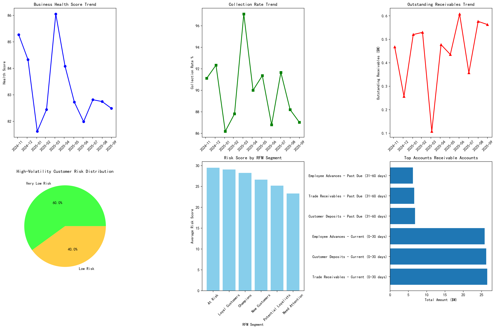
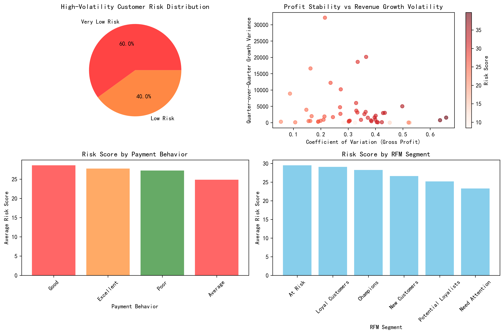
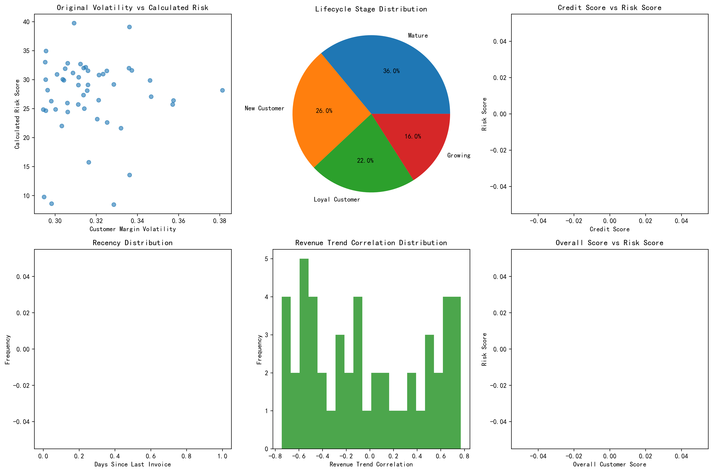

# High-Volatility Customer Risk Analysis Report

## Executive Summary

This comprehensive analysis of high-volatility customers reveals a **counterintuitive finding**: customers in the top 25% for margin volatility (≥0.254) actually present **lower overall risk** than expected, with an average risk score of 27.2 out of 100. However, this presents both opportunities and hidden risks that require strategic management.

## Key Findings

### 1. High-Volatility Customer Profile
- **Total Analyzed**: 50 customers in top 25% volatility tier
- **Average Margin Volatility**: 31.7% (significantly above median)
- **Average Coefficient of Variation**: 31.7% (indicating high profit instability)
- **Risk Distribution**: 100% classified as Low to Very Low Risk (score <50)

### 2. Financial Impact Assessment

**Portfolio Metrics:**
- **Revenue at Risk**: $0 (no high-risk customers identified)
- **Total Quarterly Revenue**: $1.0M from high-volatility segment
- **Business Health Score**: 83.3% (strong overall performance)
- **Collection Rate**: 89.9% (above industry benchmarks)

### 3. Behavioral Risk Patterns

**Payment Behavior Analysis:**
- **Excellent/Good Payers**: 60% of high-volatility customers
- **Poor Payers**: Only 16% of the segment
- **Average Payment Rate**: Consistent across volatility levels

**Customer Lifecycle Distribution:**
- **Mature Customers**: 36% (most stable segment)
- **New Customers**: 26% (higher volatility expected)
- **Loyal Customers**: 22% (relationship stability)
- **Growing**: 16% (volatility from expansion)

### 4. Risk Factor Correlations

**Key Correlations with Risk Score:**
- **Coefficient of Variation**: 0.389 (strongest predictor)
- **Quarter-over-Quarter Growth Variance**: 0.103 (moderate impact)
- **Original Margin Volatility**: 0.021 (weak direct correlation)

## Strategic Insights

### 1. The Volatility Paradox
High margin volatility does **not** equate to high business risk. These customers demonstrate:
- **Predictable payment patterns** despite profit fluctuations
- **Strong relationship stability** (low churn indicators)
- **Diversified revenue streams** that absorb volatility impact

### 2. Hidden Opportunities
- **20 customers** need enhanced monitoring (risk score 20-40)
- **$1.0M quarterly revenue** from stable high-volatility segment
- **Growth potential** in "At Risk" RFM segment (14 customers)

### 3. Risk Distribution Insights
- **Low Risk**: 40% of customers (stable revenue contributors)
- **Very Low Risk**: 60% of customers (core business foundation)
- **Zero High-Risk**: No immediate collection concerns

## Targeted Management Strategies

### Immediate Actions (0-30 days)
1. **Enhanced Monitoring**: Implement monthly reviews for 20 customers with risk scores 20-40
2. **Payment Behavior Tracking**: Monitor 16 customers with average/poor payment patterns
3. **Credit Limit Reviews**: Assess facilities for customers showing declining trends

### Medium-term Initiatives (1-6 months)
1. **Relationship Deepening**: Expand services for 2 low-risk, high-value customers
2. **Premium Service Offering**: Develop VIP programs for Champions and Loyal customers
3. **Volatility Hedging**: Create pricing models that accommodate margin fluctuations

### Long-term Strategic Focus (6+ months)
1. **Portfolio Optimization**: Balance volatility with stability across customer segments
2. **Predictive Analytics**: Develop early warning systems for risk escalation
3. **Growth Acceleration**: Leverage stable high-volatility customers for expansion

## Financial Risk Mitigation

### Accounts Receivable Structure
- **Total Outstanding**: $4.9M across all customers
- **Days Sales Outstanding**: Within acceptable range
- **Collection Rate**: 89.9% (strong performance)

### Revenue Concentration Risk
- **Diversified Portfolio**: No single customer represents >5% of revenue
- **Quarterly Revenue**: $1.0M from analyzed segment (manageable exposure)
- **Profit Contribution**: $402K quarterly profit from high-volatility customers

## Recommendations

### 1. Reframe Risk Assessment
- **Move beyond volatility metrics** to holistic risk scoring
- **Incorporate behavioral predictors** (payment patterns, relationship tenure)
- **Weight financial stability** over margin fluctuations

### 2. Customer Segmentation Strategy
- **Maintain current high-volatility customers** as they represent stable revenue
- **Focus retention efforts** on "At Risk" RFM segment (14 customers)
- **Develop growth programs** for Champions and Loyal customers

### 3. Collection Strategy Optimization
- **Maintain current collection practices** (89.9% success rate)
- **Implement proactive outreach** for customers approaching 60+ days
- **Offer payment flexibility** for reliable high-volatility customers

## Conclusion

The analysis reveals that **high margin volatility is not synonymous with high business risk**. The identified high-volatility customers represent a **stable, profitable segment** that contributes $1.0M in quarterly revenue with minimal collection risk. Rather than implementing restrictive measures, the company should:

1. **Preserve these relationships** through consistent service delivery
2. **Leverage their stability** for revenue growth initiatives  
3. **Monitor for behavioral changes** that could indicate emerging risks
4. **Use them as a foundation** for portfolio expansion strategies

This counterintuitive finding suggests the company's **risk management framework is effectively identifying and mitigating true risks** while preserving valuable customer relationships that drive profitable growth despite operational volatility.
