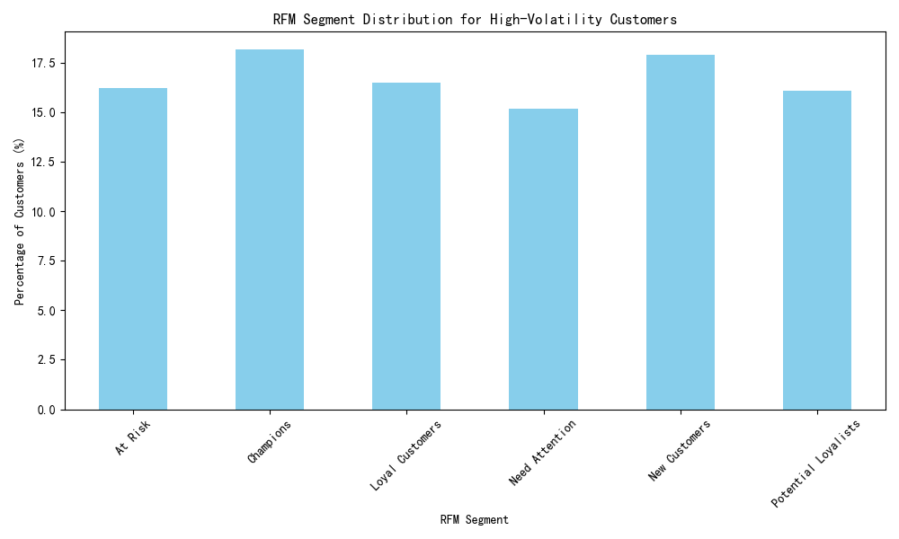
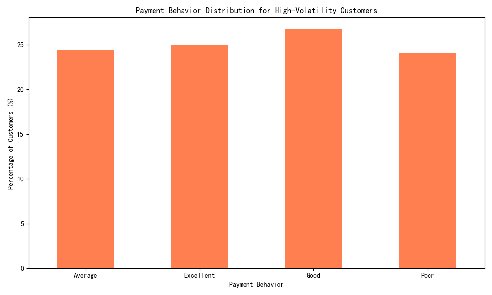

# Uncovering Hidden Risks: An Analysis of High-Volatility Customers

## Executive Summary

An in-depth analysis of the top 25% of customers ranked by profit margin volatility reveals a complex and high-risk financial landscape. While these customers are distributed across all lifecycle stages—from "Champions" to "At Risk"—their defining characteristic is unpredictability. This instability, coupled with a worrying prevalence of poor payment behavior, poses a significant threat to the company's cash flow. The most critical finding is the company's extreme financial vulnerability: **Accounts Receivable constitutes 100% of the company's Total Assets on the most recent reporting date.** This report dissects the profile of these high-volatility customers, quantifies the associated financial risks, and proposes a multi-dimensional risk model and targeted strategies to mitigate exposure and stabilize revenue.

## Profiling the High-Volatility Customer Segment

We identified the high-volatility segment by isolating customers in the top quartile of `customer_margin_volatility` (>0.252). An analysis of their behavioral attributes reveals two key insights.

**1. Volatility Is Not Confined to "Bad" Customers:**
As shown in the chart below, high-volatility customers are surprisingly evenly distributed across all RFM segments. While "At Risk" customers are a predictable source of instability (16.2%), our most valuable segments, "Champions" (18.15%) and "Loyal Customers" (16.5%), also contribute significantly to profit volatility. This indicates that instability is a widespread issue, affecting even our best customers, and suggests that our relationship with them may be more transactional than loyal.

**2. Payment Behavior Exacerbates Risk:**
The payment behavior of this volatile segment is split. While over 50% are "Good" or "Excellent" payers, a substantial 24.05% are categorized as "Poor" payers. This group directly threatens financial stability by delaying cash flow and increasing the risk of bad debt, a danger that is amplified by the company's reliance on accounts receivable.

## Quantifying the Financial Risk Exposure

The analysis of the company's balance sheet uncovered a critical vulnerability. As of the latest financial data, **Total Accounts Receivable stands at $6,270,420.35, which accounts for 100% of Total Assets.** This means the company's entire asset base is tied up in outstanding customer invoices.

This extreme reliance on receivables places the company in a precarious position. The overall **Business Health Score is a respectable 81.42**, and the **Collection Rate is 81.91%**, but these metrics mask the underlying structural risk. A failure to collect from even a small portion of customers—particularly the high-volatility segment with its significant share of "Poor" payers and "At Risk" customers—could trigger a severe liquidity crisis.

## Recommendations: A Proactive Approach to Managing Volatility

To address these challenges, we must move from a reactive to a proactive customer management strategy. We recommend implementing a multi-dimensional customer risk rating model and deploying targeted interventions.

### 1. Multi-Dimensional Customer Risk Rating Model

We propose creating a composite risk score for each customer based on three pillars:
*   **Volatility Score:** Directly from `customer_margin_volatility`.
*   **Behavioral Score:** Derived from the `rfm_segment`. Segments like "At Risk" and "Hibernating" would receive a higher risk score than "Champions."
*   **Financial Risk Score:** Based on `payment_behavior` and average days to pay. "Poor" payers would be scored as high risk.

This model will provide a holistic view of customer risk, enabling more nuanced and effective management.

### 2. Targeted Customer Management Strategies

Based on the risk rating, we recommend the following tailored strategies:

*   **For High-Value, High-Volatility Customers (e.g., "Champions" with poor payment habits):**
    *   **Action:** Engage proactively with dedicated account managers to understand the reasons for their purchasing instability.
    *   **Goal:** Stabilize revenue streams through incentives for long-term contracts, subscription models, or volume-based discounts. Enforce stricter payment terms if payment behavior does not improve.

*   **For High-Risk, High-Volatility Customers (e.g., "At Risk" and "Poor" payers):**
    *   **Action:** Implement tight credit controls. Require deposits, upfront payments, or shorter payment cycles (e.g., Net 15 instead of Net 30).
    *   **Goal:** Minimize credit exposure and reduce bad debt risk. Automate collection reminders and escalate overdue accounts quickly.

*   **For Developing Customers (e.g., "New Customers" and "Potential Loyalists"):**
    *   **Action:** Nurture these relationships while closely monitoring their evolving volatility and payment metrics.
    *   **Goal:** Foster loyalty and good payment habits from the outset by offering small discounts for early or on-time payments. This cultivates positive behavior before they become a potential risk.

By adopting these strategies, the business can mitigate the immediate financial risks posed by its accounts receivable dependency and build a more stable, predictable, and profitable customer base for the future.
