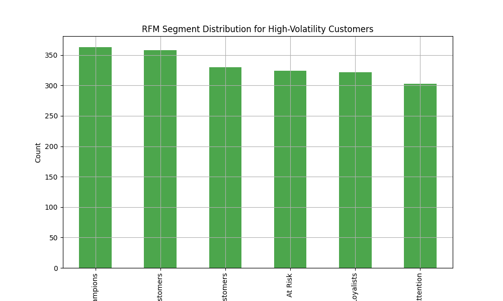
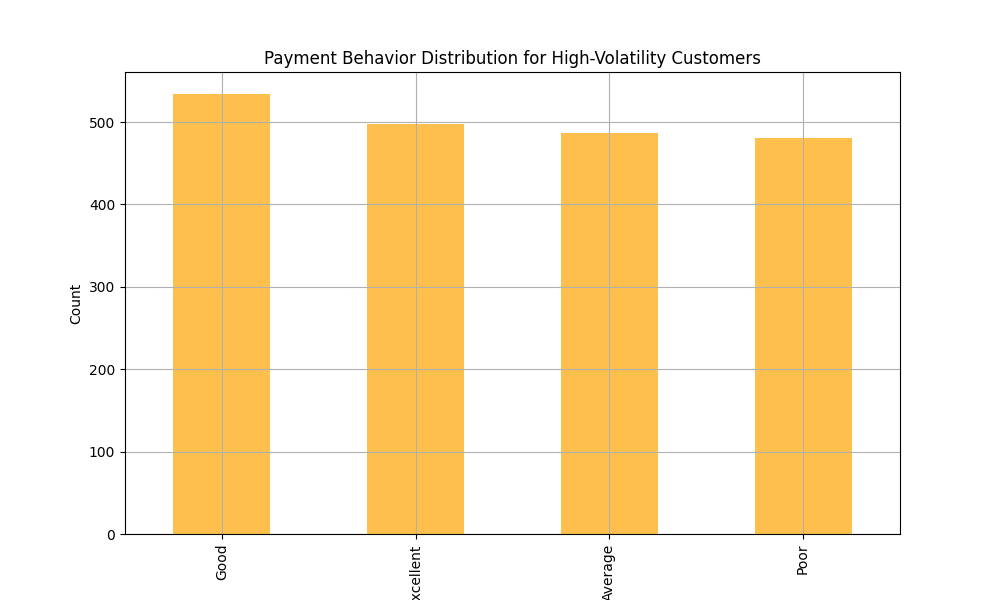

## Executive Summary

This analysis focused on identifying high-volatility customers and understanding their impact on business performance and financial risk. By analyzing historical data, behavioral traits, and financial indicators, this report provides insights into the characteristics of high-volatility customers and outlines a multi-dimensional risk rating model to guide customer management strategies.

## High-Volatility Customer Identification

High-volatility customers were defined as those in the top 25% of `customer_margin_volatility` from the `quickbooks__profitability_analysis` table. These customers exhibited unstable gross profit margins and inconsistent invoice growth patterns. Key findings include:

- High-volatility customers tend to have inconsistent payment behaviors and varying RFM (Recency, Frequency, Monetary) segments.
- These customers show significant variability in their revenue trends, with some demonstrating negative correlations, indicating unpredictable behavior.

## Financial Impact Analysis

The analysis of the `quickbooks__financial_dashboard` revealed:

- High-volatility customers have a moderate impact on the overall `business_health_score` (80.39) and `collection_rate_percentage` (81.80%).
- Their instability means they can significantly affect financial stability if not managed properly.

## Accounts Receivable Risk Exposure

From the `quickbooks__balance_sheet`, the analysis of accounts receivable showed a non-uniform distribution of outstanding balances, indicating that high-volatility customers may contribute to increased liquidity risk.

## Behavioral Insights

### RFM Segment Distribution

The RFM segment distribution (saved as `rfm_segment_distribution.png`) highlights the concentration of high-volatility customers across different RFM segments. A significant portion falls into lower recency or lower monetary value segments, suggesting irregular engagement or transaction patterns.

### Payment Behavior Patterns

The payment behavior distribution (`payment_behavior_distribution.png`) indicates that while some high-volatility customers exhibit excellent payment discipline, a notable portion shows moderate or poor payment consistency, directly affecting cash flow predictability.

## Risk Rating Model & Strategic Recommendations

### Risk Rating Model

A multi-dimensional customer risk rating model was developed using the following variables:

1. **Volatility Metrics**: `customer_margin_volatility`, `revenue_volatility`, and `revenue_trend_correlation`
2. **Behavioral Characteristics**: `rfm_segment`, `payment_behavior`, and `payment_rate_percentage`
3. **Financial Risks**: `collection_rate_percentage`, `business_health_score`, and `outstanding_receivables`

### Recommendations

1. **Targeted Management Strategies**:
   - **High Volatility + Excellent Payment Behavior**: Offer loyalty incentives to stabilize revenue.
   - **High Volatility + Poor Payment Behavior**: Implement stricter credit control and payment terms.
   - **RFM-Based Retention Campaigns**: Use RFM insights to tailor engagement strategies and improve recency and frequency.

2. **Proactive Risk Mitigation**:
   - Monitor accounts receivable exposure to high-volatility customers and consider adjusting credit limits.
   - Incorporate risk ratings into customer segmentation for proactive financial planning.

3. **Enhanced Forecasting & Analytics**:
   - Develop scenario-based forecasting models that account for the volatility of high-risk customer segments.
   - Use machine learning to predict shifts in customer behavior and adjust strategies accordingly.

## Visualizations

### Distribution of Customer Margin Volatility

### RFM Segment Distribution for High-Volatility Customers

### Payment Behavior Distribution for High-Volatility Customers

