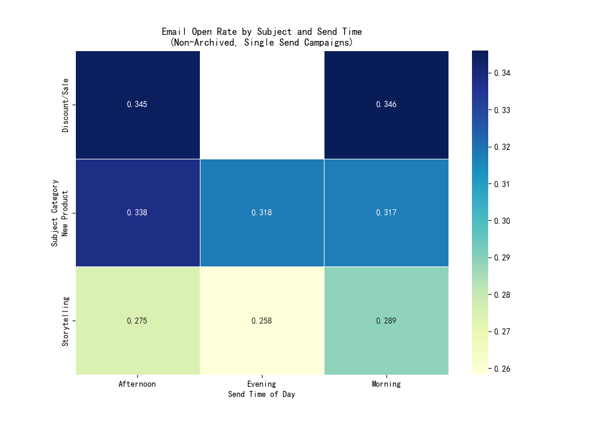

# Optimizing Email Campaign Performance: An Analysis of Send Time and Subject Content

## Executive Summary

This analysis dives into the Klaviyo campaign data to uncover the relationship between email send timing, subject matter, and key performance metrics. By examining open rates and click-to-open rates across different times of day and content categories, we have identified clear patterns that can inform a more effective and segmented email marketing strategy.

The key finding is that a one-size-fits-all approach to email timing is suboptimal. The ideal send time is highly dependent on the type of content being delivered. Promotional content, such as sales and new product announcements, performs best in the afternoon, when subscribers are most likely to open and click. In contrast, brand-building content like storytelling resonates most with a highly engaged morning audience.

Based on these findings, we recommend a content-segmented timing strategy to significantly boost engagement and drive better campaign results. Further recommendations include targeted A/B testing to explore new opportunities and refining subject lines for brand content.

---

## Analysis of Campaign Performance

To understand the interplay between content and timing, campaigns were categorized by their subject line into three primary groups: **Discount/Sale**, **New Product**, and **Storytelling**. We analyzed their performance during three key time windows: **Morning (6 AM - 12 PM)**, **Afternoon (12 PM - 6 PM)**, and **Evening (6 PM - 12 AM)**. The analysis was focused on non-archived, single-send campaigns to provide a clear view of standard email marketing efforts.

### Key Performance Metric 1: Email Open Rate

The open rate is the first crucial hurdle for any email campaign. Our analysis reveals that promotional content consistently achieves higher open rates than brand-building content.

**Insights:**
- **Discount/Sale Campaigns:** These are the top performers, achieving the highest open rates. They perform exceptionally well when sent in the **Morning (34.6%)** and **Afternoon (34.5%)**.
- **New Product Campaigns:** These also demonstrate strong performance, with a peak open rate in the **Afternoon (33.8%)**. Performance is consistent throughout the day.
- **Storytelling Campaigns:** This category has the lowest open rates, suggesting a more niche appeal. However, they perform significantly better in the **Morning (28.9%)** compared to other times of the day.

### Key Performance Metric 2: Email Click-to-Open Rate (CTOR)

The click-to-open rate measures the engagement of subscribers who have already opened the email. A high CTOR indicates that the email content and call-to-action are compelling.

**Insights:**
- **Discount/Sale Campaigns:** These emails not only get opened but also drive the most action, with a peak click rate in the **Afternoon (14.8%)**.
- **New Product Campaigns:** Following a similar pattern to open rates, click-throughs for new products are strongest in the **Afternoon (14.2%)**.
- **Storytelling Campaigns:** Despite lower open rates, storytelling content generates a strong CTOR in the **Morning (13.1%)**. This indicates that the audience for this content is smaller but highly engaged and interested in the brand's narrative.

---

## Actionable Recommendations & Business Impact

The data provides a clear roadmap for optimizing email strategy. The following recommendations are designed to maximize engagement by aligning send times with content strategy.

### 1. Implement a Content-Segmented Sending Schedule

Move away from a uniform send time and adopt a schedule based on the campaign's objective:
- **For Driving Sales (Discounts & New Products):** Schedule these campaigns for the **Afternoon**. Subscribers are most receptive to promotional offers and product news during this window, leading to higher opens and, more importantly, higher click-through rates.
- **For Building Brand Loyalty (Storytelling):** Deploy these campaigns in the **Morning**. This is when your most engaged brand advocates are most likely to open and interact with your content, strengthening their connection to the brand.

### 2. Strategic A/B Testing to Uncover New Opportunities

The analysis showed a lack of data for "Discount/Sale" campaigns sent in the evening. This data gap represents an opportunity, not a limitation.
- **Recommendation:** Design a controlled A/B test to compare the performance of an evening send against the current best-performing afternoon slot for a promotional campaign. This could uncover a new, untapped window for driving revenue.

### 3. Enhance Storytelling Subject Lines

The lower open rate for storytelling content suggests that the subject lines may not be compelling enough to grab a wider audience's attention.
- **Recommendation:** While the core content is resonating with a select group, experiment with more intriguing and curiosity-driven subject lines. The goal is to increase the initial open rate without sacrificing the quality of engagement. A/B test different subject line styles (e.g., questions, teasers) to find what works best.

### Potential Risks and Mitigation

- **Audience Fatigue:** Sending content at optimal times could increase email frequency for some subscribers. Monitor unsubscribe rates and overall engagement metrics closely to ensure the new schedule is not causing burnout.
- **Testing Costs:** A/B testing requires resources. To mitigate this, start with small, well-defined tests on limited segments of your audience to validate hypotheses before a full-scale rollout.

By implementing these data-driven strategies, the business can expect to see a significant improvement in email campaign performance, leading to higher customer engagement and increased revenue.
