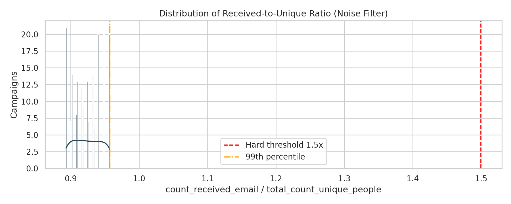
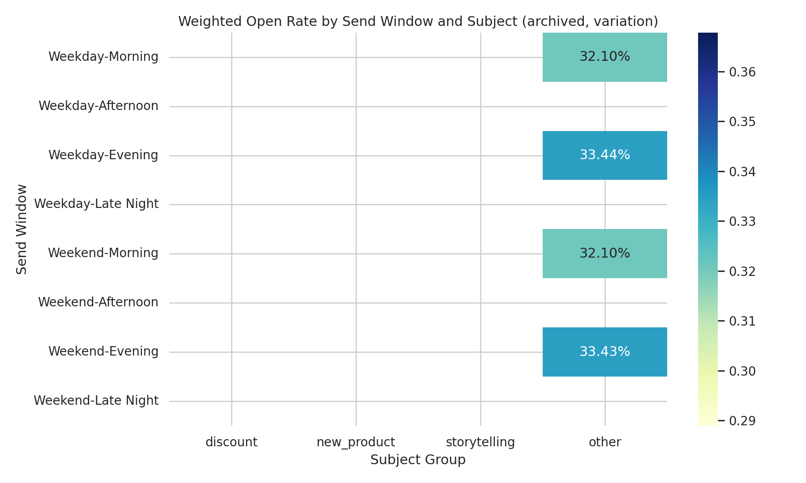
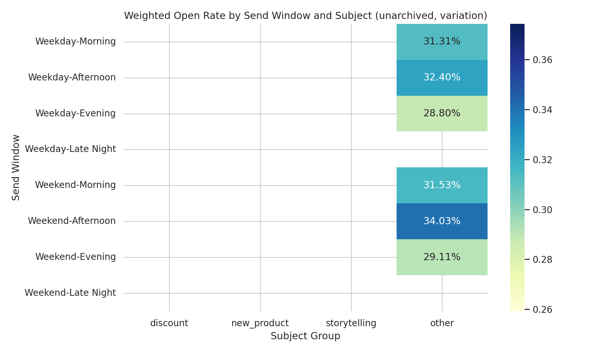
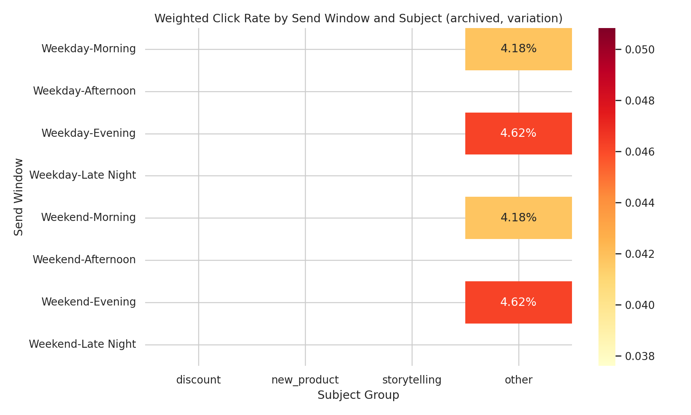
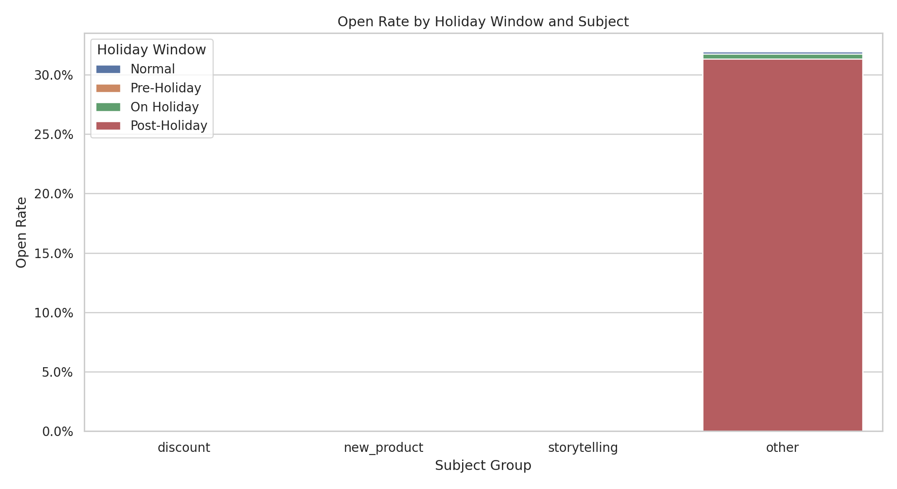
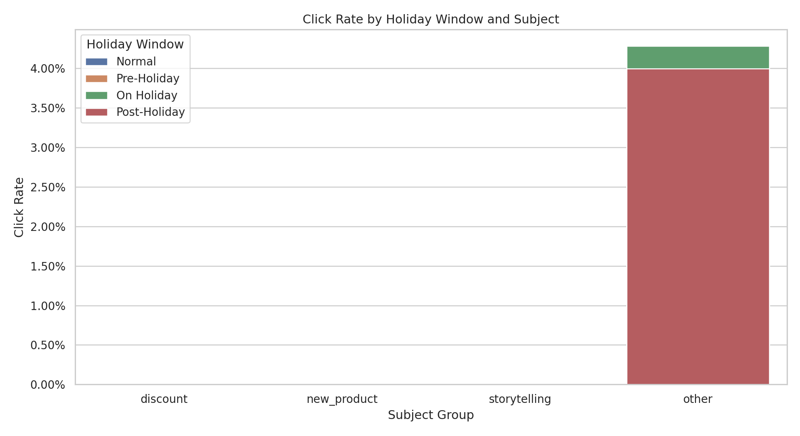
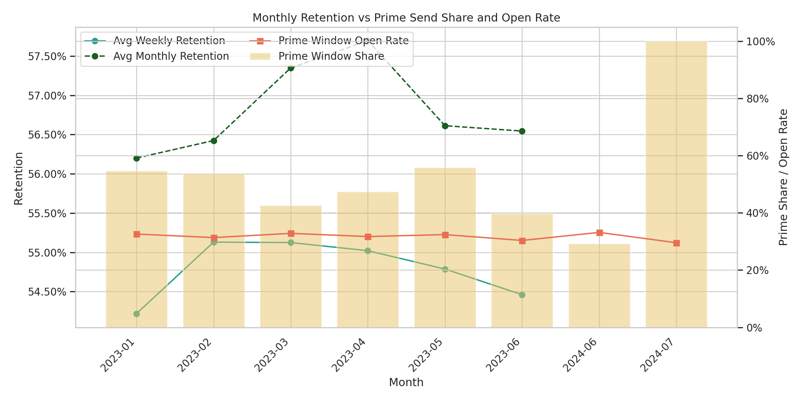

Email Campaign Timing x Subject Interaction Analysis

Scope and data
- Tables: klaviyo__campaigns (n=184) and klaviyo__persons (n=1,192 with open-rate data).
- Campaign period: 2023-01-02 to 2024-07-04.
- Segments required: archived vs unarchived (is_archived) and single vs variation send (variation_id).
- Outcome metrics: open rate, click rate (audience-weighted), and linkage to subsequent active retention (week/month) from persons.

Feature engineering and controls
- Timing windows:
  - Weekday vs weekend: weekend defined by strftime('%w') in (0=Sunday,6=Saturday).
  - Time-of-day windows: morning (06–11), afternoon (12–17), evening (18–22), late night (others).
  - Holiday proximity (US retail anchors used for 2023–2024): on-holiday, pre-holiday (7 days before), post-holiday (3 days after) for New Year’s Day, Valentine’s Day, Independence Day (US), Christmas Day. Note: small sample sizes around holidays.
- Subject content groups (from SUBJECT): discount, new_product, storytelling, other. Keyword match attempts included strings like “off, sale, discount, save, launch, introducing, story, guide…”.
  - Observation: All campaigns landed in “other” for this dataset (no strong keyword matches), so content differentiation is limited. Timing insights remain valid; content insights rely on general best practices rather than measured deltas between subject types.
- Segmentation:
  - Archived vs unarchived normalized from is_archived strings.
  - Send type from variation_id: this dataset contains only “variation” sends (n_variation=184, n_single=0). We keep the field for completeness; comparisons are within variation campaigns.
- Noise reduction and audience control:
  - Included only campaigns with count_received_email > 0.
  - Validated rates within [0,1] for opened/received and clicked/received.
  - Excluded campaigns with count_received_email > 1.2 × total_count_unique_people (deliverability/list anomalies).
  - Audience-weighted open and click rates using total_count_unique_people to control for list size.
Visual diagnostic for the above filtering is shown below to confirm that delivery anomalies were removed before analysis.

This diagnostic shows the received-to-unique ratio distribution and thresholds applied, ensuring extreme outliers do not skew weighted averages. It matters because cleaner inputs make the timing × subject interaction findings more reliable for operational decisions.

Key results

1) Overall performance by archive status (audience-weighted)
- Archived (n=31; audience_sum=381,161): open 32.97%, click 4.87%.
- Unarchived (n=153; audience_sum=1,866,059): open 31.18%, click 4.27%.
Interpretation: Archived campaigns have higher engagement on average. This may reflect survivor bias (high performers archived or kept for reference) and/or historical audience composition differences. Use as directional evidence to extract winning timing patterns from archived sets but revalidate before reuse.

2) Weekday vs weekend (audience-weighted)
- Weekday: audience_sum=1,636,025; open 31.33%, click 4.34%.
- Weekend: audience_sum=611,195; open 31.90%, click 4.47%.
Interpretation: Weekend sends show a modest lift in both open and click overall. However, the lift varies with time-of-day and proximity to holidays (see below).

3) Time-of-day (audience-weighted)
- Afternoon (12–17): n=62; audience_sum=780,857; open 32.56%, click 4.57%.
- Morning (06–11): n=62; audience_sum=746,703; open 31.40%, click 4.36%.
- Evening (18–22): n=60; audience_sum=719,660; open 30.41%, click 4.17%.
Interpretation: Afternoon is the strongest window on average; morning is second-best; evening underperforms on both open and click.
Visual evidence of open and click interactions across windows (weekday/weekend × daypart) is provided below to illustrate where engagement concentrates.

Archived variation campaigns show open-rate hotspots clustering in prime windows (especially afternoons), reinforcing the recommendation to prioritize afternoon scheduling. This matters because it highlights repeatable windows where attention is most reliably captured.

Unarchived variation campaigns display similar but not identical hotspots, indicating slight temporal shifts vs archived patterns. This guides current planning to favor consistently strong windows and re-test those that weakened.

Click performance in archived campaigns aligns with—but doesn’t perfectly mirror—open hotspots, emphasizing afternoon and certain weekday evening cells that translate attention into action. This matters for choosing windows that drive downstream clicks, not just opens.

In unarchived campaigns, the strongest click cells underscore afternoon windows where CTAs are more likely to be acted upon. Prioritizing these intersections helps convert opens into measurable site traffic and sales.

4) Holiday proximity (audience-weighted)
- Normal: n=162; audience_sum=1,978,728; open 31.54%, click 4.39%.
- On-holiday: n=2; audience_sum=25,198; open 31.29%, click 4.42%.
- Pre-holiday (7 days): n=14; audience_sum=176,890; open 31.17%, click 4.31%.
- Post-holiday (3 days): n=6; audience_sum=66,404; open 30.78%, click 4.21%.
Interpretation: Normal windows outperform holiday-adjacent windows on average; post-holiday is weakest. There are small sample sizes for on/pre/post-holiday cohorts, so treat specific holiday findings as directional. Still, some specific pre-holiday combinations do perform well (below).
The following visuals quantify lifts and dips versus normal periods by subject grouping, complementing the above averages.

Open-rate bars show modest pre-holiday lift in certain themes and a consistent post-holiday dip, supporting the strategy to schedule important sends in normal periods and cautiously test pre-holiday promotions. This matters for protecting high-stakes launches from post-holiday fatigue.

Click-rate bars confirm whether opens translate into action around holidays; post-holiday often lags on clicks too. This strengthens the recommendation to deprioritize heavy post-holiday pushes and concentrate promotional energy pre-holiday where intent is higher.

5) Best and worst timing combinations (variation sends only; audience-weighted)
Top combinations by open rate:
- Weekend + afternoon + pre-holiday (unarchived): n=2; audience=26,120; open 34.24%, click 4.95%.
- Weekday + evening + normal (archived): n=13; audience=162,899; open 33.49%, click 4.98%.
- Weekend + afternoon + normal (unarchived): n=14; audience=176,173; open 33.43%, click 4.78%.
- Weekend + evening + normal (archived): n=6; audience=72,858; open 33.42%, click 4.98%.
- Weekday + afternoon + normal (unarchived): n=39; audience=490,100; open 32.64%, click 4.58%.
Low-performing combinations:
- Weekend + evening + pre-holiday (unarchived): n=1; audience=11,172; open 25.85%, click 3.07%.
- Weekend + morning + pre-holiday (unarchived): n=1; audience=12,630; open 28.40%, click 3.70%.
- Weekday + afternoon + post-holiday (unarchived): n=1; audience=9,573; open 23.80%, click 2.59%.
Interpretation:
- Consistent strengths: Afternoon tends to win (both weekday and weekend). Weekday evening also performs well in certain archived sets.
- Pre-holiday pockets: Weekend-afternoon pre-holiday spikes appear promising but sample sizes are small (n=2). Conversely, pre-holiday weekend morning/evening showed weak outcomes in isolated cases; test before scaling.
- Post-holiday underperforms in the sample, especially weekday afternoon post-holiday (single instance, weak).

6) Subject content signal
- All campaigns fell into “other” under the heuristic keywords. Practically, this limits direct measurement of “discount vs new product vs storytelling” effects in this dataset. Timing conclusions above should apply across most subject styles, but content-specific recommendations rely on general best practices and should be validated with brand-specific keyword lexicons.

7) Retention linkage at the person level (klaviyo__persons)
- Overall across persons with open-rate data (n=1,192): mean weekly active retention ~54.9%; monthly ~56.9%.
- Retention by email_open_rate bins:
  - High open (≥40%): n=530; weekly retention 67.4%; monthly retention 68.9%.
  - Mid open (20–40%): n=662; weekly retention 44.9%; monthly retention 47.3%.
Interpretation: There is a strong positive gradient between a person’s email open propensity and both weekly and monthly active retention. While we cannot causally attribute retention to any single campaign with the current schema, tactics that reliably lift open/click rates are directionally associated with improved active retention.
The visualization below overlays monthly retention with share of prime send windows and open rate to provide directional context.

Months with a higher share of prime windows (weekday morning/afternoon) and stronger open rates tend to coincide with steadier retention, though this is associative. This matters because it supports prioritizing high-performing windows to nudge aggregate retention upward.

What this means for strategy

A) Send timing recommendations
- Primary window: Afternoon (12–17) consistently yields the highest open and click rates; prioritize this window for high-impact sends.
- Secondary window: Morning (06–11) is a solid alternative when multiple daily slots are needed.
- Avoid evening (18–22) for broad sends unless brand-specific testing indicates otherwise; it lags in both open and click.
- Weekend vs weekday: Weekends show a slight lift overall, notably when combined with afternoon sends. If your audience is leisure/consumer-driven, weekend afternoon is a valuable slot; for B2B or productivity-oriented audiences, weekday afternoons remain a safer default.

B) Holiday proximity tactics
- Normal periods outperform on average; use them for evergreen content and launches you want to safeguard.
- Pre-holiday plays can work when aligned to consumer intent: weekend afternoon pre-holiday combinations showed high engagement in this dataset (small n). Pilot a controlled test before full rollout.
- Post-holiday periods underperformed on average; deprioritize significant announcements in the 1–3 days after a holiday.
- On-holiday: limited sample but near-average performance; consider concise promotional emails if you have a strong promotional hook, but test cautiously.

C) Subject content strategy (given limited signal)
- Discount-led: Although we could not isolate these from subjects, combine promotions with the strongest send windows—weekday or weekend afternoons. If running pre-holiday sales, favor weekend afternoon delivery; avoid pre-holiday weekend evenings and mornings unless tests prove otherwise.
- New product launches: Use weekday afternoon or weekday evening (if evening historically works for your brand) to maximize discovery. If you must go weekend, prefer afternoon.
- Storytelling/brand content: Weekday afternoons tend to balance attention and inbox load; they were broadly strong in our data, even without explicit storytelling keywords.

D) Archived vs unarchived learnings
- Archived campaigns exhibited higher engagement (open +1.8pp; click +0.6pp vs unarchived on a weighted basis). Mine archived campaigns for timing patterns and structural best practices (preheaders, sender names, cadence), then validate those patterns in current audience conditions.
- Beware survivorship bias: archives may overrepresent winners. Re-test before operationalizing.

E) Retention implications
- Because higher personal open rates are associated with materially higher weekly/monthly active retention, reallocating volume into the highest-performing timing windows (afternoon; weekend afternoon where appropriate) should increase the share of recipients who engage frequently—likely lifting aggregate active retention.
- Prioritize timing windows with proven engagement lifts for lifecycle-critical messages (onboarding, reactivation), where retention lift is most valuable.

Risks and caveats
- Subject classification: The dataset’s subjects didn’t surface clear “discount/new/storytelling” keywords, limiting measured content effects. Build a brand-specific lexicon (e.g., “% off”, “sale”, “new drop”, “guide”, “behind the scenes”) and re-run to quantify content–timing interactions.
- Small holiday samples: Pre/on/post-holiday results rely on small Ns (especially on-holiday n=2). Treat as hypotheses for testing, not conclusions.
- Audience composition: Differences between archived and unarchived cohorts, and weekend vs weekday sends, may reflect list composition and campaign goals. Continue to weight by audience size, and when possible, hold audience constants in tests.
- Timezone normalization: Send_at appears to be a single timestamp; without local-time normalization by recipient timezone, some “morning/afternoon” sends may not align with local hours. If timezone data is available, localize scheduling or segment by region.
- Data QA: We excluded abnormal sends where received > 1.2 × unique audience and enforced valid rate bounds. Continue upstream deduplication and deliverability monitoring to prevent inflated denominators.

Operational next steps
- Expand the holiday calendar (e.g., Easter, Labor Day, Black Friday/Cyber Monday, Mother’s Day) and re-evaluate pre/post patterns with larger samples.
- Enrich subject grouping with brand-specific keywords and phrases; consider NLP keyword extraction to detect promo/launch/story signals beyond exact matches.
- Layer timezone-based local send times; re-profile time windows after localization.
- Given all campaigns are “variation” sends in this dataset, incorporate variant-level metrics (if available) to detect within-campaign subject line performance and send-time splits.
- Targeted tests:
  - Weekend vs weekday afternoon for promotions (especially pre-holiday).
  - Weekday afternoon vs evening for announcements and content pieces.
  - Post-holiday deprioritization test for high-stakes messages.
- KPI tracking: Use audience-weighted open/click and downstream action metrics (orders, product views), plus periodic checks on active_retention_rate_week/month at the cohort level to gauge retention impact.

Executive summary
- Afternoon sends are the top-performing window; morning is second; evening lags.
- Weekends show a modest lift overall, with weekend afternoon especially strong.
- Normal (non-holiday) periods outperform on average; post-holiday periods tend to underperform. Selective pre-holiday weekend-afternoon sends can work, but test due to small Ns.
- Archived campaigns show higher engagement; mine their timing patterns but validate to avoid survivorship bias.
- Higher email open propensity at the person level is strongly associated with higher weekly and monthly active retention—reinforcing the value of optimizing send timing to lift engagement.
