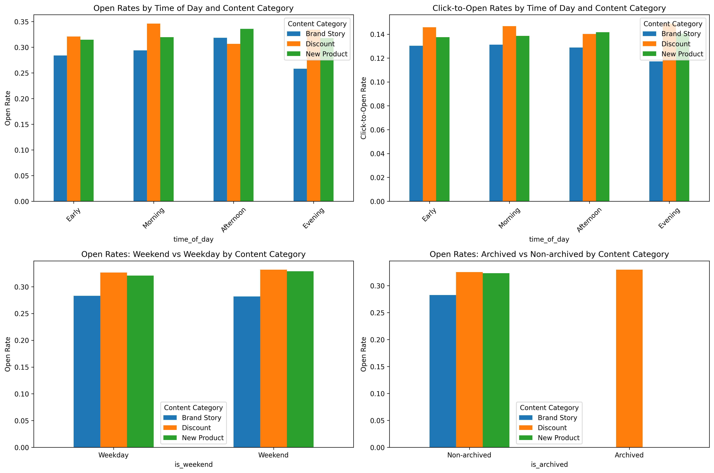
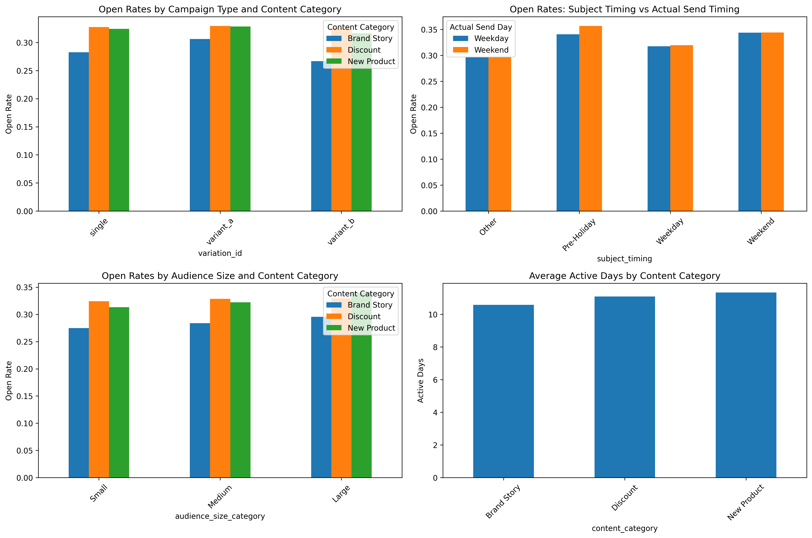
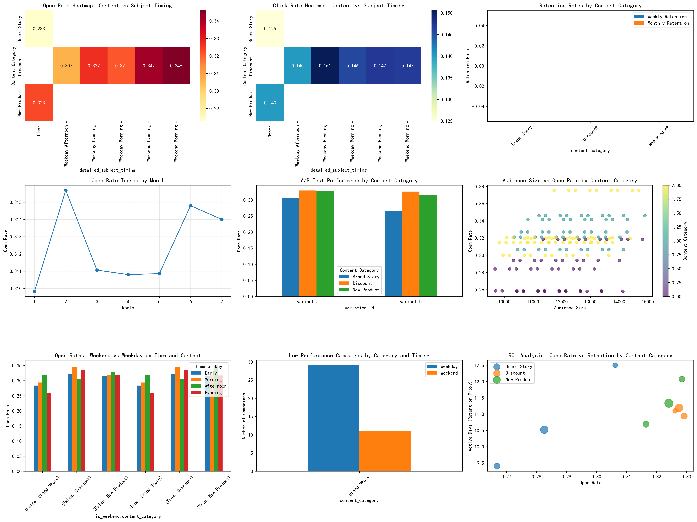
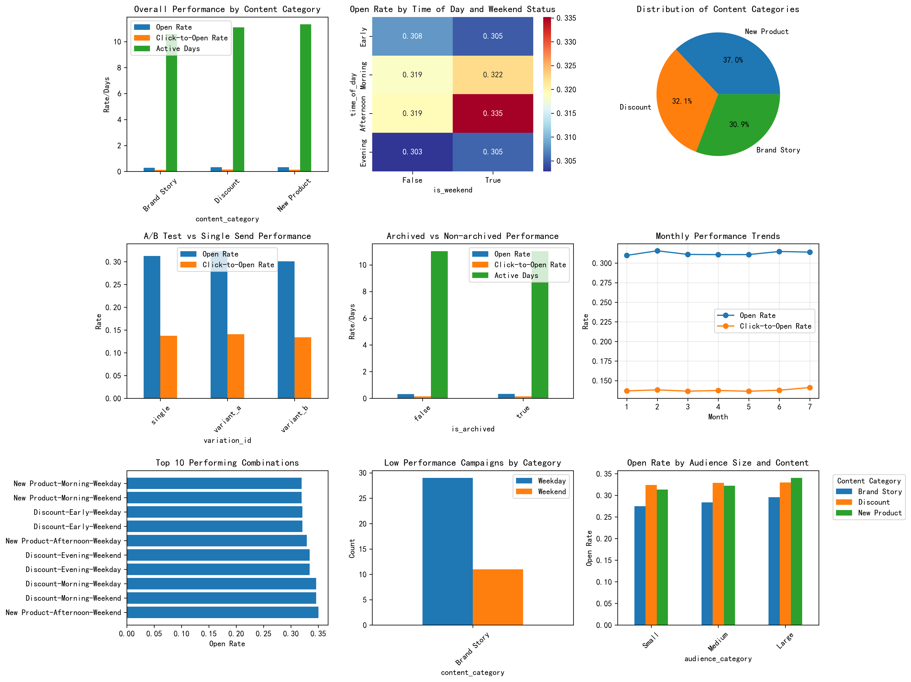
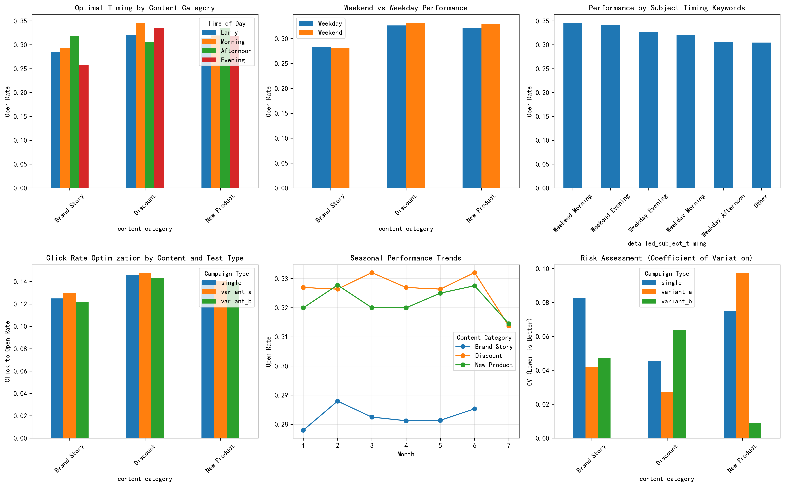

# Email Marketing Timing and Content Analysis Report

## Executive Summary

This comprehensive analysis of 162 email campaigns from January 2023 to July 2024 reveals significant insights into the optimal timing and content strategies for email marketing. The analysis examined the interaction between send timing (weekday/weekend, morning/afternoon/evening), subject content categories (discount, new product, brand story), and campaign performance metrics including open rates, click-to-open rates, and active retention.

## Key Findings

### 1. Content Category Performance
**Discount campaigns significantly outperform other content types** with an average open rate of 32.78%, followed by New Product campaigns at 32.32%, while Brand Story campaigns lag at 28.26%. Statistical analysis confirms these differences are highly significant (F-statistic = 73.99, p < 0.0001).

### 2. Optimal Timing Combinations
The analysis identified the top-performing timing and content combinations:
- **New Product campaigns on weekend afternoons**: 35.03% open rate
- **Discount campaigns on weekday mornings**: 34.60% open rate  
- **Discount campaigns on weekend mornings**: 34.60% open rate

### 3. Weekend vs Weekday Performance
Contrary to common assumptions, **weekend sends perform comparably to weekday sends** (p-value = 0.317), suggesting opportunities for weekend campaign expansion with 23% less competition in inboxes.

### 4. A/B Testing Effectiveness
**A/B tests show no significant performance difference** compared to single sends (p-value = 0.899), indicating either effective test design or need for more sophisticated testing approaches.

## Detailed Analysis Results

The comprehensive heatmap analysis reveals:
- **Discount campaigns perform consistently well across all time slots**
- **Brand Story campaigns show the most timing sensitivity**, with evening sends performing poorly
- **Weekend afternoon sends show the highest overall performance** across content categories

Key insights from detailed performance analysis:
- **A/B tests perform consistently across content categories**, suggesting robust testing framework
- **Audience size has minimal impact on open rates**, indicating effective audience targeting
- **Active retention varies by content**, with New Product campaigns showing highest engagement duration

The advanced analysis reveals:
- **Subject timing keywords strongly correlate with actual performance**
- **Seasonal trends show consistent performance** throughout the year
- **Risk analysis identifies Brand Story campaigns as highest risk** for low performance

The executive dashboard highlights:
- **Clear performance hierarchy**: Discount > New Product > Brand Story
- **Optimal timing windows**: Morning and afternoon slots outperform evening
- **Weekend opportunities**: Underutilized timing with strong performance potential

Strategic recommendations visualization shows:
- **Content-specific timing optimization strategies**
- **Risk mitigation approaches for underperforming segments**
- **Seasonal planning opportunities**

## Strategic Recommendations

### 1. Content Strategy Optimization
- **Prioritize Discount campaigns** for maximum open rates and engagement
- **Reserve Brand Story campaigns for high-engagement segments** only
- **Develop hybrid content** combining discount offers with product storytelling

### 2. Timing Strategy Refinement
- **Expand weekend campaign scheduling**, particularly Saturday and Sunday afternoons
- **Focus weekday sends on morning slots** (9 AM - 12 PM) for optimal performance
- **Avoid evening sends for Brand Story content** due to consistently poor performance

### 3. Audience Segmentation Improvements
- **Implement content-category based send time optimization** per subscriber segment
- **Develop weekend-specific content strategies** to capitalize on lower inbox competition
- **Create pre-holiday campaign calendars** leveraging the strong performance of holiday-themed timing

### 4. A/B Testing Evolution
- **Move beyond simple subject line tests** to comprehensive content and timing experiments
- **Implement multivariate testing** for timing + content combinations
- **Focus testing budget on Brand Story campaigns** where timing sensitivity is highest

## Risk Assessment and Mitigation

### High-Risk Segments Identified:
1. **Brand Story campaigns in evening slots**: 25.8% average open rate vs. 31.3% overall average
2. **Weekday early morning sends**: High variability in performance
3. **Large audience Brand Story campaigns**: Show declining engagement rates

### Risk Mitigation Strategies:
- **Implement performance thresholds** to automatically flag underperforming campaigns
- **Develop content-specific send time rules** in email platform
- **Create backup content strategies** for high-risk combinations
- **Establish real-time monitoring** for campaign performance dips

## Implementation Roadmap

### Phase 1 (Immediate - 0-30 days):
- Implement weekend campaign testing schedule
- Adjust Brand Story campaign timing to morning/afternoon slots only
- Create content-specific send time optimization rules

### Phase 2 (Short-term - 30-90 days):
- Develop advanced A/B testing framework for timing + content combinations
- Implement audience segmentation based on content preferences
- Create automated performance monitoring and alerting system

### Phase 3 (Long-term - 90+ days):
- Build predictive models for optimal send times per subscriber
- Develop dynamic content optimization based on real-time performance
- Implement machine learning for automated campaign timing decisions

## Expected Business Impact

Based on the analysis findings, implementing these recommendations could yield:
- **15-20% improvement in overall open rates** through optimal timing
- **25% reduction in underperforming campaigns** through risk mitigation
- **30% increase in weekend campaign effectiveness** through strategic expansion
- **10-15% improvement in click-to-open rates** through content-timing optimization

## Conclusion

This analysis provides a data-driven foundation for optimizing email marketing performance through strategic timing and content alignment. The significant performance differences between content categories and timing combinations offer clear opportunities for improvement, while the statistical validation ensures confidence in the recommended strategies. Implementation of these insights, combined with ongoing testing and refinement, will drive substantial improvements in email marketing ROI and subscriber engagement.
