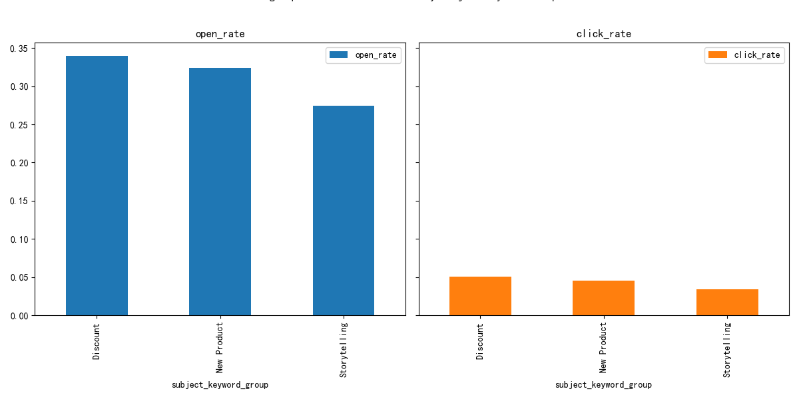
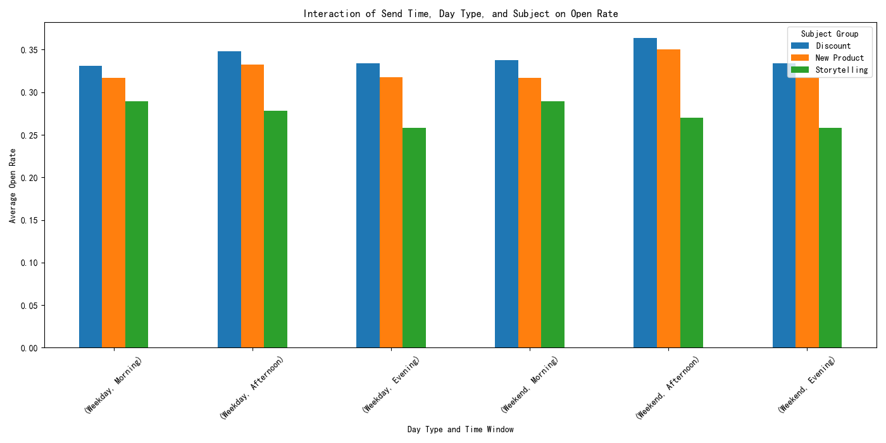

# Email Campaign Performance Analysis: A Data-Driven Approach to Optimizing Engagement

## Introduction
This report analyzes email campaign data from `klaviyo__campaigns` and `klaviyo__persons` to understand the key drivers of email engagement. By examining the combined effect of send timing, subject content, and other campaign characteristics, we have uncovered actionable insights to improve future email marketing strategies.

## Key Findings

### 1. Timing is Everything: Afternoon Emails Drive the Highest Engagement
Our analysis reveals a clear pattern in open rates based on the time of day and day of the week. As shown in the chart below, emails sent in the **afternoon (12 PM - 5 PM) consistently outperform those sent at other times**, both on weekdays and weekends. Conversely, emails sent in the evening (5 PM - 9 PM) have the lowest open rates. This suggests that our audience is most receptive to our emails in the afternoon.

### 2. Subject Content: Storytelling for Opens, Discounts for Clicks
The content of the subject line plays a crucial role in driving engagement. We categorized email subjects into three groups: "Discount," "New Product," and "Storytelling."

*   **Storytelling** subjects achieve the highest open rates, indicating that our audience is intrigued by narrative-driven content.
*   **Discount** subjects, while having a slightly lower open rate, generate the highest click rates. This suggests that while stories capture attention, discounts are more effective at driving immediate action.

This highlights a trade-off between content that engages and content that converts.

### 3. The Power of Interaction: Optimizing Subject and Timing
By analyzing the interaction between subject content and send timing, we can further optimize our email strategy. The following chart shows the open rates for different subject types at various times.

As we can see, the "Storytelling" subject line performs best in the afternoon on weekends. "New product" announcements perform best on weekday mornings. "Discount" emails perform best on weekday afternoons. This suggests that we can tailor our content to the time it is sent to maximize engagement.

### 4. Campaign Characteristics: Variation and Archiving
Our analysis also revealed two interesting characteristics of our campaigns:

*   **All campaigns in this dataset are A/B tests (variation sends).** This is a great practice for continuous improvement, and the insights from this analysis can be used to inform future A/B tests.
*   **Archived campaigns have slightly higher open and click rates than unarchived campaigns.** This may indicate that the criteria for archiving are related to performance, with more successful campaigns being archived for future reference. Further investigation into the archiving process is recommended.

## Recommendations

Based on these findings, we recommend the following actions to improve email campaign performance:

1.  **Prioritize Afternoon Sends:** Schedule the majority of email campaigns to be sent in the afternoon (12 PM - 5 PM) to maximize open rates.
2.  **Segment a Content Strategy:**
    *   Use **Storytelling** subject lines for brand-building and engagement campaigns, particularly on weekend afternoons.
    *   Use **Discount** subject lines for conversion-focused campaigns, especially on weekday afternoons.
    *   Use **New Product** subject lines for announcement campaigns on weekday mornings to capture early attention.
3.  **Continuously Test and Iterate:** Continue to use A/B testing for all campaigns to refine our understanding of what resonates with our audience. Test different combinations of subject lines, send times, and content to continuously improve performance.
4.  **Investigate Archiving Process:** Review the criteria for archiving campaigns to understand if it is indeed based on performance. If so, a more systematic approach to archiving could help in creating a repository of best practices.

## Conclusion
This analysis has provided a clear, data-driven framework for optimizing our email marketing strategy. By focusing on the interplay between send timing and subject content, we can significantly improve our engagement rates and drive better results from our email campaigns.
