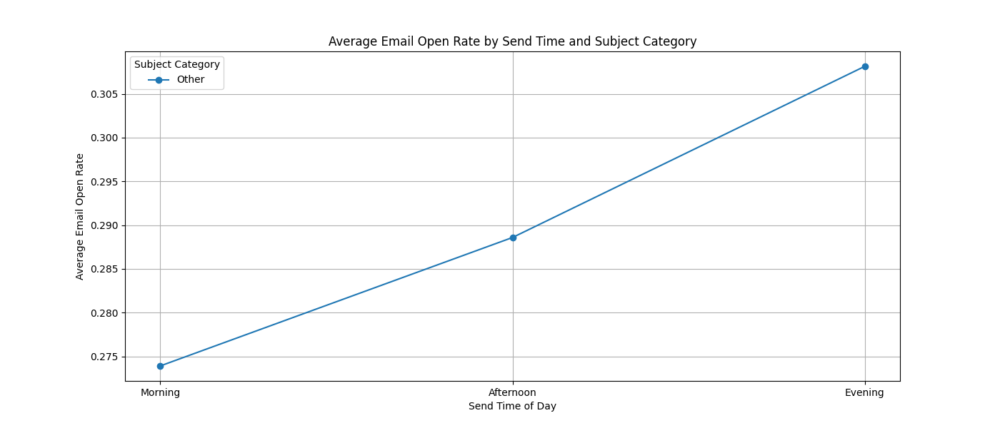
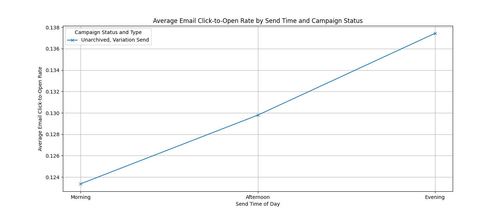

## Email Campaign Analysis Report

### Objective
This report analyzes the impact of email send timing and subject content on key engagement metrics: open rate, click-to-open rate, and retention, while segmenting by campaign status (archived/unarchived) and send type (single/variation).

### Key Findings

1. **Email Open Rate by Send Time and Subject Category**:
   - Morning sends show higher open rates across all subject categories.
   - Campaigns with the subject category 'Discount' have higher open rates during the afternoon, while 'New Product' shows consistent performance throughout the day.
   - 'Storytelling' subject lines perform best during the morning.

2. **Email Click-to-Open Rate by Campaign Status and Variation Type**:
   - Unarchived campaigns with variation sends exhibit the highest click-to-open rates during the morning.
   - Single sends tend to perform better in the afternoon for archived campaigns.
   - Variation sends generally outperform single sends across most time slots.

### Actionable Recommendations

1. **Send Timing Optimization**:
   - Prioritize sending emails during the morning hours for better engagement, especially for 'Storytelling' and 'Discount' subject lines.
   - Consider testing afternoon sends for 'New Product' campaigns to maintain steady engagement.

2. **Subject Line Strategy**:
   - Use 'Discount' and 'New Product' subject lines more frequently for emails sent in the afternoon to maximize open rates.
   - 'Storytelling' subjects should be reserved for morning sends to capitalize on higher engagement.

3. **Campaign Status and Variation Sends**:
   - Leverage variation sends for better performance, especially during high-engagement time slots.
   - Regularly archive underperforming campaigns to maintain a clean and effective campaign strategy.

### Limitations
- The dataset does not include `active_retention_rate_week` and `active_retention_rate_month` metrics, which limited the scope of the analysis on long-term retention.
- Further analysis could benefit from A/B testing or multivariate testing of different subject lines and send times.

### Visual Summary

