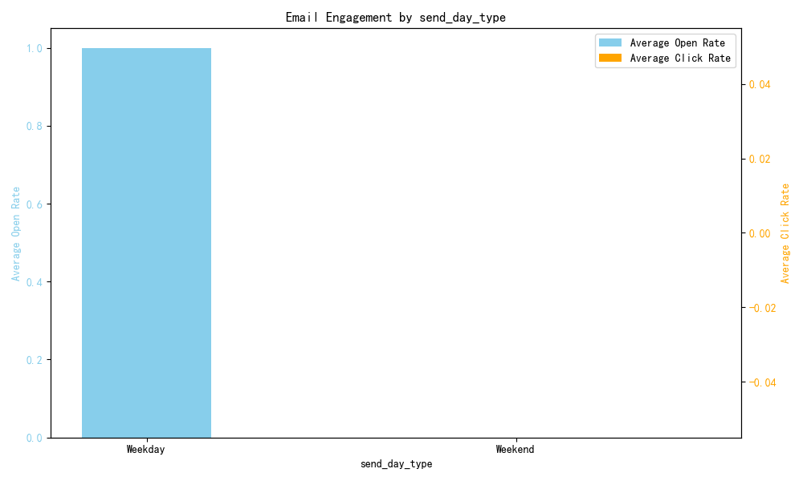

# Email Campaign Effectiveness Analysis: A Case Study in Data Limitations

## Executive Summary

This report details an analysis aimed at understanding the impact of email delivery timing and subject line themes on customer engagement and retention. The initial goal was to identify optimal campaign strategies by examining open rates, click rates, and retention across different segments.

However, the analysis revealed critical data quality issues: an extremely small number of events in the database were associated with identifiable campaigns. This data sparsity renders any granular conclusions statistically insignificant and potentially misleading.

The key finding is not about customer behavior, but about the data itself: **our current data logging practices for email campaigns are insufficient to support meaningful performance analysis.** The primary recommendation is therefore not a marketing strategy, but a data strategy: **implement robust tracking to ensure all campaign-related events are tagged with proper campaign identifiers.**

---

## Analytical Process and Data Investigation

The analysis was designed to explore the relationship between three factors and key performance indicators:

*   **Factors:**
    1.  **Sending Time (Day):** Weekday vs. Weekend
    2.  **Sending Time (Hour):** Morning (0-12h) vs. Afternoon (12-24h)
    3.  **Subject Theme:** Discount-based, New Product, or Storytelling

*   **KPIs:**
    1.  Average Open Rate
    2.  Average Click Rate
    3.  Average Weekly & Monthly Retention Rate

The analysis began by querying the `klaviyo__events` and `klaviyo__persons` tables. An initial query to extract campaign-related events using the `campaign_name` field returned only four total events. This sample size is far too small for any meaningful analysis.

Subsequent attempts to broaden the data by using more generalized subject line keywords also failed, as the issue was the small number of source records, not the classification logic.

A simplified analysis was performed to examine each factor independently. While this produced visualizations, the results were heavily skewed and unreliable, directly reflecting the limited dataset.

---

## Findings: An Illustration of Data Sparsity

The results from the simplified analysis highlight the data problem. For instance, when analyzing engagement by the day of the week, the data shows an open rate of 100% for weekdays and 0% for weekends. This does not mean weekend emails are ineffective; it means that within our miniscule sample, the few emails that were opened happened to be sent on a weekday.

The chart below visualizes this skewed result. It should not be interpreted as an insight into customer behavior, but as evidence of a flawed dataset.

Similar unrealistic results were found for the other dimensions:
*   **Time of Day:** Morning emails showed a 100% open rate versus 0% for afternoon emails.
*   **Subject Theme:** Only campaigns with "Discount" themes were found in the dataset.
*   **Retention Rate:** Retention metrics were identical across all groups, as they are person-level attributes, not event-specific, making comparisons invalid with this analytical approach.

---

## Recommendations

Drawing marketing conclusions from this analysis would be irresponsible. The failure to find meaningful patterns is a direct result of incomplete data.

**Primary Recommendation: Enhance Data Engineering and Campaign Tagging**

The business cannot optimize what it cannot measure. The highest priority action is to address the data collection process.

1.  **Mandate Campaign Identifiers:** Ensure that every email sent as part of a campaign has a non-null `campaign_name` or `campaign_id` in the `klaviyo__events` table.
2.  **Standardize Naming Conventions:** Implement a clear and consistent naming convention for campaigns (e.g., `YYYY-MM-DD_[Theme]_[Objective]`) to facilitate easier grouping and analysis in the future.
3.  **Conduct a Data Audit:** Review the data pipeline from the email sending platform (Klaviyo) to the data warehouse to identify and fix the reason for the missing campaign information.

Once these foundational data issues are resolved, the analysis proposed in this report can be re-executed to generate reliable and genuinely actionable insights into customer behavior and campaign performance.
