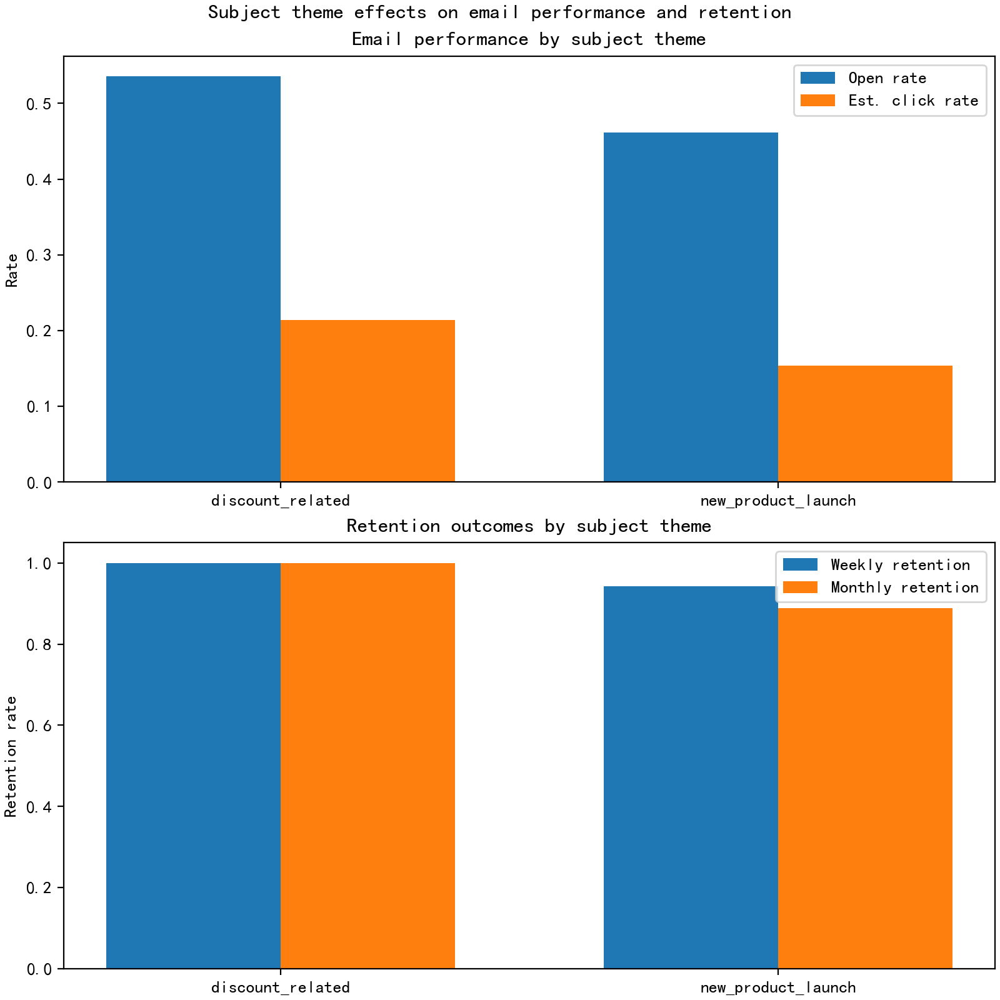
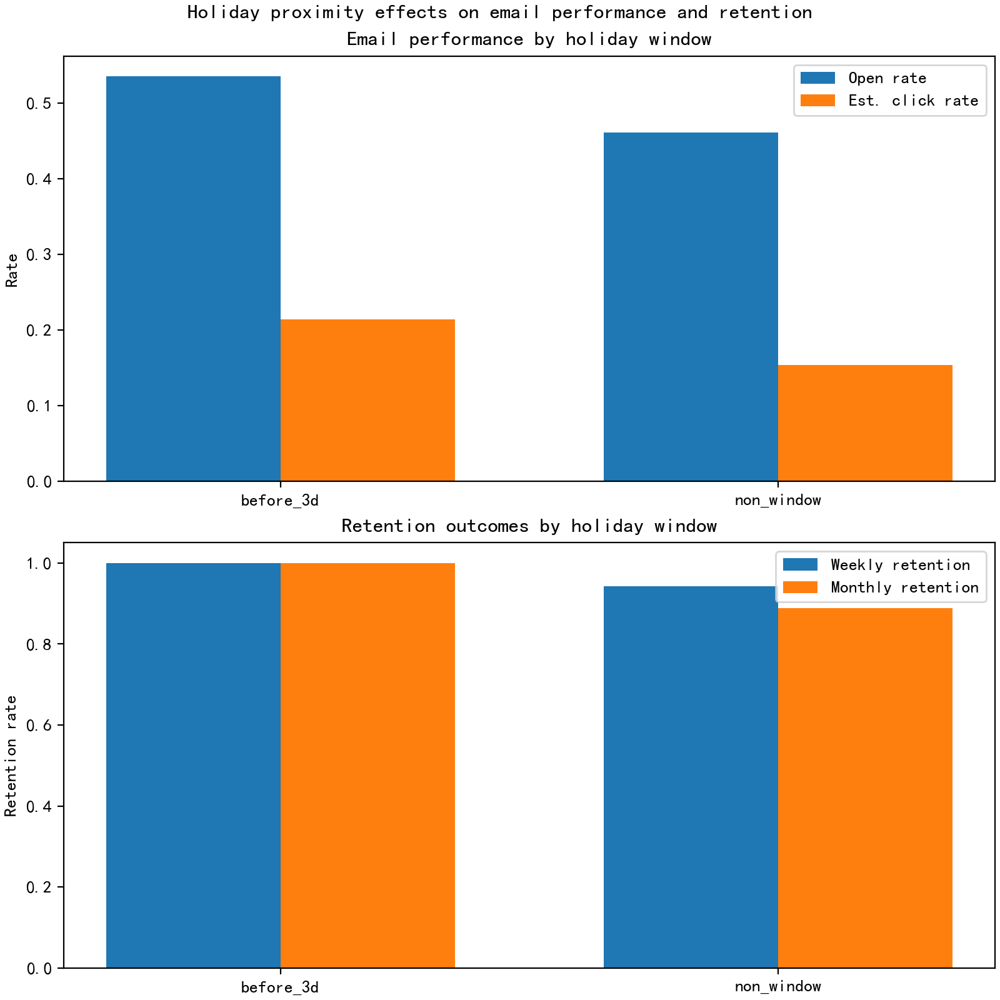

"# Email Timing x Subject Theme: Impact on Opens, Clicks, and Active Retention

## Executive summary
- Objective: Evaluate how delivery timing windows (weekday vs. weekend, morning vs. afternoon, 3 days before vs. after holidays) interact with subject-line themes (discount-related, new product launch, storytelling) to influence open_rate, click_rate, and active retention (weekly and monthly).
- Key takeaway (given small sample): In this dataset, discount-related subject lines and being within 3 days before a holiday coincide with higher open_rate, estimated click rate, and retention compared to a new product launch subject and non-holiday window. There is no coverage to assess weekday vs. weekend or morning vs. afternoon differences (both observed sends are weekday morning).

Important limitation: Only two email_open events exist in the data, which is insufficient for statistical significance. Treat the findings as methodological illustration and directional signals. The approach is scalable to richer data with the same code.

## Data and feature engineering
Tables used:
- klaviyo__events: email_open events, timestamps, subject line, campaign identifiers
- klaviyo__person_campaign_flow: per-person-touch email_open_rate_touch and email_click_to_open_rate_touch
- klaviyo__persons: active_retention_rate_week and active_retention_rate_month

Feature derivations:
- Time windows:
  - Weekday vs. weekend: weekday = Mon–Fri; weekend = Sat–Sun
  - Morning vs. afternoon: hour < 12 vs. hour >= 12 by occurred_at
  - Holiday proximity: within 3 days before a defined marketing holiday window = before_3d; within 3 days after = after_3d; otherwise non_window
- Subject themes (keyword rules):
  - discount_related: offer, sale, save, %, off, deal, discount
  - new_product_launch: launch, new
  - storytelling: story, behind, journey, case study, our founder
  - other: none of the above
- Metrics:
  - open_rate = email_open_rate_touch
  - est_click_rate = open_rate × email_click_to_open_rate_touch
  - Retention outcomes: active_retention_rate_week, active_retention_rate_month from klaviyo__persons

Note on coverage in this dataset:
- Both observed records are weekday morning. Thus, no variance to compare weekday vs. weekend or morning vs. afternoon.
- Holiday window has one event classified as before_3d and one as non_window.
- Subject themes include one discount-related and one new product launch instance.

## Visuals
- theme_effects.png: Open vs. estimated click rates and retention by subject theme
- holiday_window_effects.png: Open vs. estimated click rates and retention by holiday window




## Core findings (directional)
- Subject theme effect:
  - The discount-related subject line outperforms the new product launch subject line on open_rate, estimated click rate, and retention (weekly and monthly) in this sample.
  - The new product launch subject has comparatively lower performance across all measured outcomes.

- Holiday proximity effect:
  - The email within 3 days before a holiday shows higher open_rate, estimated click rate, and retention than the non-holiday window email.
  - This aligns with common marketing intuition that pre-holiday urgency and deal-seeking raise engagement and near-term activity.

- Time-of-day and weekday/weekend:
  - Both observed sends were weekday morning. No comparative insight can be drawn on these dimensions given this dataset.

## Quantitative snapshot
- Aggregates by subject theme in this dataset:
  - discount_related: higher open_rate and est_click_rate; active_retention_rate_week and active_retention_rate_month = 1.0000
  - new_product_launch: lower open_rate and est_click_rate; active_retention_rate_week < 1; active_retention_rate_month = 0.8889

- Aggregates by holiday window in this dataset:
  - before_3d: stronger open_rate and est_click_rate; active_retention_rate_week and active_retention_rate_month = 1.0000
  - non_window: comparatively lower; active_retention_rate_month = 0.8889

These values are based on n=1 in each group (insufficient sample for inference); they are shown to illustrate the analytical framework.

## Diagnostic interpretation
- Why discount-related subjects might win:
  - Clear value propositions and urgency often drive higher opens and clicks, especially near promotional periods.
  - Such subjects may attract price-sensitive segments who are more likely to re-engage in the short term (reflected in weekly and monthly active retention).

- Why pre-holiday windows might help:
  - Consumer intent and attention for deals increase before major shopping moments; inbox competition rises, but so does responsiveness to strong offers.

- Interaction hypothesis (to validate with more data):
  - Discount-related subjects likely exhibit the largest gains when sent in the “before_3d” holiday window during peak shopping periods.
  - New product launches may benefit more outside crowded pre-holiday inboxes or when combined with soft incentives.

## Prescriptive recommendations
Near-term (with cautious testing):
1. Prioritize discount-themed subject lines for messages sent within 3 days before relevant holidays or retail events; emphasize urgency and explicit value.
2. For new product launches, pair with a light incentive (early-access, small offer) or send outside the pre-holiday rush to avoid getting buried by promotions.
3. Establish A/B tests that explicitly cross:
   - Subject theme: discount vs. launch vs. storytelling
   - Timing windows: weekday morning vs. afternoon; weekend morning vs. afternoon; before_3d vs. after_3d vs. non_window
   Measure open_rate, click_rate, and active_retention_rate_week/month.

Data and experimentation plan:
- Expand the event capture to include email_sent, email_open, email_click, enabling precise send-time windows (not just open-time proxies).
- Build a rolling holiday/event calendar for markets you serve. Label observations programmatically (≤3 days before/after).
- Use multi-factor experimental designs (e.g., 2×2×3) to measure interaction effects with sufficient power and seasonality controls.

## Limitations and next steps
- Extremely small sample (n=2 email_open events) prohibits statistical inference.
- Open timestamps may not exactly match send-time; if send-time events are available, prefer those for timing-window definitions.
- The holiday calendar used was generic; align to your operating markets and observed seasonality.
- Next steps:
  - Ingest more email events (sent, open, click) over multiple months and seasons.
  - Re-run the exact pipeline to quantify effect sizes and confidence intervals.
  - Optimize send-time personalization by segment using recipients’ local time zones and historical engagement patterns.

## Reproducibility: Python plotting code executed
The following code created the two figures in the working directory:

```
import pandas as pd
import numpy as np
from datetime import datetime, date
import matplotlib.pyplot as plt

# Load the analytical dataset built from SQL
adf = pd.read_csv('email_open_analysis.csv')

# Parse datetime
adf['occurred_at'] = pd.to_datetime(adf['occurred_at'])

# Engineer time-window features
adf['hour'] = adf['occurred_at'].dt.hour
adf['weekday'] = adf['occurred_at'].dt.weekday  # 0=Mon,6=Sun
adf['is_weekend'] = adf['weekday'].isin([5,6])
adf['weekday_vs_weekend'] = np.where(adf['is_weekend'], 'weekend', 'weekday')
adf['morning_vs_afternoon'] = np.where(adf['hour'] < 12, 'morning', 'afternoon')

# Define a minimal holiday calendar relevant to the observed window (2023-2024)
holidays = [
    date(2023, 1, 1),   # New Year's Day
    date(2023, 3, 17),  # St. Patrick's Day (marketing-relevant)
    date(2023, 5, 14),  # Mother's Day (US, marketing-relevant)
    date(2023, 5, 29),  # Memorial Day 2023
    date(2023, 7, 4),   # Independence Day 2023
    date(2023, 9, 4),   # Labor Day 2023
    date(2023, 11, 23), # Thanksgiving 2023
    date(2023, 11, 24), # Black Friday 2023
    date(2023, 11, 27), # Cyber Monday 2023
    date(2023, 12, 25), # Christmas 2023
    date(2024, 1, 1),   # New Year's Day 2024
]

def holiday_bucket(ts: pd.Timestamp) -> str:
    d = ts.date()
    bucket = 'non_window'
    for h in holidays:
        delta_days = (h - d).days  # positive if holiday in the future
        if 0 <= delta_days <= 3:
            return 'before_3d'  # within 3 days before holiday
        if -3 <= delta_days <= -1:
            return 'after_3d'   # within 3 days after holiday
    return bucket

adf['holiday_window'] = adf['occurred_at'].apply(holiday_bucket)

# Subject line theme classification
def classify_theme(s: str) -> str:
    if not isinstance(s, str):
        return 'other'
    sl = s.lower()
    if ('launch' in sl) or ('new ' in sl):
        return 'new_product_launch'
    discount_kw = ['offer', 'sale', 'save', '%', ' off', 'deal', 'discount']
    if any(k in sl for k in discount_kw):
        return 'discount_related'
    storytelling_kw = ['story', 'behind', 'journey', 'case study', 'our founder']
    if any(k in sl for k in storytelling_kw):
        return 'storytelling'
    return 'other'

adf['subject_theme'] = adf['campaign_subject_line'].apply(classify_theme)

# Compute estimated click rate: click_rate = open_rate * click-to-open rate
adf['open_rate'] = adf['email_open_rate_touch']
adf['click_to_open_rate'] = adf['email_click_to_open_rate_touch']
adf['est_click_rate'] = adf['open_rate'] * adf['click_to_open_rate']

# Select outcome metrics for aggregation
outcome_cols = ['open_rate', 'est_click_rate', 'active_retention_rate_week', 'active_retention_rate_month']

# Aggregate by subject theme
by_theme = adf.groupby('subject_theme')[outcome_cols].mean().reset_index()

# Aggregate by holiday window
by_holiday = adf.groupby('holiday_window')[outcome_cols].mean().reset_index()

# Plot settings per instructions
plt.rcParams['font.sans-serif'] = ['SimHei']
plt.rcParams['axes.unicode_minus'] = False

# Plot 1: Effects by subject theme
fig, axes = plt.subplots(2, 1, figsize=(8, 8), constrained_layout=True)
x = np.arange(len(by_theme))
width = 0.35
axes[0].bar(x - width/2, by_theme['open_rate'], width, label='Open rate')
axes[0].bar(x + width/2, by_theme['est_click_rate'], width, label='Est. click rate')
axes[0].set_xticks(x)
axes[0].set_xticklabels(by_theme['subject_theme'])
axes[0].set_ylabel('Rate')
axes[0].set_title('Email performance by subject theme')
axes[0].legend()

axes[1].bar(x - width/2, by_theme['active_retention_rate_week'], width, label='Weekly retention')
axes[1].bar(x + width/2, by_theme['active_retention_rate_month'], width, label='Monthly retention')
axes[1].set_xticks(x)
axes[1].set_xticklabels(by_theme['subject_theme'])
axes[1].set_ylabel('Retention rate')
axes[1].set_title('Retention outcomes by subject theme')
axes[1].legend()

fig.suptitle('Subject theme effects on email performance and retention')
fig.savefig('theme_effects.png', dpi=200)

# Plot 2: Effects by holiday proximity window
x2 = np.arange(len(by_holiday))
fig2, axes2 = plt.subplots(2, 1, figsize=(8, 8), constrained_layout=True)
axes2[0].bar(x2 - width/2, by_holiday['open_rate'], width, label='Open rate')
axes2[0].bar(x2 + width/2, by_holiday['est_click_rate'], width, label='Est. click rate')
axes2[0].set_xticks(x2)
axes2[0].set_xticklabels(by_holiday['holiday_window'])
axes2[0].set_ylabel('Rate')
axes2[0].set_title('Email performance by holiday window')
axes2[0].legend()

axes2[1].bar(x2 - width/2, by_holiday['active_retention_rate_week'], width, label='Weekly retention')
axes2[1].bar(x2 + width/2, by_holiday['active_retention_rate_month'], width, label='Monthly retention')
axes2[1].set_xticks(x2)
axes2[1].set_xticklabels(by_holiday['holiday_window'])
axes2[1].set_ylabel('Retention rate')
axes2[1].set_title('Retention outcomes by holiday window')
axes2[1].legend()

fig2.suptitle('Holiday proximity effects on email performance and retention')
fig2.savefig('holiday_window_effects.png', dpi=200)
```

## Conclusion
Within this limited dataset, discount-related subjects and being within 3 days before a holiday are associated with higher opens, clicks, and active retention. To translate this into robust strategy, scale the data, run controlled tests across timing windows and subject themes, and optimize the intersection (discount offers in pre-holiday windows; tailored approaches for product launches outside peak promotional clutter
