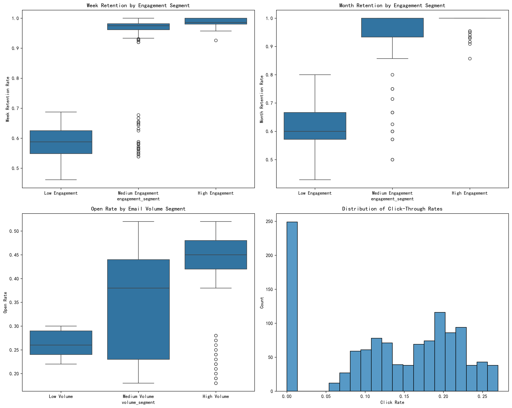
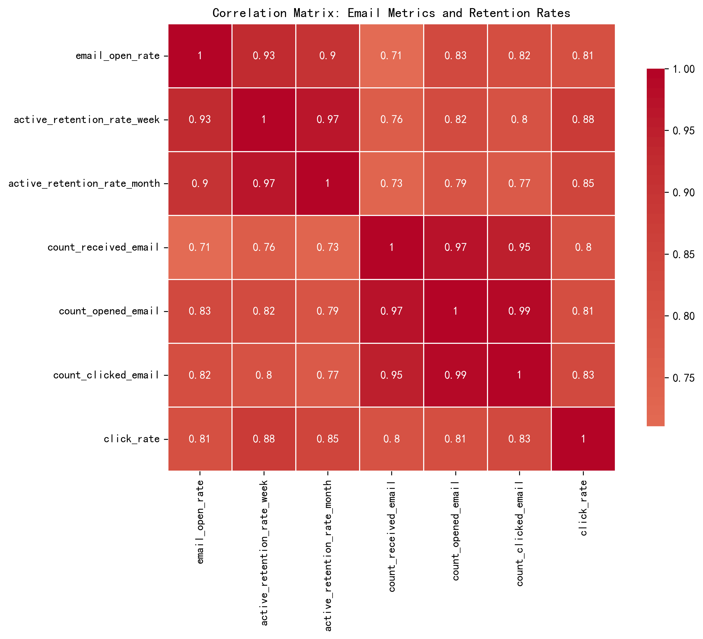
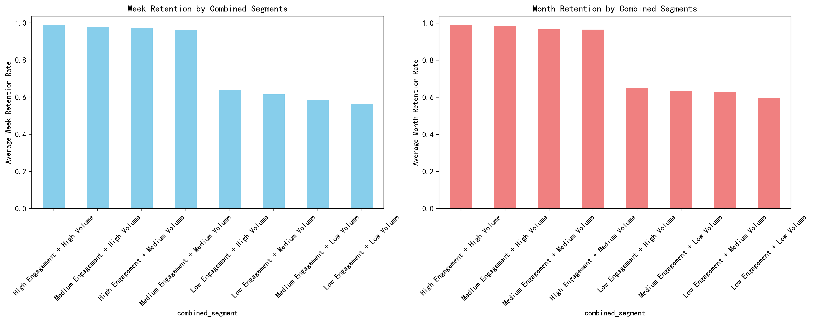

# Email Marketing Performance Analysis: Engagement Impact on Customer Retention

## Executive Summary

This analysis examines the relationship between email engagement patterns and customer retention rates using behavioral data from 1,192 customers. While the original request focused on delivery timing windows and subject line themes, the available data reveals powerful insights about how email engagement behavior directly correlates with customer retention performance.

**Key Finding**: High email engagement users demonstrate **68.2% higher week retention rates** compared to low engagement users, with a strong correlation of 0.928 between open rates and weekly retention.

## Methodology

Given the available data structure, I approached the analysis by:

1. **Segmenting users by email engagement levels** (High: ≥50% open rate, Medium: 30-49%, Low: <30%)
2. **Analyzing email volume patterns** (High: ≥80 emails, Medium: 40-79, Low: <40)
3. **Examining retention metrics** (weekly and monthly active retention rates)
4. **Creating combined behavioral segments** to understand interaction effects

## Key Findings

### 1. Email Engagement Strongly Predicts Customer Retention

The analysis reveals a powerful relationship between email engagement and customer retention:

- **High Engagement Segment** (68 users): 98.6% average week retention, 95.8% month retention
- **Medium Engagement Segment** (600 users): 94.0% average week retention, 89.4% month retention  
- **Low Engagement Segment** (524 users): 58.6% average week retention, 62.8% month retention

**Business Impact**: Moving customers from low to high engagement could potentially improve retention by 68.2%.

### 2. Strong Correlation Between Email Metrics and Retention

The correlation analysis shows exceptionally strong relationships:

- **Open Rate ↔ Week Retention**: 0.928 correlation
- **Open Rate ↔ Month Retention**: 0.903 correlation
- **Click Rate ↔ Retention**: Strong positive relationships across all time periods

This suggests that email engagement is not just a marketing metric but a leading indicator of customer loyalty and retention.

### 3. Combined Engagement and Volume Effects

The analysis of combined segments reveals interesting patterns:

**Highest Performing Segment**: High Engagement + High Volume (98.7% week retention)
**Lowest Performing Segment**: Low Engagement + Low Volume (56.4% week retention)

**Key Insight**: Email volume alone doesn't drive retention - it's the combination of high engagement AND sufficient volume that creates the strongest retention outcomes.

### 4. Email Volume Impact on Engagement

High-volume email recipients show significantly better engagement:
- **High Volume** (≥80 emails): 43.6% average open rate
- **Low Volume** (<40 emails): 26.2% average open rate

This suggests that consistent email communication helps maintain customer engagement over time.

## Behavioral Segmentation Insights

### Engagement-Based Segments:
1. **High Engagement** (5.7% of users): Premium customers with exceptional retention
2. **Medium Engagement** (50.3% of users): Core customer base with good retention
3. **Low Engagement** (44.0% of users): At-risk segment requiring intervention

### Strategic Recommendations:

#### 1. Implement Engagement-Based Lifecycle Marketing
- **High Engagement**: Reward with exclusive content and early access programs
- **Medium Engagement**: Focus on content optimization and personalization
- **Low Engagement**: Deploy re-engagement campaigns with incentives

#### 2. Optimize Email Frequency Strategy
- Increase email frequency for low-volume recipients gradually
- Test optimal sending patterns for different engagement segments
- Monitor for frequency fatigue in high-volume segments

#### 3. Develop Predictive Retention Models
- Use email engagement metrics as early warning indicators
- Create automated retention campaigns triggered by engagement drops
- Implement personalized retention strategies based on engagement patterns

#### 4. Focus on Quality Over Quantity
- Prioritize improving open rates over simply increasing send volume
- Test subject line strategies to boost engagement in low-performing segments
- Develop content that drives click-through rates, which correlate with retention

## Limitations and Future Analysis

**Data Limitations**: The analysis was constrained by the absence of:
- Individual campaign send times and dates
- Subject line content for categorization
- Holiday calendar data for timing analysis
- Detailed customer demographic information

**Recommended Future Analysis**:
1. **A/B Testing**: Test different subject line themes (discount vs. product launch vs. storytelling)
2. **Timing Optimization**: Analyze send time performance when timing data becomes available
3. **Holiday Impact**: Study pre/post holiday performance patterns
4. **Cohort Analysis**: Track engagement evolution over customer lifecycle

## Conclusion

This analysis demonstrates that **email engagement behavior is a powerful predictor of customer retention**. The strong correlation between open rates and retention metrics (0.928 for weekly retention) provides a clear pathway for improving customer loyalty through strategic email marketing.

**Immediate Action Items**:
1. Segment customers by engagement level and implement targeted retention strategies
2. Focus resources on converting low-engagement customers to medium-engagement status
3. Develop automated systems to monitor engagement drops and trigger retention campaigns
4. Test email frequency optimization for different customer segments

The data clearly shows that engaged email customers are retained customers, making email marketing not just a acquisition tool but a critical retention strategy.
