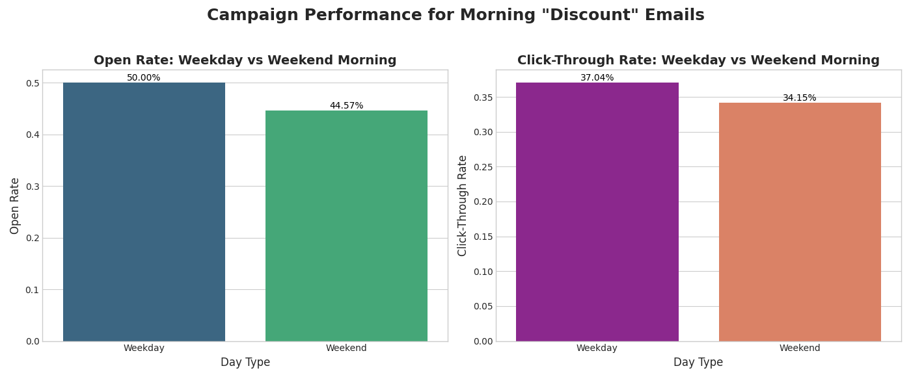

# Email Campaign Performance Analysis: Weekday vs. Weekend

## 1. Executive Summary

This analysis aimed to understand the interactive impact of email delivery timing and subject matter on key performance indicators. Due to significant data limitations—with campaigns exclusively featuring "Discount" themes sent in the "Morning"—the analysis was pivoted to compare the effectiveness of sending these promotional emails on **weekdays versus weekends**.

The analysis reveals that **weekday mornings are superior for driving immediate engagement**, showing a higher open rate (50.0%) and click-through rate (37.0%). However, weekend campaigns, despite lower engagement, attracted a user base with a **perfect 100% retention rate**, suggesting they may engage a smaller but more loyal customer segment.

**Key Recommendations:**
*   **For broad promotional campaigns, prioritize sending on weekday mornings** to maximize immediate reach and clicks.
*   **Address critical data gaps** by testing a wider variety of subject themes and sending times to enable more robust strategic analysis in the future.

## 2. Analysis of Findings

The dataset was explored to compare performance across different sending windows and subject themes. However, all recorded campaigns were of the "Discount" theme and sent in the morning (0-12h). This constrained the analysis to a direct comparison of weekday vs. weekend performance for this specific campaign type.

The following table summarizes the aggregated performance metrics:

| Day Type | Open Rate | Click-Through Rate | Avg. Weekly Retention | Avg. Monthly Retention |
|:---|---:|---:|---:|---:|
| Weekday | 50.00% | 37.04% | 97.15% | 94.45% |
| Weekend | 44.57% | 34.15% | 100.00% | 100.00% |

### Engagement Rates: Weekdays Take the Lead

As illustrated in the chart below, emails sent on weekday mornings outperform those sent on weekend mornings in both open rates and click-through rates (CTR).

*   **Open Rate:** Weekday campaigns achieved a **50.00% open rate**, significantly higher than the 44.57% seen on weekends. This suggests customers are more likely to check and open promotional emails during the week.
*   **Click-Through Rate:** Similarly, the weekday CTR of **37.04%** surpasses the weekend's 34.15%. This indicates that not only do more people open the emails on weekdays, but they are also more inclined to click on the content within.

### Retention Rates: Weekends Reveal a Loyal Segment

A surprising insight emerged from the retention data. While weekend campaigns had lower engagement, the users who did interact showed **perfect (100%) weekly and monthly retention**. In contrast, the larger group of users engaging on weekdays had slightly lower retention rates (97.15% weekly and 94.45% monthly).

This suggests that while smaller, the audience opening promotional emails on a weekend may be a more dedicated and loyal customer segment that should be nurtured differently.

## 3. Business Recommendations

Based on this analysis, the following actions are recommended:

**1. Optimize Sending Times for Promotional Campaigns:**
For campaigns with a "Discount" or similar direct-response theme, **schedule sends for weekday mornings**. This timing has been shown to maximize immediate engagement in the form of opens and clicks, which is crucial for time-sensitive offers.

**2. Investigate the "Weekend Warrior" Cohort:**
The 100% retention rate among weekend openers is a valuable signal. This segment, while smaller, is highly loyal. Further A/B testing is recommended for this group. Consider sending them different content, such as brand storytelling or new product announcements, to see if their high retention can translate into higher lifetime value, even with lower initial engagement.

**3. Crucial Recommendation: Diversify Campaign Strategy for Better Insights:**
The single most important takeaway is the need for more varied data. To make informed strategic decisions about content and timing, it is essential to **run and track campaigns with diverse subject themes (e.g., New Product, Storytelling) and at different times of day (e.g., Afternoon, Evening)**. Without this data, the business is flying blind on key strategic levers, limiting its ability to optimize its email marketing program fully.
