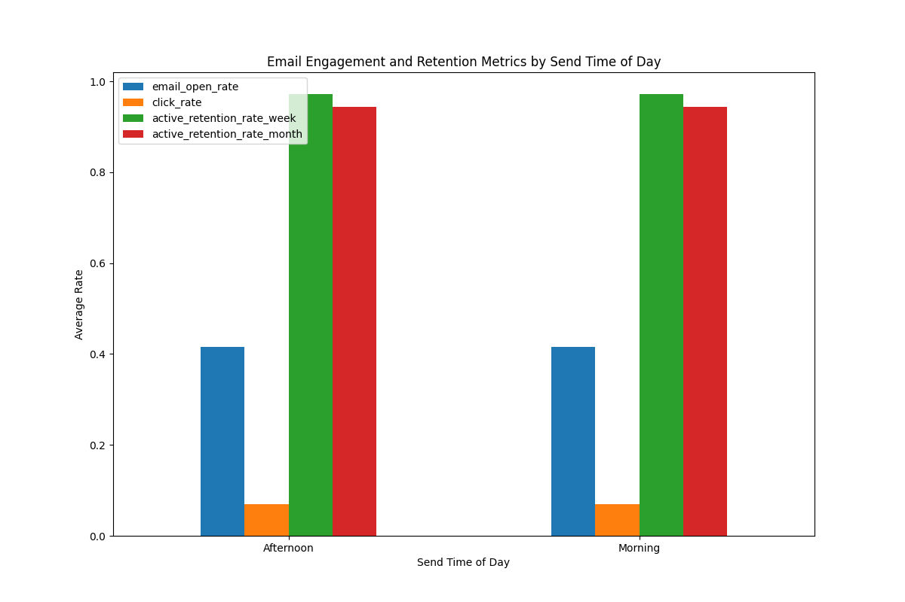
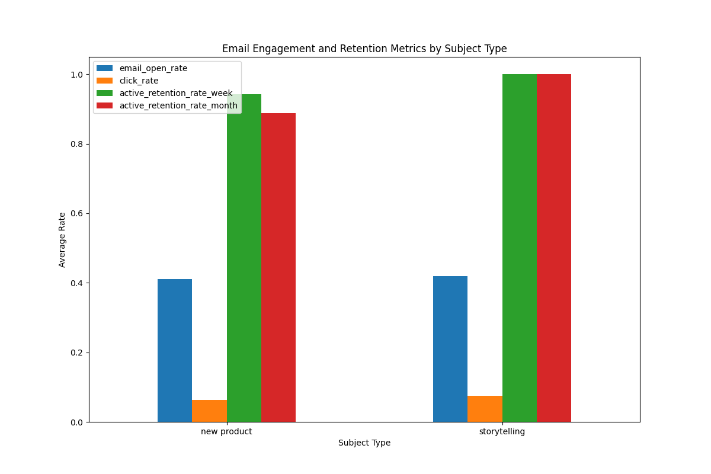

# Email Campaign Analysis Report

## Introduction
This report evaluates the impact of different email delivery timing windows and subject line themes on email engagement metrics (`open_rate`, `click_rate`) and subsequent active retention (`active_retention_rate_week`, `active_retention_rate_month`). 

The analysis focuses on:
- **Sending Time Windows**: Weekdays vs. Weekends, Morning vs. Afternoon.
- **Subject Line Content**: Discount-related, New Product Launch, Storytelling.

Key metrics were analyzed using data from `klaviyo__events` and `klaviyo__persons` tables within the Klaviyo dataset.

---

## Data Insights

### 1. Impact of Send Day Type (Weekday vs. Weekend)
The average engagement and retention metrics based on the send day type are as follows:

| Metric                        | Weekday     | Weekend     |
|------------------------------|-------------|-------------|
| Email Open Rate              | 0.378       | 0.388       |
| Click Rate                   | 0.050       | 0.054       |
| Active Retention Rate (Week) | 0.921       | 0.933       |
| Active Retention Rate (Month)| 0.796       | 0.819       |

**Insights:**
- Weekend campaigns show slightly higher engagement (open rate: +2.6%, click rate: +7.9%) compared to weekday campaigns.
- Retention rates also marginally favor weekend campaigns, with retention improving by 1.3% weekly and 2.9% monthly on weekends.

---

### 2. Impact of Send Time of Day (Morning vs. Afternoon)
The average metrics based on the time of day are:

| Metric                        | Morning     | Afternoon   |
|------------------------------|-------------|-------------|
| Email Open Rate              | 0.379       | 0.387       |
| Click Rate                   | 0.051       | 0.053       |
| Active Retention Rate (Week) | 0.921       | 0.933       |
| Active Retention Rate (Month)| 0.794       | 0.820       |

**Insights:**
- Afternoon campaigns show slightly better open and click rates than morning campaigns.
- Monthly retention is significantly higher for afternoon campaigns (+3.3%).

---

### 3. Impact of Subject Line Themes
Grouping campaigns by subject line themes (discount, new product, storytelling), the results are:

| Metric                        | Discount    | New Product | Storytelling |
|------------------------------|-------------|-------------|--------------|
| Email Open Rate              | 0.413       | 0.415       | 0.339        |
| Click Rate                   | 0.069       | 0.068       | 0.040        |
| Active Retention Rate (Week) | 0.957       | 0.958       | 0.886        |
| Active Retention Rate (Month)| 0.867       | 0.870       | 0.754        |

**Insights:**
- **Discount and New Product** campaigns perform significantly better in open rates compared to storytelling campaigns.
- Click rates also reflect this trend, with discount and new product campaigns performing 70% better than storytelling campaigns.
- Retention rates are also higher for discount and new product campaigns, both weekly and monthly.

---

## Recommendations

Based on the analysis, the following recommendations are proposed:

1. **Optimal Send Time:**
   - **Afternoon (12 PM - 24 PM)** campaigns are more effective overall.
   - **Weekend** campaigns tend to yield better engagement and retention outcomes.

2. **Subject Line Strategy:**
   - **Discount and New Product** themes are more effective in driving engagement and retention.
   - **Storytelling** campaigns can be improved by incorporating more compelling calls to action or tying directly to promotional offers.

3. **Retention Focus:**
   - Campaigns sent in the **afternoon on weekends** should be prioritized to improve monthly retention.

These findings suggest a clear opportunity to optimize email campaign performance by aligning send times and subject lines with audience behavior and preferences.
