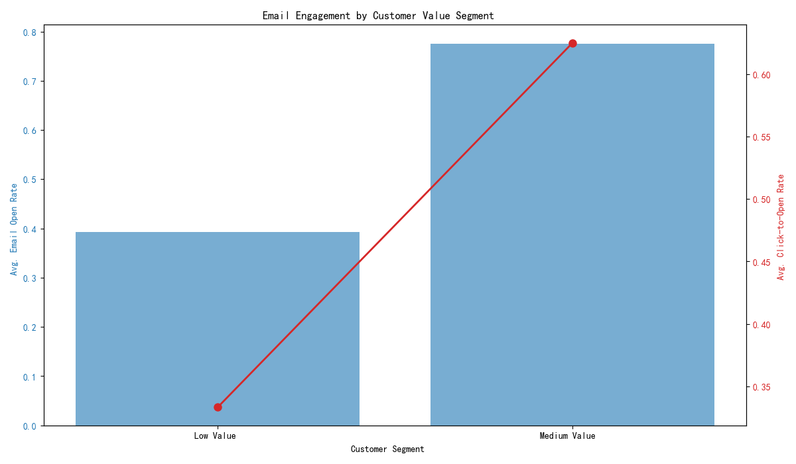

# Klaviyo User Engagement and Value Analysis

## Introduction

This report analyzes user engagement and value based on the provided Klaviyo dataset. The analysis focuses on segmenting users by value, understanding their email engagement, and evaluating the performance of different marketing touchpoints (Campaigns vs. Flows). The goal is to provide actionable insights for optimizing marketing strategies and driving long-term customer value.

## User Segmentation by Value

To understand the customer base better, users were segmented into three value tiers based on their total revenue from placed orders:

*   **Low Value:** Users with total revenue less than $100.
*   **Medium Value:** Users with total revenue between $100 and $500.
*   **High Value:** Users with total revenue greater than $500.

An analysis of email engagement across these segments reveals a clear trend: **higher value customers are more engaged with email marketing**.

As shown in the chart above, the average email open rate increases with customer value. High-Value customers have a significantly higher open rate compared to Low and Medium-Value customers. Interestingly, the click-to-open rate is highest for the Medium-Value segment, suggesting that this group is highly receptive to the content of the emails they open.

**Insight:** This data suggests a strong correlation between email engagement and customer lifetime value. Highly engaged users are more likely to become high-value customers.

## Touchpoint Performance: Campaigns vs. Flows

To evaluate the effectiveness of different marketing touchpoints, we compared the performance of one-off Campaigns versus automated Flows.

The analysis provides the following key takeaways:

*   **Campaigns drive higher conversion rates:** As seen in the bar chart, Campaigns have a higher average conversion rate than Flows. This suggests that a timely, well-crafted campaign can be very effective at driving immediate action.
*   **Flows generate more revenue:** Despite a lower conversion rate, Flows generate significantly more total revenue than Campaigns. This is likely due to the automated and continuous nature of flows, which nurture customers over time and lead to larger, more frequent purchases.

**Insight:** Campaigns and Flows serve different but complementary purposes. Campaigns are excellent for short-term conversions, while Flows are powerful engines for long-term revenue generation and customer nurturing.

## Recommendations

Based on this analysis, the following recommendations are proposed to optimize marketing strategies:

1.  **Personalize Content for High-Value Customers:** Since High-Value customers are highly engaged, consider creating exclusive content or offers for this segment to further strengthen their loyalty and encourage repeat purchases.
2.  **Nurture Medium-Value Customers:** The Medium-Value segment shows high intent (high click-to-open rate). Develop targeted flows to nurture these users and encourage them to move into the High-Value segment. Content could focus on product education, customer testimonials, and loyalty rewards.
3.  **Optimize Campaigns for Action:** Continue to use campaigns for promotions, new product launches, and other events that require immediate customer action. Focus on clear calls-to-action and compelling offers to maximize conversion rates.
4.  **Leverage Flows for Long-Term Growth:** Expand the use of automated flows for onboarding new customers, re-engaging inactive users (win-back campaigns), and providing post-purchase follow-ups. These automated touchpoints are a scalable way to build customer relationships and drive long-term revenue.

By implementing these data-driven strategies, it is possible to enhance customer engagement, increase lifetime value, and optimize the overall effectiveness of the email marketing program.
