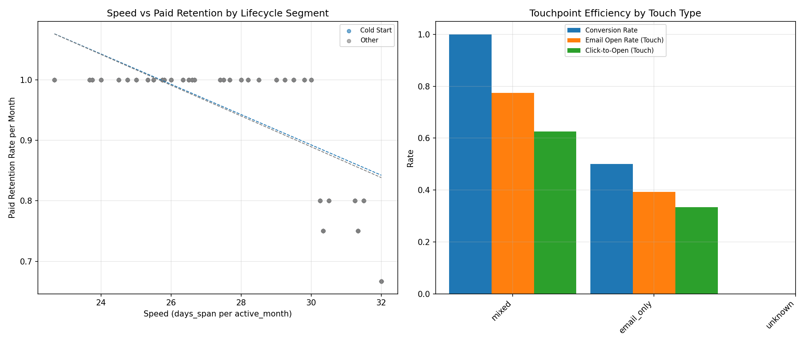

# Lifecycle Segmentation and Touchpoint Efficiency (Klaviyo)

Data sources analyzed:
- klaviyo__persons (n=1,192)
- klaviyo__person_campaign_flow (n=4)
- klaviyo__campaigns, klaviyo__flows (metadata)

Goal
- Segment users into lifecycle stages and analyze the speed from first touch to peak activity (proxied) and its relationship with long-term retention/payment.
- Compare touchpoint efficiency (open, click-to-open, conversion) and assess how typical touchpoint paths impact retention/payment.
- Recommend optimizations for frequency, cooling periods, and content cadence.

How segments were defined (given available fields):
- Cold Start: first touch within 90 days of the dataset’s latest first_event_on (a recent new user). SQL proxy used: julianday(max(first_event_on)) - julianday(first_event_on) <= 90.
- Win-back (strict): requires 90-day inactivity gap. We proxied inactivity via months_gap = months_span - active_months. In this dataset, max months_gap = 1, so there are no users meeting a strict 90-day inactivity condition.
- Win-back (loose): months_gap >= 1 and recent last activity (30 days). In this dataset, none surfaced in our counts (practically negligible). We present results primarily for Cold Start vs Other.

Key metrics used
- Speed proxy: days_span per active_month (lower is faster ramping of activity). 
- Retention/payment: paid_retained_month_count, paid_retention_rate_month.
- Email efficiency: email_open_rate (person level), plus per-touch metrics from person_campaign_flow: email_open_rate_touch, email_click_to_open_rate_touch, has_converted.
- Touch type approximation (from person_campaign_flow):
  - email_only (email count>0, sms=0)
  - sms_only (sms>0, email=0)
  - mixed (both>0)
  - unknown (no touch record)

Lifecycle segmentation and summary (SQL evidence)
- Users by segment (strict definitions):
  - Cold Start: 89
  - Other: 1,103
  - Win-back strict/loose: 0 (driven by months_gap <= 1 in this dataset)

- Segment-level means:
  - Other (n=1,103)
    - avg_days_span: 98.43
    - avg_active_months: 3.58
    - avg_active_retention_rate_month: 0.9544
    - avg_paid_retained_month_count: 3.58
    - avg_paid_retention_rate_month: 0.9544
    - avg_email_open_rate: 0.4272
    - avg_speed_days_per_active_month: 27.4382
  - Cold Start (n=89)
    - avg_days_span: 98.64
    - avg_active_months: 3.60
    - avg_active_retention_rate_month: 0.9567
    - avg_paid_retained_month_count: 3.60
    - avg_paid_retention_rate_month: 0.9567
    - avg_email_open_rate: 0.4287
    - avg_speed_days_per_active_month: 27.4309

Insight 1: Speed vs long-term retention/payment
- Correlation between speed_days_per_active_month and paid_retention_rate_month:
  - Cold Start: -0.667
  - Other: -0.688
- Interpretation: Faster ramp (lower days per active month) is associated with higher paid retention. Users who concentrate activity more efficiently early tend to retain better. This supports prioritizing quick, high-value onboarding touches.

Insight 2: Touchpoint efficiency (small-sample caveat)
- Touchpoint efficiency by touch_type (from klaviyo__person_campaign_flow):
  - mixed: email_open_rate_touch ≈ 0.775, click-to-open ≈ 0.50, has_converted ≈ 1.0, paid_retention_rate_month ≈ 1.00
  - email_only: email_open_rate_touch ≈ 0.393, click-to-open lower, has_converted ≈ 0.5, paid_retention_rate_month ≈ 1.00
  - unknown: no touch record; paid_retention_rate_month ≈ 0.954
- Efficiency by last_touch_kind (campaign+flow vs none): campaign+flow shows non-zero open and click-to-open performance; users without a recorded last touch have no per-touch metrics.
- Interpretation: Mixed channel touches appear more efficient (higher open and conversion) than email_only; however, the sample is tiny (4 rows), so treat as directional, not definitive.

Visualization
- The figure shows:
  - Left: scatter of speed (days_span per active_month) vs paid_retention_rate_month by lifecycle segment with simple trend lines.
  - Right: bar chart comparing conversion and open metrics by touch_type.

What the data shows and why it matters
- There are no strict Win-back users due to short inactivity gaps (months_gap ≤ 1). Lifecycle focus should emphasize Cold Start acceleration and ongoing engagement.
- Faster initial ramp correlates with higher retention/payment, suggesting onboarding and early lifecycle messaging are crucial to long-term value.
- Mixed touch types (email+sms) look promising for efficiency, but more data is needed to validate at scale. Even so, this provides a hypothesis for channel-mix testing.

Recommendations
1) Cold Start onboarding acceleration
- Sequence design: 2–3 high-value touches in the first 7–10 days with concise content and clear primary action.
- Content cadence: Start with value (setup guides, first purchase incentives, personalized picks) and reduce friction (deep links, direct-to-cart).
- Success KPI: reduce speed_days_per_active_month and increase week-1 engagement (opens/CTO) and week-4 paid_retention_rate_month.

2) Win-back framework and cooling periods
- Since strict 90-day lapses are rare, implement tiered cooling periods and reactivation windows:
  - Micro-winback: 30–45 day inactivity with lighter cadence (1 touch/week) and non-promotional value reminders.
  - Standard winback: 60–90 day inactivity with stronger offers and re-activation CTAs; test 1–2 touches over 10–14 days.
- Define explicit inactivity windows in your data pipeline (e.g., user-level last_event_on gaps) so true Win-back segments are available for targeting and measurement.

3) Channel-mix optimization
- Pilot mixed sequences (email+sms) for early lifecycle cohorts:
  - Test a flow-first (triggered) message followed by a campaign reinforcement within 3–5 days.
  - Use A/B testing to compare email_only vs mixed on open rate, click-to-open, has_converted, and 30–60 day retention.
- Respect message fatigue: If mixed is used, adopt a cooling period of 3–4 days between touches unless user demonstrates intent (e.g., click) to justify a shorter follow-up.

4) Frequency and cadence guidelines
- Cold Start: 2–3 initial touches in first 7–10 days; then taper to 1–2 per week by weeks 3–4.
- Active (Other): Maintain 1–2 touches per week; trigger additional messages only on intent signals (e.g., product view).
- Win-back (when enabled): 1–2 touches total per campaign with 5–7 day spacing; avoid over-sending to reactivated users—re-enter them into the Cold Start cadence with reduced frequency.

5) Content tactics
- Lift open rate with curiosity and relevance: dynamic subject lines, clear value propositions.
- Boost click-to-open with concise layouts, prominent CTAs, and personalized product blocks.
- For SMS, keep messages action-oriented and time-sensitive; use it sparingly to avoid fatigue.

Limitations and next steps
- Touchpoint-level sample is small (n=4), so path-efficiency insights are indicative only.
- No strict 90-day inactivity users in this dataset; to evaluate Win-back impact robustly, ensure inactivity gap tracking is enabled (e.g., daily event-level recency) and revisit once available.
- Next: instrument path-level sequences (e.g., ordered series of touch types) to quantify which paths produce the best long-term retention/payment across cohorts.

Appendix: How the figure was generated
- Python code executed: plot_lifecycle.py (saved and run in this directory).
- The script loads person_enriched.csv, computes segment metrics and correlations, aggregates touchpoint efficiency by touch_type and last_touch_kind, and saves lifecycle_touch_efficiency.png.

File generated
- lifecycle_touch_efficiency.png

In summary: Accelerate early lifecycle engagement to improve long-term retention/payment, cautiously test mixed-channel touches for efficiency gains, and implement tiered win-back cadences with appropriate cooling periods. Enhance data capture to enable true Win-back segmentation and path-level optimization at scale.
