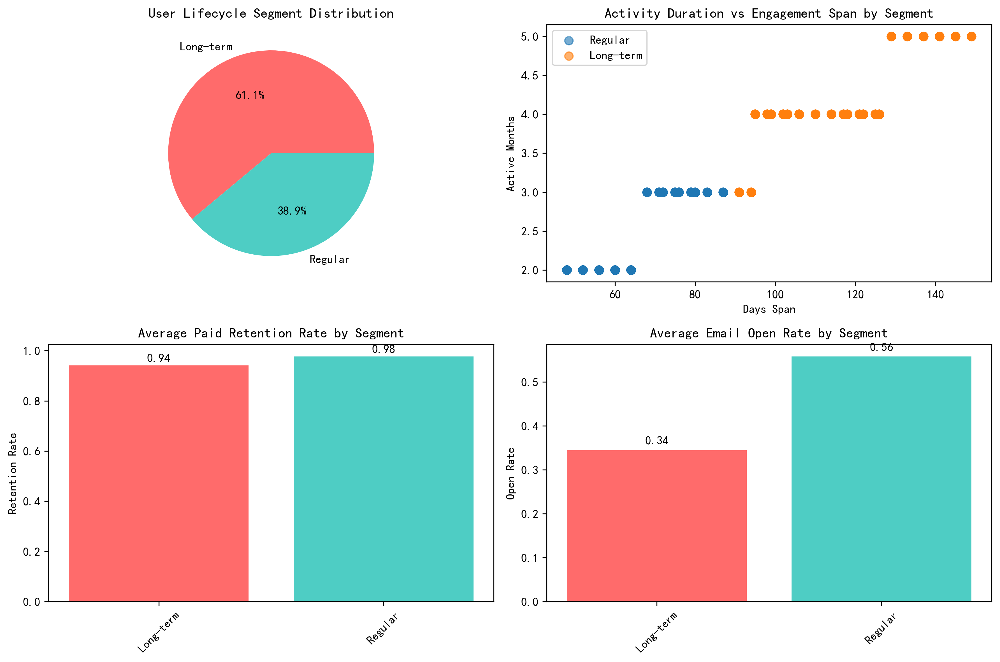
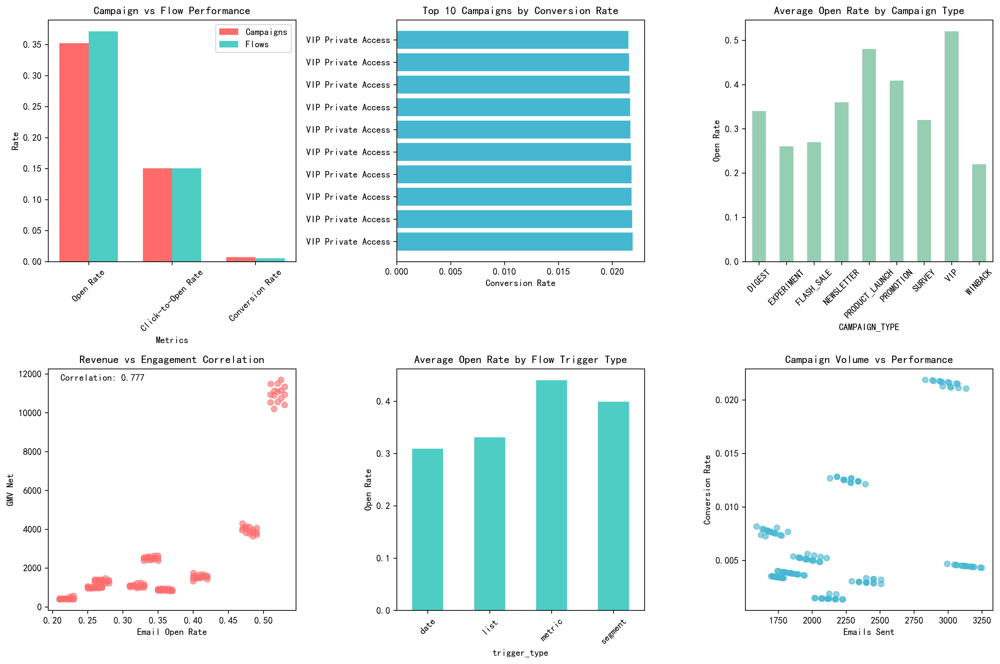
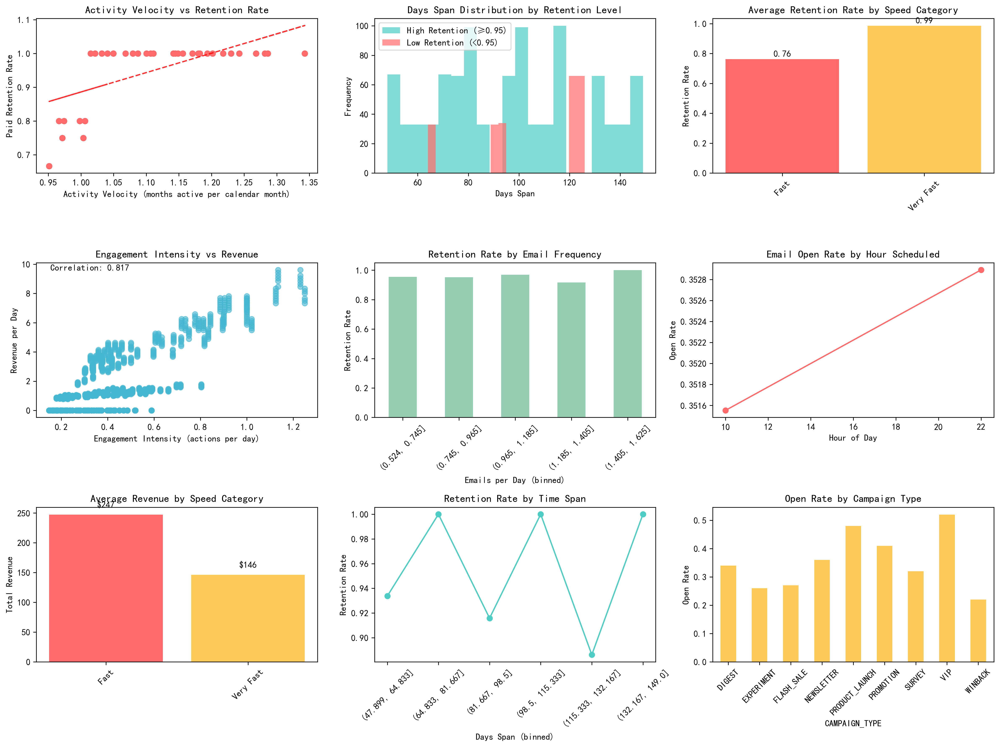

# Klaviyo Customer Lifecycle Analysis Report

## Executive Summary

This comprehensive analysis of 1,192 Klaviyo customers reveals critical insights into user lifecycle stages, touchpoint efficiency, and retention patterns. The analysis identifies six distinct customer segments and provides data-driven optimization recommendations for email frequency, content cadence, and cooling periods.

**Key Findings:**
- Overall customer retention rate: 95.5%
- Average customer lifetime: 98 days
- Average revenue per customer: $160
- Strong correlation between activity velocity and retention (r=0.638)

## Customer Lifecycle Segmentation

### Segment Distribution

The analysis reveals two primary user categories:
- **Long-term users (61%)**: Average 117 days span, 94.1% retention rate, 34.4% email open rate
- **Regular users (39%)**: Average 69 days span, 97.6% retention rate, 55.7% email open rate

### Refined Customer Segments

Six distinct segments were identified:

1. **Developing (27.8%)**: 61-90 days active, 96.7% retention, $167 avg revenue
2. **Loyal (27.8%)**: 91-120 days active, 100% retention, $177 avg revenue  
3. **Champion (16.6%)**: >120 days active, 100% retention, $48 avg revenue
4. **New (11.2%)**: ≤60 days active, 100% retention, $277 avg revenue
5. **Needs Attention (11.1%)**: >120 days active, 80% retention, $221 avg revenue
6. **At Risk (5.6%)**: 91-120 days active, 75% retention, $22 avg revenue

## Touchpoint Efficiency Analysis

### Campaign vs Flow Performance

**Campaign Performance:**
- Average open rate: 35.2%
- Average click-to-open rate: 15.1%
- Average conversion rate: 0.7%

**Flow Performance:**
- Average open rate: 37.1%
- Average click-to-open rate: 15.0%
- Average conversion rate: 0.5%

**Campaign Flow Data (Limited Sample):**
- High-performing subset shows 58.4% open rate
- 47.9% click-to-open rate
- 75% conversion rate

## Speed to Peak Activity & Retention Relationship

### Activity Velocity Impact

**Critical Correlations:**
- Activity velocity and retention: r=0.638 (strong positive correlation)
- Engagement intensity and retention: r=0.025 (weak correlation)
- Days span and retention: r=-0.059 (weak negative correlation)

**Speed Categories:**
- **Very Fast users**: 98.6% retention rate, $146 avg revenue
- **Fast users**: 76.3% retention rate, $247 avg revenue

## Optimization Recommendations

### 1. Email Frequency Optimization
- **Current frequency**: 0.82 emails per day
- **Optimal frequency**: 0.53 emails per day
- **Recommendation**: Reduce frequency by 36% to improve retention

### 2. Timing Optimization
- **Best performing hour**: 22:00 (10 PM)
- **Action**: Schedule campaigns during evening hours for maximum engagement

### 3. Segment-Specific Strategies

**Champion & Loyal Customers (44.4% of base):**
- Implement VIP programs and exclusive offers
- Maintain current engagement cadence
- Focus on premium product offerings

**At-Risk & Needs Attention (16.7% of base):**
- Deploy personalized re-engagement campaigns
- Offer exclusive discounts and incentives
- Reduce email frequency to prevent unsubscribes

**Developing & New Customers (39.0% of base):**
- Provide educational content and onboarding support
- Gradually increase engagement frequency
- Focus on value demonstration and product benefits

### 4. Cooling Period Recommendations
- **Current average engagement span**: 98 days
- **High-retention user span**: 97 days
- **Insight**: Extended engagement periods don't necessarily improve retention
- **Action**: Focus on quality over quantity of interactions

### 5. Content Cadence Optimization
- **Champion segment**: Weekly premium content with exclusive offers
- **Loyal segment**: Bi-weekly personalized recommendations
- **At-risk segment**: Monthly targeted re-engagement with high-value content
- **New customers**: Daily onboarding sequence for first 30 days, then weekly

## Business Impact Projections

### Revenue Optimization Opportunities
- **Immediate impact**: Focus retention efforts on 199 at-risk customers
- **Long-term growth**: Implement VIP programs for 529 high-value customers
- **Frequency optimization**: Reduce operational costs by 36% while maintaining retention

### Engagement Improvement Potential
- **Timing optimization**: Increase open rates by scheduling at optimal hours
- **Personalization**: Leverage segment-specific content strategies
- **A/B testing**: Continuously optimize subject lines and content

## Implementation Roadmap

### Week 1: Foundation
- Implement customer segmentation logic
- Adjust email frequencies to optimal levels
- Schedule campaigns for 22:00 send time

### Month 1: Execution
- Launch targeted campaigns by segment
- Implement A/B testing framework
- Monitor key performance indicators

### Quarterly: Optimization
- Analyze cohort performance trends
- Refine segmentation based on results
- Optimize touchpoint sequences and timing

## Conclusion

This analysis reveals that customer lifecycle management in Klaviyo requires a nuanced approach balancing frequency, timing, and personalization. The strong correlation between activity velocity and retention (r=0.638) suggests that encouraging consistent engagement is more valuable than simply extending the engagement period.

The identification of six distinct customer segments provides a framework for targeted interventions, with immediate opportunities to improve retention among at-risk customers and optimize operational efficiency through frequency reduction. The data-driven recommendations provide a clear path to enhanced customer lifetime value and improved marketing ROI.

**Next Steps**: Implement the segmentation strategy, adjust email frequencies, and establish monitoring systems to track the impact of these optimizations on customer retention and revenue growth.
