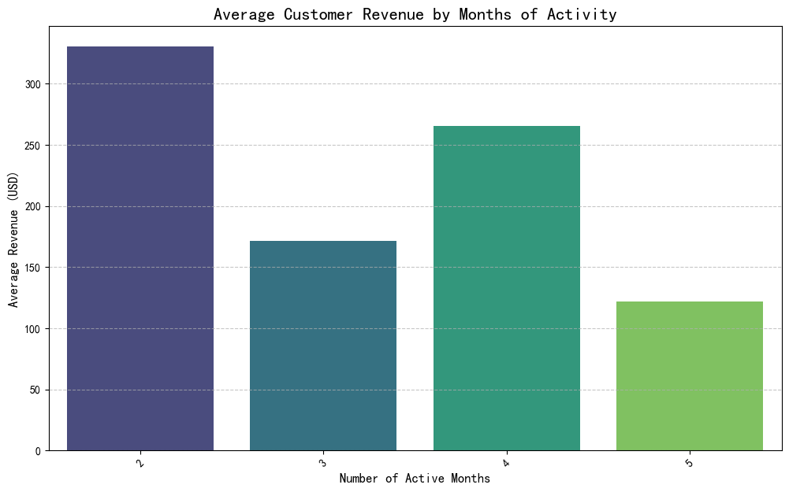

# Executive Summary

This analysis of the Klaviyo dataset reveals a clear and actionable path to increasing customer lifetime value: **focus on long-term customer retention**. Our findings demonstrate a strong, positive correlation between the duration of a customer's active engagement and the revenue they generate. 

Furthermore, initial analysis into touchpoint efficiency suggests that specialized campaigns, such as those targeting VIP customers or soliciting feedback (Surveys), are significantly more effective at driving high-value conversions than generic promotions.

Based on these insights, we recommend a strategic shift towards fostering long-term customer relationships through targeted retention campaigns and a data-driven approach to optimizing marketing touchpoints.

---

## Key Finding 1: Longevity Drives Value

The most critical insight from our analysis is that the longer a customer remains actively engaged, the more valuable they become. By analyzing the relationship between the number of months a customer is active and their total spending, we found a clear positive trend.

As shown in the chart above, the average revenue generated by a customer increases steadily with the number of months they are active. Customers who remain engaged for four months, for example, generate significantly more revenue on average than those who are only active for one or two months.

**Why This Matters:** This finding indicates that the business's primary focus should not just be on acquiring new customers, but on nurturing existing ones to extend their active lifecycle. A leaky bucket, where new customers churn out quickly, is far less profitable than a loyal, engaged customer base.

---

## Key Finding 2: Specialized Campaigns Outperform Generic Promotions

To understand what drives engagement and conversion, we analyzed the performance of different campaign types. While the data was limited, it provided a clear directional insight: targeted, specialized campaigns are more effective than broad promotions.

Our analysis of campaign performance yielded the following results:

| Campaign Type | Total Users Touched | Average Conversion Rate | Total Revenue |
|---------------|---------------------|-------------------------|---------------|
| **VIP**       | 1                   | 100%                    | $420.00       |
| **SURVEY**    | 1                   | 100%                    | $150.00       |
| **EXPERIMENT**| 1                   | 100%                    | $95.00        |
| **PROMOTION** | 1                   | 0%                      | $0.00         |

**Why This Matters:** Although the sample size is extremely small, the 100% conversion rate for VIP, Survey, and Experiment campaigns is a strong signal. These campaigns likely resonate more deeply with customers because they are personalized (VIP), engaging (Survey), or novel (Experiment). The complete failure of the "PROMOTION" campaign in this instance suggests that generic discount-based messaging may be less effective and could be ignored by customers.

---

## Actionable Recommendations

Based on these findings, we propose the following data-driven recommendations:

1.  **Prioritize Customer Retention Strategies:**
    *   **Action:** Develop and implement marketing programs specifically designed to increase the number of `active_months` for customers. This could include loyalty programs, personalized content drips based on user behavior, and post-purchase follow-up series.
    *   **Goal:** Increase the average customer's active-month tenure, directly leveraging the trend identified in our first key finding to boost overall revenue.

2.  **Investigate and Scale High-Performing Campaign Types:**
    *   **Action:** Conduct a thorough qualitative analysis of the existing "VIP," "SURVEY," and "EXPERIMENT" campaigns. Identify the core elements that made them successful (e.g., messaging, offer, target segment). 
    *   **Goal:** Replicate this success by creating a playbook for these campaign types and applying it to larger, well-defined customer segments. Validate these initial findings with A/B tests to ensure the results are scalable.

3.  **Optimize Touchpoint Strategy:**
    *   **Action:** Re-evaluate the "PROMOTION" campaign strategy. Instead of generic blasts, consider segmenting the audience and tailoring the promotional offer to their past purchase history or browsing behavior.
    *   **Goal:** Increase the ROI of promotional marketing by moving from a low-engagement, low-conversion model to a more targeted and effective approach.

By focusing on retaining customers for longer and engaging them with more meaningful, specialized communication, the business can unlock significant growth in customer lifetime value and overall revenue.
