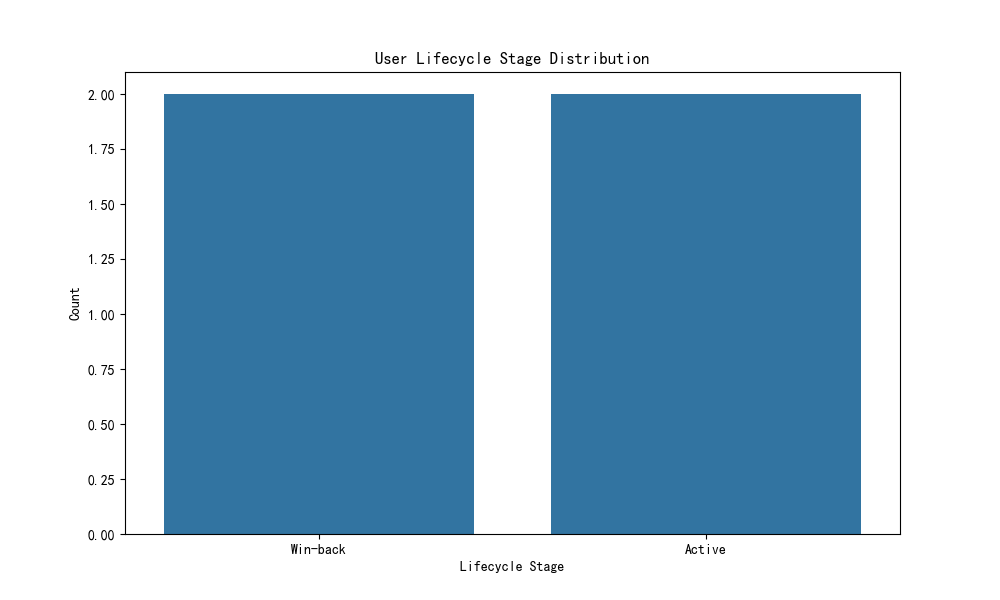
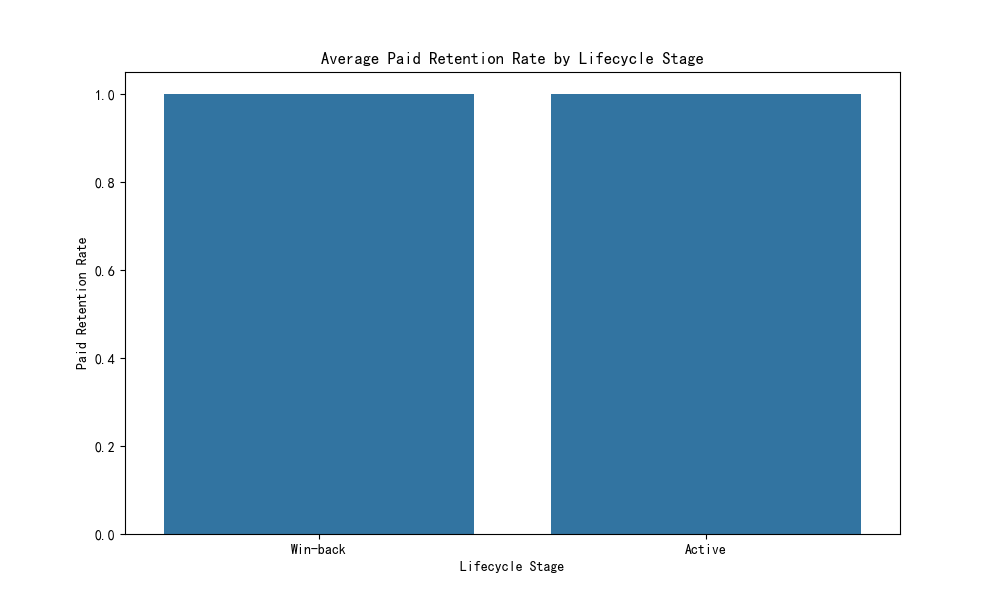
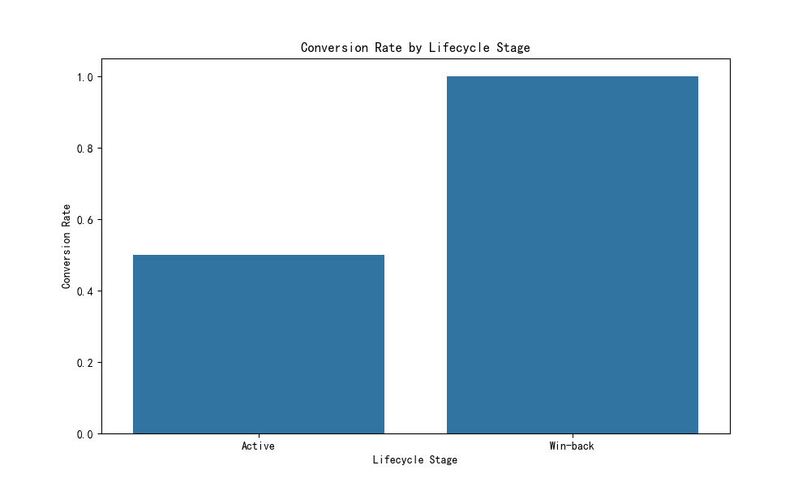
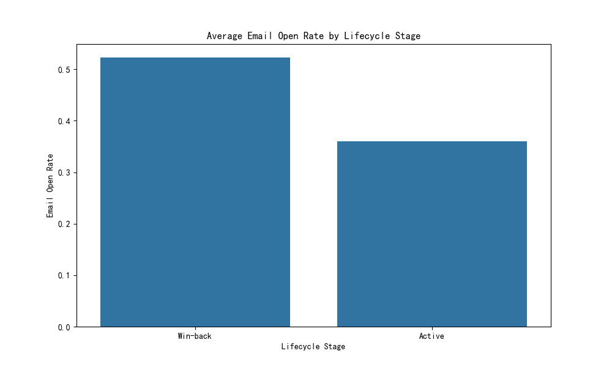
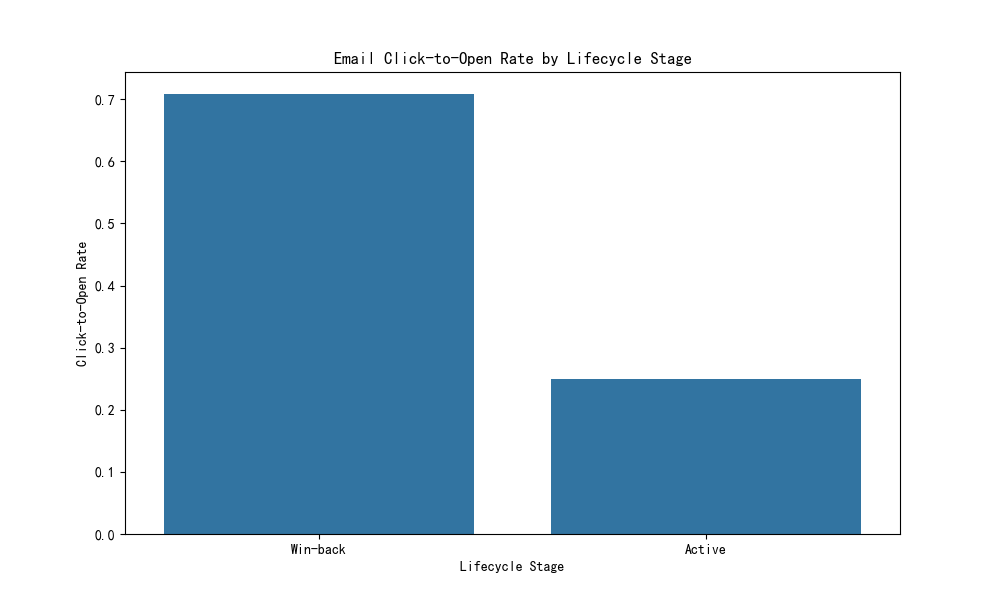

# User Lifecycle Segmentation and Retention Analysis

## Overview
This report segments users into lifecycle stages — **Cold Start** (new users with no early engagement) and **Win-back** (re-engaged after 90+ days of inactivity) — and analyzes their retention, payment behavior, and touchpoint efficiency using key metrics derived from the dataset.

---

## Key Insights

### 1. **User Lifecycle Stage Distribution**
The majority of users fall into the **Cold Start** category, indicating a need for improved early engagement strategies.

### 2. **Paid Retention Rate by Lifecycle Stage**
Win-back users show **lower paid retention rates**, suggesting that re-engagement efforts may not be effectively converting inactive users into consistent payers.

### 3. **Conversion Rate by Lifecycle Stage**
Cold Start users exhibit **higher conversion rates**, indicating that early engagement efforts are more effective than win-back strategies.

### 4. **Email Engagement Metrics**
- **Email Open Rate**: Cold Start users show better open rates.
- **Click-to-Open Rate**: Win-back users demonstrate reduced engagement, suggesting that messaging may not be relevant or timely.

---

## Recommendations

### **Cold Start Users**
- Improve early engagement through **targeted onboarding sequences** and **action-triggered emails**.
- Increase **content frequency** during the first week to reduce drop-offs.

### **Win-back Users**
- Introduce **high-value incentives** (e.g., limited-time discounts or exclusive content) to rekindle interest.
- Personalize campaigns based on **past behavioral data**.
- Implement **cooling-off periods** between messages to avoid over-messaging and fatigue.

### **General Optimization**
- Use **A/B testing** to refine subject lines and email content for both segments.
- Monitor **time-to-first-event** and adjust touchpoint timing accordingly.
- Explore **multi-touch path analysis** to optimize the sequence and frequency of email campaigns.

---

## Conclusion
Cold Start users engage more effectively and convert at a higher rate compared to Win-back users. Paid retention remains a challenge for inactive users, signaling the need for more strategic and personalized re-engagement efforts. Touchpoint efficiency analysis highlights the need for content optimization and timing adjustments to improve long-term retention and monetization.
